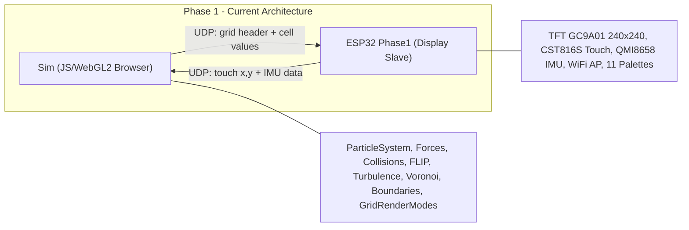
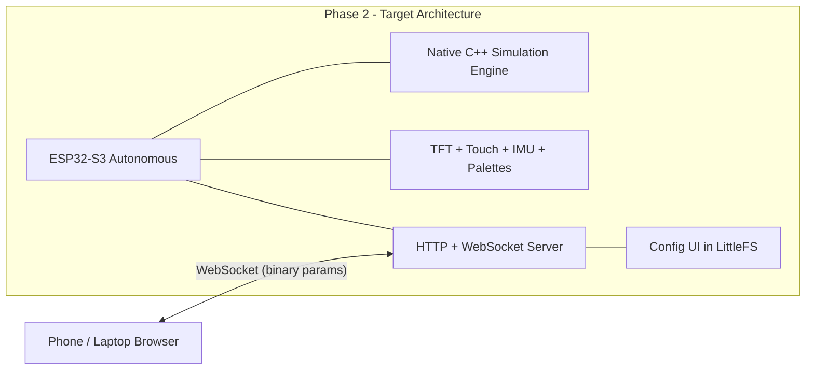
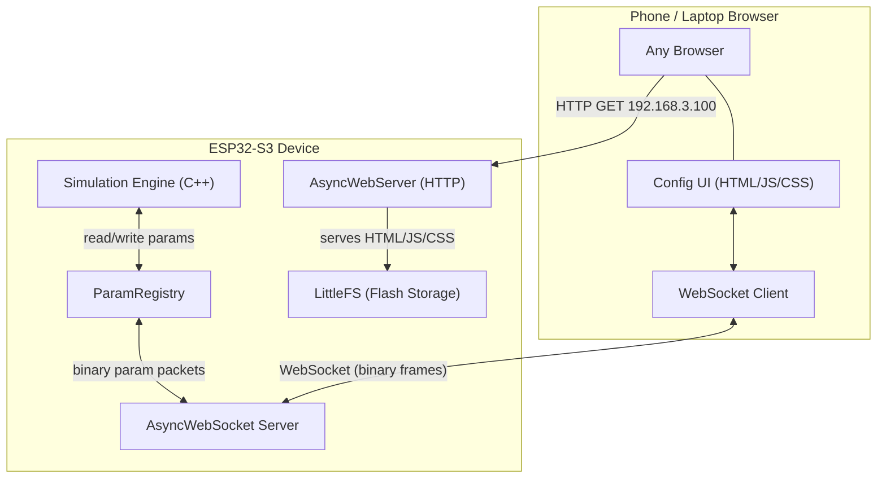
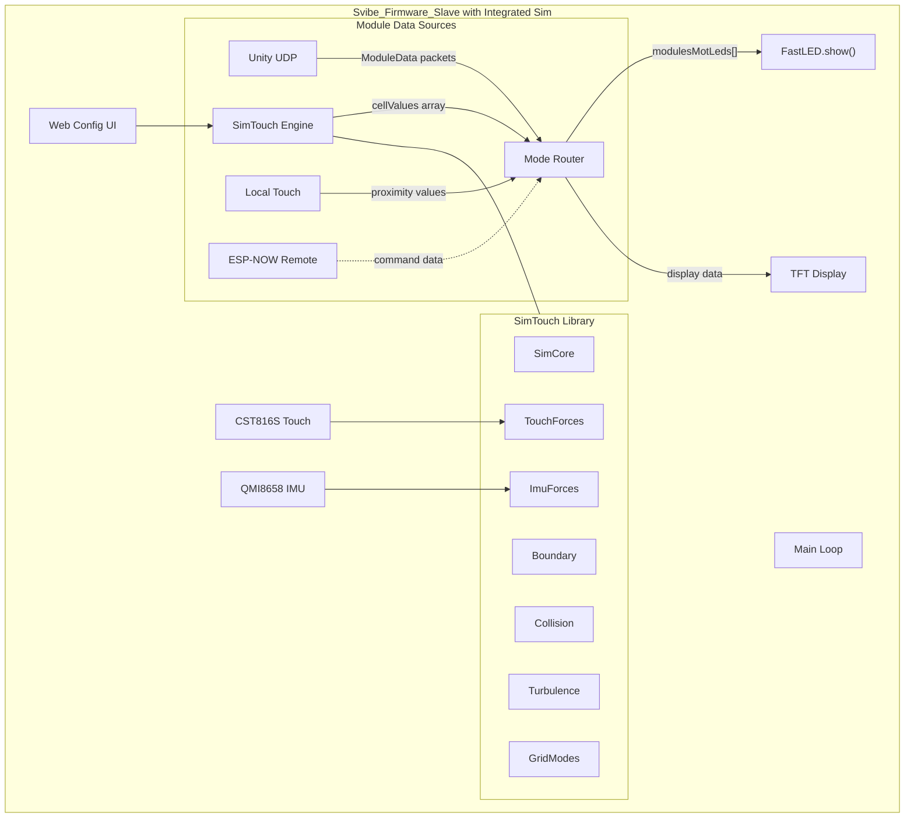

# Sim-to-ESP32 Migration Plan

## Current State







## Hardware Constraints (LilyGo T-RGB 2.1 Half-Circle Primary, Waveshare 1.28 Secondary)

- **CPU**: Dual-core Xtensa LX7 @ 240MHz
- **RAM**: 320KB SRAM + 2MB PSRAM (QSPI, slower access)
- **Flash**: 16MB
- **Primary Display/Touch**: LilyGo T-RGB 2.1-inch half-circle (ST7701 RGB panel + onboard touch via LilyGo library)
- **Secondary Display/Touch**: Waveshare GC9A01 240x240 + CST816S (existing Phase1 compatibility path)
- **IMU**: QMI8658 (I2C)
- **Target FPS**: 30-60 FPS

### Board Compatibility (PlatformIO Env Switch)

Phase2 uses a single codebase with board-specific backends selected by PlatformIO env:

- `phase2_lilygo` (default): LilyGo T-RGB 2.1 half-circle, LVGL v8 compatibility mode.
- `phase2_waveshare`: Waveshare 1.28 compatibility mode.
- `phase2_lilygo_v9`: LilyGo future-development env for LVGL v9 migration.

Board switches are env-only (no simulation code changes). Build flags control backend routing:

- `TARGET_LILYGO=1` / `TARGET_WAVESHARE=0` for LilyGo
- `TARGET_LILYGO=0` / `TARGET_WAVESHARE=1` for Waveshare
- `LVGL_VERSION_8` or `LVGL_VERSION_9` for UI helper selection

## Scope: What Gets Ported vs. Dropped

### Port to C++ (Core Logic)


| JS Module                                        | ESP32 C++ Target        | Priority |
| ------------------------------------------------ | ----------------------- | -------- |
| `particleSystem.js` (~547 lines)                 | `SimCore.cpp/h`         | P0       |
| `gravityForces.js`                               | `Forces.cpp/h`          | P0       |
| `collisionSystem.js` (~294 lines)                | `Collision.cpp/h`       | P0       |
| `circularBoundary.js` / `rectangularBoundary.js` | `Boundary.cpp/h`        | P0       |
| `boundaryUtils.js`                               | `Boundary.cpp/h`        | P0       |
| `turbulenceField.js` (~1456 lines)               | `Turbulence.cpp/h`      | P1       |
| `mouseForces.js` (touch mapping)                 | `TouchForces.cpp/h`     | P0       |
| `gridRenderModes.js` (~970 lines)                | `GridModes.cpp/h`       | P0       |
| `gridGeometry.js`                                | `GridGeometry.cpp/h`    | P1       |
| `voronoiField.js`                                | `Voronoi.cpp/h`         | P2       |
| `fluidFLIP.js` (~498 lines)                      | `FluidFLIP.cpp/h`       | P2       |
| `organicBehavior.js` / forces                    | `OrganicBehavior.cpp/h` | P3       |
| `pulseModulator.js`                              | `Modulator.cpp/h`       | P2       |
| `emuForces.js` (IMU mapping)                     | `ImuForces.cpp/h`       | P1       |
| `soundAnalyzer.js` (~504 lines)                  | `AudioAnalyzer.cpp/h`   | P3       |
| `micForces.js` (~357 lines)                      | `MicForces.cpp/h`       | P3       |
| `inputModulator.js` (~190 lines)                 | `InputModulator.cpp/h`  | P3       |


### Keep As-Is from Phase1

- [Graphics.cpp](Embedded/esp32/Phase1/src/Graphics.cpp) -- display init, LVGL, touch driver, `SimGraph()` rendering
- [Palettes.cpp](Embedded/esp32/Phase1/src/Palettes.cpp) -- 11 FastLED gradient palettes
- [WifUdp.cpp](Embedded/esp32/Phase1/src/WifUdp.cpp) -- WiFi AP, UDP send/receive
- [Acc.cpp](Embedded/esp32/Phase1/src/Acc.cpp) -- QMI8658 IMU driver

### Drop (JS/Browser Only)

- All WebGL renderers, ShaderManager, GLSL shaders
- lil-gui UI panels
- DOM overlays, HTML/CSS
- WebSocket/Web Serial managers
- `SoundVisualizer` (browser DOM visualization only)
- Event bus (replace with direct function calls)
- Debug/perf monitoring (replace with Serial logging)

### Port but Disabled (Future Hardware)

- **Audio analysis pipeline** (`SoundAnalyzer`, `MicInputForces`, `InputModulator`): Port the core algorithms (FFT band extraction, beat detection, audio-to-force mapping, audio-to-parameter modulation). Compile-gated with `#if HAS_MIC`. The Web Audio API capture layer is replaced by an I2S driver for a future MEMS microphone module (e.g., INMP441 or SPH0645 via I2S). The FFT computation uses `ESP-DSP` or `arduinoFFT` library instead of the browser's `AnalyserNode`.

## Migration Phases

### Phase 2A: Minimal Viable Simulation (P0 -- Foundation)

Port the absolute minimum to see particles moving on screen.

**New files to create** under `Embedded/esp32/Phase2/`:

1. `**SimConfig.h**` -- Central configuration struct mirroring `simParams` and `gridParams` from [main.js](Sim/src/main.js) (lines 44-210). Use `constexpr` defaults. Fixed-size. No dynamic allocation.

```cpp
struct SimConfig {
    // Simulation
    float timeStep = 1.0f / 30.0f;  // 30 FPS target
    float timeScale = 1.0f;
    float velocityDamping = 1.0f;
    float maxVelocity = 1.0f;
    uint16_t particleCount = 200;    // Reduced from 500
    float particleRadius = 0.01f;
    // Boundary
    uint8_t boundaryMode = 0;  // 0=BOUNCE, 1=WARP
    uint8_t boundaryShape = 0; // 0=CIRCULAR, 1=RECTANGULAR
    float boundaryScale = 1.03f;
    float boundaryDamping = 0.8f;
    // Gravity
    float gravityX = 0.0f;
    float gravityY = 0.0f;
    // Collision
    bool collisionEnabled = true;
    uint8_t collisionGridSize = 8;  // Reduced from 10
    float collisionRepulsion = 0.5f;
    // Grid rendering
    uint8_t gridMode = 0;  // 0=Proximity
    float maxDensity = 2.1f;
    float smoothRateIn = 0.15f;
    float smoothRateOut = 0.08f;
    // Grid specs
    uint16_t targetCellCount = 200;  // Reduced
    uint8_t gridGap = 1;
    uint8_t theme = 0;
};
```

1. `**Boundary.h/cpp**` -- Port from [baseBoundary.js](Sim/src/simulation/boundary/baseBoundary.js), [circularBoundary.js](Sim/src/simulation/boundary/circularBoundary.js), [rectangularBoundary.js](Sim/src/simulation/boundary/rectangularBoundary.js). Normalized [0,1] coordinate space. Key methods: `enforceBoundary()`, `getBoundaryType()`, `getRadius()`.
2. `**SimCore.h/cpp**` -- Port from [particleSystem.js](Sim/src/simulation/core/particleSystem.js). **Critical design decisions:**
  - Use **fixed-size arrays** (not `Float32Array` / dynamic allocation): `float particlesX[MAX_PARTICLES]`, `float particlesY[MAX_PARTICLES]`, `float velX[MAX_PARTICLES]`, `float velY[MAX_PARTICLES]`
  - `MAX_PARTICLES` = 300 (tunable), consuming ~4.8KB for 4 arrays of 300 floats
  - Port `initializeParticles()`, `step()`, `applyExternalForces()`, `updateParticles()` from lines 229-350 of particleSystem.js
  - The `step()` loop: gravity -> turbulence -> collisions -> velocity integration -> boundary enforcement
3. `**Collision.h/cpp**` -- Port from [collisionSystem.js](Sim/src/simulation/forces/collisionSystem.js). Spatial grid-based collision with fixed-size grid. Use static arrays instead of JS dynamic arrays. Grid size 8x8 = 64 cells with small per-cell particle index lists.
4. `**GravityForces.h/cpp**` -- Trivial port from `gravityForces.js`. Apply (gx, gy) to all velocity arrays.
5. `**TouchForces.h/cpp**` -- Port from [mouseForces.js](Sim/src/simulation/forces/mouseForces.js). Map CST816S touch (0-240 pixel) to normalized [0,1] simulation space. Support attract/repulse modes.
6. `**GridModes.h/cpp**` -- Port from [gridRenderModes.js](Sim/src/renderer/gridRenderModes.js). Start with `Proximity` mode only. Takes particle positions + grid cell centers, outputs `uint8_t` value per cell (0-255). This feeds directly into the existing `SimGraph()` rendering path (but locally, not via UDP).
7. `**Main.cpp` (Phase2)** -- New main loop:

```cpp
void loop() {
    LoopAcc();  // existing IMU
    EVERY_N_MILLISECONDS(1000/30) {
        touchForces.update(simCore);  // read touch, apply forces
        imuForces.apply(simCore);     // map IMU to gravity
        simCore.step();               // physics tick
        gridModes.compute(simCore, cellValues);  // cell values
        renderGrid(cellValues);       // reuse SimGraph-style rendering
        UiLoop();                     // LVGL tick
    }
}
```

### Phase 2B: Turbulence and IMU (P1)

1. `**Turbulence.h/cpp**` -- Port from [turbulenceField.js](Sim/src/simulation/forces/turbulenceField.js). This is the largest and most complex module (~1456 lines). Key optimizations:
  - Port the custom Perlin/Simplex noise functions (already pure math, no browser deps)
  - Start with a single `patternStyle` (e.g., "Checkerboard") and add others incrementally
  - Use `float` throughout (not `double`)
  - Pre-compute noise lookup tables where possible
  - Skip `domainWarp`, `symmetry`, `blur` initially
2. `**ImuForces.h/cpp**` -- Port from [emuForces.js](Sim/src/simulation/forces/emuForces.js). Map QMI8658 accelerometer (x,y,z) to simulation gravity/directional bias. The IMU data path already exists in [Acc.cpp](Embedded/esp32/Phase1/src/Acc.cpp).
3. `**GridGeometry.h/cpp**` -- Port from [gridGeometry.js](Sim/src/coreGrid/gridGeometry.js). Compute grid cell positions based on target cell count, gap, aspect ratio, and boundary shape. Output: array of cell center coordinates + cell dimensions. This replaces the header-based geometry currently received via UDP.

### Phase 2C: Advanced Physics (P2)

1. `**Voronoi.h/cpp**` -- Port from `voronoiField.js`. Voronoi cell generation, distance calculations, force application. Memory-intensive (cell positions, movement) -- may need PSRAM.
2. `**FluidFLIP.h/cpp**` -- Port from [fluidFLIP.js](Sim/src/simulation/core/fluidFLIP.js) (~498 lines). FLIP fluid solver with pressure projection. Grid-based: `gridSize^2` arrays for u, v, pressure, divergence, solid. At grid size 32: 32x32x7 arrays = ~28KB. Consider grid size 16 (7KB) for ESP32.
3. `**Modulator.h/cpp**` -- Port from [pulseModulator.js](Sim/src/input/pulseModulator.js). LFO waveforms (sine, square, triangle, sawtooth) that modulate simulation parameters over time. Pure math.

### Phase 2D: Organic Behaviors, Audio, and Polish (P3)

1. **`OrganicBehavior.h/cpp`** -- Port swarm, automata, chain behaviors. Neighbor search requires spatial partitioning (can reuse collision grid).
2. **`AudioAnalyzer.h/cpp`** -- Port from `soundAnalyzer.js`. Core algorithms: FFT frequency band extraction (Sub through Brilliance), volume/peak tracking, beat detection (energy history comparison). On ESP32, the Web Audio API capture is replaced by I2S input from a MEMS mic module. FFT via `ESP-DSP` or `arduinoFFT`. Compile-gated: `#if HAS_MIC` (disabled by default, `HAS_MIC=0` in build flags).
3. **`MicForces.h/cpp`** -- Port from `micForces.js`. Routes audio analysis data (volume, bands, beat) to simulation forces. Sensitivity, smoothing, baseline amplitude. Works with `AudioAnalyzer` when enabled.
4. **`InputModulator.h/cpp`** -- Port from `inputModulator.js`. Maps audio input to any simulation parameter (like PulseModulator but audio-driven). Frequency band selection, attack/release envelope, threshold gating, custom frequency/width. Integrates with `ParamRegistry` for target selection.
5. **`PresetStorage.h/cpp`** -- NVS (Non-Volatile Storage) based preset system. Save/load `SimConfig` snapshots to ESP32 flash. Support multiple preset slots (8-16). Auto-load last preset on boot. Accessible via Web Config UI (save/load/rename) and WebSocket protocol (`0xFE` preset select, add `0xFC` = save current as preset).
6. **Remote configuration** -- Keep WiFi/UDP for receiving preset changes and configuration from the JS Sim (which becomes a remote control tool rather than the simulation host).

## Phase 2E: Self-Hosted Web Configuration UI

### Architecture




The ESP32 already runs a WiFi Access Point (`SimTouchScreen`). Adding an HTTP server + WebSocket server lets any device with a browser become a config remote.

### Binary WebSocket Protocol (Typed Variable Format)

Each message is a compact binary frame. The first byte is the **parameter index** (0-255). The following bytes carry the value, whose type is determined by the parameter registry.

**Message format:**

```
[1 byte: paramIndex] [N bytes: value]
```

**Type encoding per parameter (known by both sides via registry):**

- `uint8`:  1 byte value (total 2 bytes)
- `uint16`: 2 bytes LE value (total 3 bytes)
- `float`:  4 bytes LE value (total 5 bytes)
- `bool`:   1 byte (0 or 1) (total 2 bytes)

**Special messages:**

- `0xFF` = **Sync request**: Client sends `[0xFF]` on connect. ESP32 responds with all parameter values sequentially (one message per param).
- `0xFE` = **Preset select**: `[0xFE, presetIndex]` -- load a preset by index.
- `0xFD` = **Heartbeat/ping**: `[0xFD]` -- keepalive.

### Parameter Registry (`ParamRegistry` in SimConfig.h)

A compile-time table mapping index -> SimConfig field, with metadata for the UI:

```cpp
enum ParamType : uint8_t { UINT8, UINT16, FLOAT, BOOL };

struct ParamDef {
    uint8_t index;
    const char* name;       // "Turbulence Strength"
    const char* group;      // "Turbulence"
    ParamType type;
    float minVal, maxVal, step;
    uint16_t offsetInConfig; // offsetof(SimConfig, field)
};

// Example registry entries (indices 50+, avoiding Unity COM_* 0–33):
// { 50, "Time Scale",         "Simulation",  FLOAT, 0.1, 3.0, 0.1, offsetof(SimConfig, timeScale) },
// { 51, "Velocity Damping",   "Simulation",  FLOAT, 0.8, 1.0, 0.01, offsetof(SimConfig, velocityDamping) },
// { 52, "Max Velocity",       "Simulation",  FLOAT, 0.5, 5.0, 0.1, offsetof(SimConfig, maxVelocity) },
// { 53, "Particle Count",     "Simulation",  UINT16, 50, 500, 10, offsetof(SimConfig, particleCount) },
// { 70, "Boundary Mode",      "Boundary",    UINT8, 0, 1, 1, offsetof(SimConfig, boundaryMode) },
// { 80, "Gravity X",          "Gravity",     FLOAT, -1.0, 1.0, 0.05, offsetof(SimConfig, gravityX) },
// { 100, "Turb Strength",     "Turbulence",  FLOAT, 0.0, 20.0, 0.5, offsetof(SimConfig, turbStrength) },
// ...
```

This registry serves double duty:

1. **ESP32 side**: Maps incoming WebSocket param index to the correct SimConfig field for reading/writing.
2. **Web UI side**: The ESP32 serves the registry as JSON at `/api/params` so the UI can auto-generate controls (sliders, toggles, dropdowns) with correct ranges.

### Mapping Details

#### 1. ParamRegistry Index Allocation

**Reserved ranges** (avoiding conflict with Unity/system commands in `Svibe_Firmware_Slave/include/Globals.h`):

- **0–33**: Unity/system commands (`COM_DISCOVERY`, `COM_TIMESCALE`, `COM_SCALE`, ..., `COM_HEART`) — **DO NOT USE**
- **34–49**: Reserved for future Unity/system expansion
- **50–255**: **SimTouch parameters** (206 indices available)

**Proposed SimTouch layout** (10-index blocks per subsystem):

| Range   | Subsystem           | Example Params                                      |
|---------|---------------------|-----------------------------------------------------|
| 50–69   | Simulation core     | timeScale, velocityDamping, maxVelocity, particleCount, particleRadius |
| 70–79   | Boundary            | boundaryMode, boundaryShape, boundaryScale, boundaryDamping |
| 80–89   | Gravity             | gravityX, gravityY                                  |
| 90–99   | Collision           | collisionEnabled, collisionGridSize, collisionRepulsion |
| 100–119 | Turbulence          | turbStrength, turbScale, turbSpeed, turbPattern     |
| 120–129 | Touch/Mouse forces  | touchStrength, touchRadius, touchMode               |
| 130–139 | IMU                 | imuSensitivity, imuSmoothing, imuEnabled            |
| 140–159 | Grid/Rendering      | gridMode, maxDensity, smoothRateIn/Out, targetCellCount, gridGap, theme |
| 160–169 | Modulator (LFO)     | modulatorWave, modulatorFreq, modulatorDepth, modulatorTarget |
| 170–189 | Audio (HAS_MIC)     | audioEnabled, audioSensitivity, beatThreshold       |
| 190–209 | Organic behaviors   | swarmEnabled, swarmCohesion, swarmSeparation        |
| 210–239 | (Reserved)          | FLIP, Voronoi, future features                      |
| 240–251 | Meta/Runtime        | presetIndex (current active preset)                 |
| 252–255 | Special messages    | 0xFC=preset save, 0xFD=heartbeat, 0xFE=preset select, 0xFF=sync |

**Implementation**: The `ParamRegistry` array in `SimConfig.h` will use these indices. WebSocket `applyParam(index, data, len)` uses `offsetof(SimConfig, field)` to write directly to the config struct.

**Status update (Phase2 implementation):**

- `Embedded/esp32/Phase2/include/SimConfig.h` now includes the missing core fields and expanded `kParamRegistry` for simulation, boundary, collision, turbulence, and grid/render controls.
- Added `PARAM_INT8` to support signed offset parameters (`gridCenterOffsetX/Y`).
- Particle display is still deferred on ESP32 for performance reasons; particle color is represented as a simple boolean (`particleColorWhite`) and opacity is kept as a placeholder parameter for future rendering support.

#### 2. Touch Mapping (CST816S → Simulation Space)

**Hardware**: CST816S I2C touch controller reports pixel coordinates (0–240, 0–240) for single touch.

**Mapping to normalized [0,1] sim space**:

```cpp
// In TouchForces.h/cpp (port from mouseForces.js):
float simX = touchPixelX / 240.0f;
float simY = touchPixelY / 240.0f;  // No Y-flip needed (both screen and sim use top=0)
```

**Coordinate frame**: Screen origin (0,0) = top-left; Sim origin (0,0) = top-left of normalized space. **No axis flip required.**

**Force application** (from `mouseForces.js`):
- Attract mode: pull particles toward touch point with distance-based falloff
- Repulse mode: push particles away from touch point
- Configurable: `touchStrength` (force magnitude), `touchRadius` (influence radius in normalized space), `touchMode` (0=attract, 1=repulse)

**Multi-touch**: CST816S is single-touch only. For future multi-touch hardware, reserve `TouchForces` API to accept arrays of touch points.

#### 3. IMU Mapping (QMI8658 → Gravity/Directional Bias)

**Hardware**: QMI8658 I2C 6-axis IMU (accelerometer + gyro). Accelerometer range ±8g or ±16g.

**Mapping to simulation gravity** (port from `emuForces.js`):

```cpp
// In ImuForces.h/cpp:
// QMI8658 axes (device flat on table, screen up):
//   X = right, Y = forward, Z = up
// Simulation expects gravityX (left/right), gravityY (up/down) in normalized units

// Map device tilt to sim gravity (low-pass filtered for tilt, not shake):
float gravityX = -accelX * imuSensitivity;  // Tilt right → particles fall right
float gravityY = accelY * imuSensitivity;   // Tilt forward → particles fall down (toward you)
// Z-axis (up/down acceleration) can modulate gravity magnitude or add vertical bias
```

**Coordinate frame**: Device X/Y → Sim X/Y with sign adjustment. Configurable: `imuSensitivity` (accel → sim gravity scale factor, e.g. 0.5), `imuSmoothing` (low-pass filter alpha, e.g. 0.1).

**Tilt vs shake**: Use low-pass filter (smoothing) for tilt-driven gravity; high-pass or threshold detection for "shake" events (future feature: shake to randomize particles).

**Integration**: `Acc.cpp` already reads QMI8658 at 100Hz. In `SIM_LOCAL` mode, feed to `simEngine.setAccel(ax, ay, az)` instead of (or in addition to) UDP send.

#### 4. Audio Mapping (HAS_MIC, Phase 2D)

**Hardware** (future): I2S MEMS microphone (e.g., INMP441, SPH0645). Compile-gated `#if HAS_MIC` (default: disabled).

**AudioAnalyzer → Forces** (`MicForces.h/cpp`, port from `micForces.js`):
- FFT band extraction (Sub, Bass, LowMid, Mid, HighMid, Presence, Brilliance) → band energy levels
- Volume/peak tracking → overall amplitude
- Beat detection (energy history comparison) → beat event flag
- Mapping: Route audio data to simulation forces (e.g., bass → particle spawn rate, beat → radial pulse)

**AudioAnalyzer → Parameters** (`InputModulator.h/cpp`, port from `inputModulator.js`):
- Select **any SimConfig parameter** as modulation target (e.g., turbulence strength, gravity, particle count)
- Frequency band selection (which FFT band drives modulation)
- Attack/release envelope, threshold gating
- **Target selection**: Store target param index in `InputModulator` config (e.g., `modulatorTarget = 100` to modulate `turbStrength` at index 100). Uses `ParamRegistry` to apply modulation.

**Implementation note**: `InputModulator` will call `applyParam(modulatorTarget, ...)` internally to drive the chosen SimConfig field based on audio input.

#### 5. Cell-to-Module Mapping (Phase 3: Svibe_Firmware_Slave Integration)

**Simulation output**: `uint8_t cellValues[cellCount]` — values 0–255, one per grid cell (typically 200–400 cells depending on config).

**Suit hardware**: 338 haptic modules (motor + LED pairs) across 4 body zones (Sig1/2/3/4) + hands/feet.

**Mapping strategies**:

1. **Direct 1:1** (recommended for Phase 3 initial integration):
   - Set `targetCellCount = 338` in SimConfig
   - Grid produces exactly 338 cells
   - `cellValues[i]` → `modulesMotLeds[i*2]` (LED) and motor PWM for module `i`
   - **Pros**: Simple, no translation layer, grid size matches suit exactly
   - **Cons**: Couples sim grid size to module count

2. **Spatial/body-zone mapping** (future flexibility):
   - Sim grid size decoupled (e.g., 256 or 400 cells)
   - Define body-zone → grid-region mapping table (e.g., "Sig1 modules 0–50 map to grid cells in upper-right quadrant")
   - Each module samples nearest grid cell(s) or interpolates
   - **Pros**: Grid size independent, can reuse same sim on different suits
   - **Cons**: Requires mapping table, more complex

**Phase 3 implementation** (`Modules.cpp`):

```cpp
void UpdateModulesFromSim(SimEngine& sim) {
    const uint8_t* cells = sim.getCellValues();
    uint16_t count = min(sim.getCellCount(), (uint16_t)NBR_MODULES);
    for (int i = 0; i < count; i++) {
        uint8_t motSpeed = cells[i];  // Already 0–255 from GridModes
        uint8_t motPwm = map(motSpeed, 0, 255, minPWM, maxPWM);
        modulesMotLeds[i*2] = ColorFromPalette(Palettes[colorPaletteIdx], motSpeed, BRIGHTNESS_LED, BLEND);
        modulesMotLeds[i*2+1] = CRGB(motPwm, 1, 0);  // Motor control on odd indices
    }
}
```

**Decision**: Start with **direct 1:1** (`targetCellCount = 338`). If future suits have different module counts or spatial requirements change, refactor to spatial mapping in Phase 3B.

### Web Config UI Design (Card-Based, Mobile-First)

Stored in `Embedded/esp32/Phase2/data/` and uploaded to LittleFS.

**Files:**

- `data/index.html` -- Single-page app
- `data/style.css` -- Responsive styles
- `data/app.js` -- WebSocket client + UI generation

**UI Layout:**

```
+----------------------------------+
|  SimTouch Config        [status] |  <- header with connection indicator
+----------------------------------+
|  [Presets v]  [Save] [Reset]     |  <- preset selector bar
+----------------------------------+
|  > Simulation            [card]  |  <- collapsible card
|    Time Scale      [====o===]    |
|    Velocity Damp   [========o]   |
|    Particle Count  [==o======]   |
|    Max Velocity    [=====o===]   |
+----------------------------------+
|  > Boundary              [card]  |
|    Mode          [Bounce | Warp] |
|    Shape      [Circle | Rect]    |
|    Scale          [======o==]    |
+----------------------------------+
|  > Gravity               [card]  |
|    X              [====o====]    |  <- centered zero slider
|    Y              [====o====]    |
+----------------------------------+
|  > Collision             [card]  |
|    Enabled          [toggle]     |
|    Repulsion      [===o=====]    |
+----------------------------------+
|  > Turbulence            [card]  |
|    Strength       [==o======]    |
|    Scale          [====o====]    |
|    Speed          [===o=====]    |
|    Pattern    [Checkerboard v]   |
+----------------------------------+
|  > Rendering             [card]  |
|    Grid Mode   [Proximity v]     |
|    Theme       [Fire v]          |
+----------------------------------+
```

**Key behaviors:**

- On page load: connect WebSocket to `ws://192.168.3.100/ws`, send sync request `[0xFF]`
- ESP32 responds with all current param values; UI populates sliders/toggles
- On slider change: send binary `[paramIndex, ...valueBytes]` via WebSocket
- ESP32 receives, updates SimConfig, applies to running simulation immediately
- Cards collapse/expand on tap for mobile friendliness
- CSS: dark theme, large touch targets (48px+), responsive grid layout
- Total page size target: < 50KB (fits easily in 16MB flash)

### ESP32 Server Implementation

**Library**: `ESPAsyncWebServer` + `AsyncTCP` (well-established ESP32 async HTTP/WS libraries)

**Key additions to firmware:**

```cpp
#include <ESPAsyncWebServer.h>
#include <LittleFS.h>

AsyncWebServer server(80);
AsyncWebSocket ws("/ws");

void setupWebServer() {
    LittleFS.begin();
    
    // Serve static files from LittleFS
    server.serveStatic("/", LittleFS, "/").setDefaultFile("index.html");
    
    // Serve param registry as JSON (for UI auto-generation)
    server.on("/api/params", HTTP_GET, [](AsyncWebServerRequest *req) {
        String json = buildParamRegistryJSON();
        req->send(200, "application/json", json);
    });
    
    // WebSocket handler
    ws.onEvent(onWebSocketEvent);
    server.addHandler(&ws);
    server.begin();
}

void onWebSocketEvent(AsyncWebSocket *server, AsyncWebSocketClient *client,
                      AwsEventType type, void *arg, uint8_t *data, size_t len) {
    if (type == WS_EVT_DATA) {
        if (data[0] == 0xFF) {
            // Sync: send all params to this client
            sendAllParams(client);
        } else {
            // Parameter update: apply to SimConfig
            applyParam(data[0], data + 1, len - 1);
        }
    }
}
```

### Memory Impact

- `ESPAsyncWebServer` + `AsyncTCP`: ~20KB RAM
- LittleFS overhead: ~4KB RAM
- WebSocket buffers: ~2KB per client (max 2 clients)
- Parameter registry: ~1KB
- **Total additional**: ~28KB RAM (fits within the 190KB headroom)

## Critical Design Decisions

### Memory Budget (320KB SRAM)


| Component                                                       | Estimate    |
| --------------------------------------------------------------- | ----------- |
| Particle arrays (300 particles x 4 floats x 4 bytes)            | 4.8 KB      |
| Collision grid (8x8 x 16 indices)                               | 1 KB        |
| Grid cell values (400 cells x 1 byte + 400 x 4 float smoothing) | 2 KB        |
| Turbulence field cache                                          | ~2 KB       |
| FLIP grid (16x16 x 7 arrays x 4 bytes)                          | 7 KB        |
| LVGL draw buffer                                                | 5.7 KB      |
| Palette data (11 x 256 x 3)                                     | 8.4 KB      |
| WiFi/networking stack                                           | ~40 KB      |
| AsyncWebServer + WebSocket + LittleFS                           | ~28 KB      |
| FreeRTOS + Arduino overhead                                     | ~60 KB      |
| **Total estimated**                                             | **~158 KB** |


Leaves ~162KB headroom. PSRAM (2MB) available for larger buffers if needed.

### Coordinate System

All simulation logic operates in **normalized [0,1] space** (matching the JS Sim). The only pixel-space conversion happens at the rendering boundary (`GridModes` output -> `SimGraph()` screen drawing).

### FPS Target

- **30 FPS** initial target (33ms per frame)
- Budget: ~10ms simulation step, ~15ms rendering, ~5ms input/overhead
- Dual-core: simulation on Core 1, rendering on Core 0 (future optimization)

### SimTouch Library Distribution

**Repository**: Private GitHub repo `github.com/MagicMods/SimTouch-lib` (or similar).

**During development** (Phase 2): Both the standalone Phase 2 project and Svibe_Firmware_Slave reference the library via **local path**. The library source lives alongside the consuming projects on disk:

```
D:\_Projects\Svibe\Svibe_Firmware\
├── SimTouch-lib/                    <-- Private git repo (the library)
│   ├── library.json
│   └── src/
│       ├── SimEngine.h/cpp
│       ├── SimConfig.h
│       └── ... (all sim modules)
├── Svibe_SimTouch - master/         <-- This project (Phase 2 standalone)
│   └── Embedded/esp32/Phase2/
│       └── platformio.ini           --> lib_extra_dirs = ../../../../SimTouch-lib
├── Svibe_Firmware_Slave/            <-- Production suit firmware (Phase 3)
│   └── platformio.ini               --> lib_extra_dirs = ../../SimTouch-lib
```

Each project's `platformio.ini` uses `lib_extra_dirs` to point to the local library:

```ini
; In Phase 2 standalone:
lib_extra_dirs = ../../../../SimTouch-lib

; In Svibe_Firmware_Slave (Phase 3):
lib_extra_dirs = ../../SimTouch-lib
```

**For distribution** (later): Switch to PlatformIO `lib_deps` referencing the private git URL:

```ini
lib_deps =
    https://github.com/MagicMods/SimTouch-lib.git
```

This requires a GitHub personal access token for private repos. PlatformIO handles cloning and version management automatically.

### Project Structure (Library-First)

The simulation engine is built as a PlatformIO library from day one, so it can be included in both the standalone Phase 2 project and the Svibe_Firmware_Slave without refactoring.

```
Embedded/esp32/Phase2/
├── platformio.ini              (standalone project config)
├── boards/
│   └── waveshare_esp32s3.json
├── lib/
│   └── SimTouch/               (SIMULATION LIBRARY - reusable)
│       ├── library.json        (PlatformIO library manifest)
│       └── src/
│           ├── SimEngine.h/cpp     (top-level API)
│           ├── SimConfig.h         (params + registry)
│           ├── SimCore.h/cpp       (particle system)
│           ├── Boundary.h/cpp      (boundary physics)
│           ├── Collision.h/cpp     (collision detection)
│           ├── GravityForces.h/cpp
│           ├── TouchForces.h/cpp
│           ├── ImuForces.h/cpp
│           ├── Turbulence.h/cpp
│           ├── GridModes.h/cpp
│           ├── GridGeometry.h/cpp
│           ├── Modulator.h/cpp
│           ├── Voronoi.h/cpp
│           ├── FluidFLIP.h/cpp
│           ├── AudioAnalyzer.h/cpp (compile-gated: HAS_MIC)
│           ├── MicForces.h/cpp     (compile-gated: HAS_MIC)
│           ├── InputModulator.h/cpp(compile-gated: HAS_MIC)
│           └── PresetStorage.h/cpp (NVS save/load)
├── include/                    (HARDWARE LAYER - project-specific)
│   ├── Graphics.h              (REUSE from Phase1)
│   ├── Palettes.h              (REUSE from Phase1)
│   ├── Acc.h                   (REUSE from Phase1)
│   ├── WifUdp.h                (REUSE from Phase1)
│   ├── Pin_config.h            (REUSE from Phase1)
│   └── lv_conf.h               (REUSE from Phase1)
├── src/                        (APPLICATION LAYER - project-specific)
│   ├── Main.cpp                (autonomous sim loop)
│   ├── Graphics.cpp            (REUSE, minor mods)
│   ├── Palettes.cpp            (REUSE as-is)
│   ├── Acc.cpp                 (REUSE as-is)
│   ├── WifUdp.cpp              (REUSE, add WebSocket config)
│   └── WebServer.cpp           (HTTP + WebSocket server)
├── data/                       (LittleFS web assets)
│   ├── index.html              (single-page config UI)
│   ├── style.css               (responsive dark theme)
│   └── app.js                  (WebSocket client + UI generator)
```

## JS-to-C++ Translation Patterns


| JavaScript                  | C++ (ESP32)                                |
| --------------------------- | ------------------------------------------ |
| `Float32Array(n)`           | `float arr[MAX_N]` (stack) or static       |
| `new Array(n).fill(0)`      | `float arr[MAX_N] = {0}`                   |
| `Math.sqrt/cos/sin/atan2`   | `sqrtf/cosf/sinf/atan2f`                   |
| `Math.random()`             | `esp_random() / (float)UINT32_MAX`         |
| `class X { constructor() }` | `struct X` or `class X` with init method   |
| `eventBus.on/emit`          | Direct function calls or callback pointers |
| `for (let i...)`            | `for (int i...)`                           |
| `Array.push()`              | Fixed-size array with count variable       |
| `console.log()`             | `log_d()` / `Serial.printf()`              |


## Validation Strategy

Each phase ends with a **side-by-side comparison**: run the JS Sim and the ESP32 simultaneously with identical parameters and visually compare the output. The existing UDP infrastructure can be used to send the same cell values from both systems to a comparison tool.

---

## Phase 3: Integration into Svibe_Firmware_Slave

### Target Project Analysis

`Svibe_Firmware_Slave` is the production firmware for the Svibe haptic suit. Key characteristics:

- **Target slave hardware**: Waveshare ESP32-S3-Touch-LCD-1.28 for production suit integration (Phase3).
- **Phase2 dev baseline**: LilyGo T-RGB 2.1 half-circle as primary simulation bring-up target.
- **338 haptic modules**: Motor + LED pairs on 4x WS2812 strips, driven via `modulesMotLeds[(338+4)*2]` CRGB array
- **Unity master**: Receives module speed/direction/color data from Unity via UDP (port 3000)
- **Multiple data formats**: `ModuleData` (speed only), `ModuleDataSD` (speed+direction), `ModuleDataSDC` (speed+direction+color)
- **SIM_FLAG already exists**: When 342-byte packets arrive, the firmware enters sim mode -- renders a grid on TFT and sends touch/IMU data back
- **Rich LVGL UI**: 10 screens (Intro, Main, Body, Colors, Settings, Power, TempHum, Console, Heart, Modules) with SquareLine Studio generated components
- **Existing AsyncWebServer**: Already uses `ESPAsyncWebServer` for OTA updates and WebSerial
- **Same shared files**: Acc.cpp, Palettes.cpp, WifUdp.cpp, Pin_config.h, ui.cpp -- largely identical to Phase1

### How the Simulation Fits



The simulation engine becomes **another data source** alongside Unity, local touch, and ESP-NOW. The existing mode-routing logic in `FromUnity()` / `Display()` already switches between these sources using flags (`SIM_FLAG`, `UNITY_CONNECTED`, `TOUCH_ENABLED`).

### Integration Architecture: Simulation as a Library

The simulation engine should be built as a **self-contained PlatformIO library** that can be included in any project:

```
lib/
└── SimTouch/
    ├── library.json           (PlatformIO library manifest)
    ├── src/
    │   ├── SimEngine.h/cpp    (top-level API: init, step, getValues)
    │   ├── SimConfig.h        (parameter struct + registry)
    │   ├── SimCore.h/cpp      (particle system)
    │   ├── Boundary.h/cpp     (boundary physics)
    │   ├── Collision.h/cpp    (collision detection)
    │   ├── GravityForces.h/cpp
    │   ├── TouchForces.h/cpp
    │   ├── ImuForces.h/cpp
    │   ├── Turbulence.h/cpp
    │   ├── GridModes.h/cpp
    │   ├── GridGeometry.h/cpp
    │   ├── Modulator.h/cpp
    │   ├── Voronoi.h/cpp
    │   ├── FluidFLIP.h/cpp
    │   ├── AudioAnalyzer.h/cpp  (compile-gated: HAS_MIC)
    │   ├── MicForces.h/cpp      (compile-gated: HAS_MIC)
    │   ├── InputModulator.h/cpp (compile-gated: HAS_MIC)
    │   └── PresetStorage.h/cpp  (NVS save/load)
    └── data/                  (web config UI assets)
        ├── index.html
        ├── style.css
        └── app.js
```

**Top-level API** (`SimEngine.h`):

```cpp
class SimEngine {
public:
    SimConfig config;
    
    void init();                              // Initialize all subsystems
    void step(float dt);                      // Run one simulation tick
    void setTouch(float x, float y, bool active);  // Feed touch input (0-1 normalized)
    void setAccel(float ax, float ay, float az);   // Feed IMU data
    
    // Output
    const uint8_t* getCellValues();           // Grid cell values (0-255), length = cellCount
    uint16_t getCellCount();
    
    // For display rendering
    uint8_t getCols();
    uint8_t getRows();
    uint8_t getCellW();
    uint8_t getCellH();
    uint8_t getGap();
    bool isCircular();
    
    // Config
    void applyParam(uint8_t index, const uint8_t* data, size_t len);
    String getParamRegistryJSON();
    void sendAllParams(std::function<void(uint8_t*, size_t)> sendFn);
};
```

### Key Integration Points in Svibe_Firmware_Slave

**1. Module Data Mapping** (`Modules.cpp`)

The simulation outputs `uint8_t cellValues[N]` (0-255). These map to `modulesMotLeds[]` exactly like `UpdateModulesDataSim()` already does (line 226-253 of Modules.cpp):

```cpp
// Existing pattern in Slave firmware:
void UpdateModulesDataSim(unsigned char *buffer) {
    for (int i = 0; i < 342; i++) {
        motSpeed = buffer[i + 1];
        motPwm = map(motSpeed, 0, 100, minPWM, maxPWM);
        modulesMotLeds[m] = ColorFromPalette(Palettes[idx], motSpeed, BRIGHTNESS_LED, BLEND);
        // ... motor control ...
    }
}

// New function for local sim:
void UpdateModulesFromSim(SimEngine& sim) {
    const uint8_t* cells = sim.getCellValues();
    uint16_t count = min(sim.getCellCount(), (uint16_t)NBR_MODULES);
    for (int i = 0; i < count; i++) {
        uint8_t motSpeed = cells[i];  // Already 0-255 from GridModes
        uint8_t motPwm = map(motSpeed, 0, 255, minPWM, maxPWM);
        modulesMotLeds[i*2] = ColorFromPalette(Palettes[colorPaletteIdx], motSpeed, BRIGHTNESS_LED, BLEND);
        // Motor control on odd indices...
        modulesMotLeds[i*2+1] = CRGB(motPwm, 1, 0);  // simplified
    }
}
```

**2. Display Rendering** (`ui.cpp`)

`SimGraph()` in the Slave (line 648-696) already renders a circular grid of cells on the TFT. With the integrated sim, it reads from `SimEngine` instead of from `modulesMotLeds[]`:

```cpp
void Display() {
    if (lv_scr_act() == ui_ScreenMain && DISPLAY_MAIN) {
        if (SIM_FLAG) {
            SimGraphLocal(simEngine);  // NEW: render from local sim engine
        } else if (!getTouchEnabled()) {
            RoundGraph(gridSelector, 0, 0, 1);
        }
    }
}
```

**3. Mode Selection** (`main.cpp`)

Add `SIM_LOCAL` as a new mode alongside `SIM_FLAG` (remote) and Unity control:

```cpp
// Existing modes:
// - Unity data:       UNITY_CONNECTED, normal module data via UDP
// - Remote sim:       SIM_FLAG, 342-byte packets from JS Sim (Phase 1 behavior)  
// - Local touch:      TOUCH_ENABLED, proximity-based module activation
// - Demo:             DEMO, animation playback

// New mode:
// - Local sim:        SIM_LOCAL, autonomous particle simulation
```

**4. Touch Input** (`ui.cpp`)

Touch is already handled via `lv_touchpad_read()`. In sim mode, touch data gets routed to `SimEngine::setTouch()` instead of (or in addition to) being sent via UDP:

```cpp
if (SIM_LOCAL) {
    // Feed touch to local simulation
    float nx = touch.data.x / 240.0f;
    float ny = touch.data.y / 240.0f;
    simEngine.setTouch(nx, ny, true);
}
```

**5. IMU Input** (`Acc.cpp`)

Already gated by `SIM_FLAG`. For local sim, feed directly to `SimEngine::setAccel()`:

```cpp
if (qmi.getDataReady() && (SIM_FLAG || SIM_LOCAL)) {
    qmi.getAccelerometer(acc.x, acc.y, acc.z);
    if (SIM_LOCAL) {
        simEngine.setAccel(acc.x, acc.y, acc.z);
    }
    // ... existing UDP send for remote sim ...
}
```

**6. WiFi / Web Config** (`WifUdp.cpp`)

The Slave already has `AsyncWebServer` on port 80 for OTA. The WebSocket config endpoint and LittleFS serving integrate alongside:

```cpp
// Existing:
server.on("/", HTTP_GET, [](AsyncWebServerRequest *req) { ... });  // OTA link
ElegantOTA.begin(&server);

// Add:
server.serveStatic("/sim", LittleFS, "/").setDefaultFile("index.html");
AsyncWebSocket ws("/ws");
ws.onEvent(onSimWebSocketEvent);
server.addHandler(&ws);
```

**7. LVGL UI Screen**

The Slave has 10 LVGL screens built with SquareLine Studio. The sim could get its own `ui_ScreenSim` or reuse `ui_ScreenMain` (which already has sim rendering logic). Adding a sim config screen would be done in SquareLine Studio or by adding an LVGL screen programmatically.

### What Changes in the Slave Firmware (Summary)

| File | Change |
|------|--------|
| `platformio.ini` | Add `lib/SimTouch` dependency, LittleFS config |
| `main.cpp` | Add `#include "SimEngine.h"`, `SimEngine simEngine;`, call `simEngine.step()` in loop, add `SIM_LOCAL` mode |
| `Modules.cpp` | Add `UpdateModulesFromSim(SimEngine&)` function |
| `ui.cpp` | Add `SimGraphLocal(SimEngine&)` for local sim rendering; route touch to `simEngine.setTouch()` in SIM_LOCAL mode |
| `WifUdp.cpp` | Add WebSocket endpoint `/ws` and LittleFS static serving at `/sim` (alongside existing OTA) |
| `Acc.cpp` | Route IMU data to `simEngine.setAccel()` when `SIM_LOCAL` |
| `Globals.h` | Add `extern bool SIM_LOCAL;`, `extern SimEngine simEngine;` |

### Cell-to-Module Mapping Strategy

The simulation grid produces ~200-400 cells. The suit has 338 modules mapped to body zones:

```
Sig1 (Top Right):    modules 0-50   + Hand Right: 51-91
Sig2 (Top Left):     modules 92-141 + Hand Left:  142-182
Sig3 (Bottom Right): modules 183-225 + Foot Right: 226-258  
Sig4 (Bottom Left):  modules 259-304 + Foot Left:  305-337
```

Two mapping approaches:

1. **Direct 1:1** (if cellCount matches moduleCount): `cellValues[i] -> moduleData[i]`. Simplest. Requires grid config with exactly 338 cells.
2. **Spatial mapping**: Map grid cells to body-zone coordinates. Each body zone gets a subset of simulation cells based on spatial position. More complex but decouples sim grid size from module count.

For Phase 3 initial integration, **direct 1:1 mapping** is recommended. The grid can be configured (`targetCellCount = 338`) to produce approximately 338 cells.

### Integration Timeline

Phase 3 integration happens AFTER Phase 2 is complete and validated as a standalone project. The work is primarily:

1. Package the simulation code as a PlatformIO library (`lib/SimTouch/`)
2. Add the library to `Svibe_Firmware_Slave/platformio.ini`
3. Add mode routing logic (~50 lines across 4-5 files)
4. Add the `UpdateModulesFromSim()` bridge function
5. Move LittleFS web assets and WebSocket config code
6. Test: activate local sim mode, verify motors respond to particles, verify TFT renders correctly

Estimated effort: 1-2 days of integration work once Phase 2 is stable.
