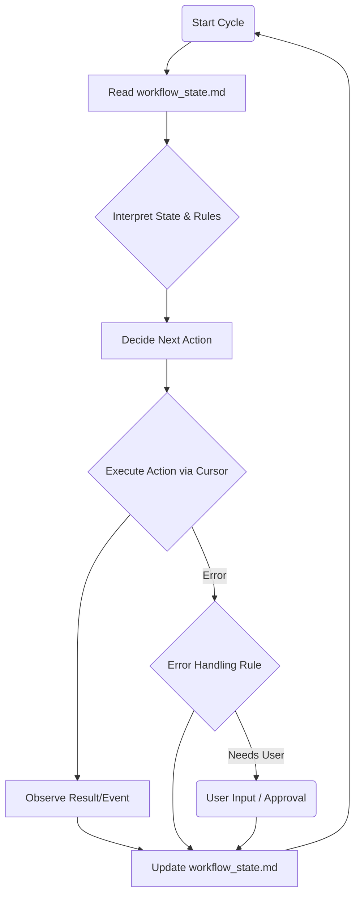

# An Autonomous AI Workflow for Cursor IDE

  
  
<em>A simple, autonomous system for AI-assisted development in Cursor.</em>

## What is this?

This project provides a streamlined way to work with AI assistants (like Claude or GPT-4) inside the Cursor IDE, making development more autonomous and consistent. It helps the AI remember project context and follow a structured process, even across different sessions. Think of it as giving your AI assistant a reliable memory and a clear playbook.

This setup is inspired by the ideas in the original `kleosr/cursorkleosr` repository but simplifies it drastically for better autonomy and lower overhead.

## Thanks to

* @atalas [Atalas Cursor IDE Profile](https://forum.cursor.com/u/atalas) 
* Contributors to the original `kleosr/cursorkleosr` concepts.

## How it Works: The Two-File System

Instead of many complex rule files, this system uses just two core Markdown files:

1. **`project_config.md` (Long-Term Memory - LTM):**
    * **Purpose:** Holds the stable, essential information about your project.
    * **Content:** Project goals, main technologies, critical coding patterns/conventions, and key constraints.
    * **Usage:** The AI reads this at the start of major tasks to understand the project's foundation. It's updated infrequently.

2. **`workflow_state.md` (Short-Term Memory + Rules + Log - STM):**
    * **Purpose:** The dynamic heart of the system. Tracks the current work session.
    * **Content:**
        * `## State`: Current phase and status
        * `## Plan`: The step-by-step plan for the current task
        * `## Rules`: All operational rules defining the workflow
        * `## Log`: A running log of actions and decisions
    * **Usage:** The AI reads this file **constantly** before acting and updates it **immediately** after acting.

## The Autonomous Loop

The AI operates in a continuous cycle, driven by the `workflow_state.md` file:

## The Workflow Phases

The system defines a structured workflow with explicit creativity control:

### Pure Phases (No Creativity)

1. **[PHASE: ANALYZE]:** Pure information gathering and understanding
   * Reading files
   * Asking clarifying questions
   * Understanding code structure
   * NO creativity or planning

2. **[PHASE: BLUEPRINT]:** Creating technical specification from requirements
   * Converting requirements to concrete steps
   * Creating detailed plans
   * NO creativity or innovation

3. **[PHASE: CONSTRUCT]:** Implementing exactly as planned
   * Zero deviation from plan
   * NO creative additions
   * Strict adherence to specification

4. **[PHASE: VALIDATE]:** Verifying implementation against plan
   * Zero tolerance for deviation
   * Clear pass/fail criteria
   * NO modifications

### Creative Phases (Innovation Allowed)

1. **[PHASE: ANALYZE+]:**
   * Information gathering with creative problem-solving
   * Brainstorming possibilities
   * Innovation in understanding
   * NO implementation planning

2. **[PHASE: BLUEPRINT+]:**
   * Technical specification with creative design
   * Innovative approaches
   * Alternative strategies
   * NO implementation

## Getting Started

1. **Locate the Files:** The core files `project_config.md` and `workflow_state.md` are located within the `cursorkleosr/` directory.
2. **Fill `project_config.md`:** Add your project's specific goals, tech stack, key patterns, and constraints.
3. **Instruct the AI:** Start your Cursor chat with a clear system prompt instructing the AI to operate *exclusively* based on these two files and the autonomous loop described above. (A good system prompt is crucial for enforcement!).
    * *Example Snippet for System Prompt:* "You are an autonomous AI developer. Operate solely based on `project_config.md` and `workflow_state.md`. Before every action, read `workflow_state.md`, determine state, consult `## Rules`, act accordingly, then immediately update `workflow_state.md`."
4. **Give the First Task:** The AI will initialize based on `RULE_INIT_01` and ask for the first task.

## Using the Workflow

* **Phase Control:** Use commands like `@analyze`, `@analyze+`, `@blueprint`, `@blueprint+`, `@construct`, `@validate` to control the workflow phase.
* **Creativity Control:** The "+" phases explicitly allow creativity and innovation, while pure phases enforce strict adherence to rules.
* **Monitoring:** You can observe the AI's progress and reasoning by looking at the `## Log` and `## State` sections in `workflow_state.md`.
* **Intervention:** If the AI gets blocked (e.g., `State.Status` is `BLOCKED_*` or `NEEDS_*`), it should report the issue based on the rules.
* **Memory Updates:** The AI should handle updates to `workflow_state.md` automatically. Updates to `project_config.md` are typically proposed by the AI and require your approval.

## What about `.cursorrules`?

The main `.cursorrules` file is now less important for the workflow itself. You might still use it for global Cursor settings (like preferred AI models or global ignores), but the core logic resides in `workflow_state.md`.

## License

This project concept is licensed under the MIT License - see the LICENSE file for details.

## Contributing

Feel free to adapt and improve this system. Share your experiences and refinements!
