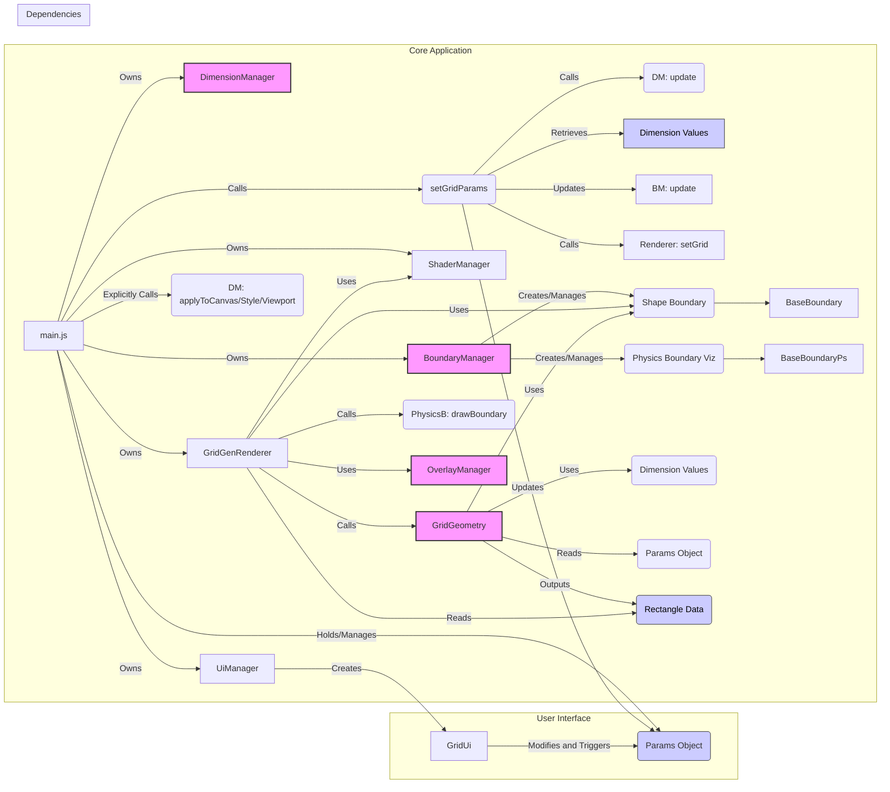
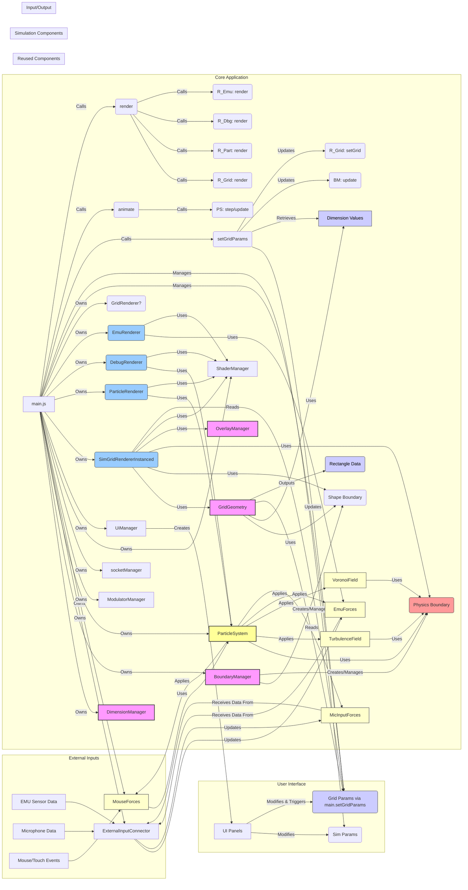

# Grid Project Architecture (`Grid/src/`)

**Objective:** This document provides a high-level overview and component breakdown of the `Grid` project, focusing on its architecture optimized for modularity and potential portability (specifically C#).

**Core Purpose:** To generate and render a 2D grid of cells efficiently using WebGL instanced drawing, driven by configurable parameters, within a dynamically sized boundary (circular or rectangular). It also includes capabilities for visualizing related data via HTML overlays and a separate physics boundary.

<strong>Key Architectural Principles:</strong>

1.  **Parameter Driven:** A central `params` object in `main.js` holds the configuration state. Changes are propagated via `main.setGridParams`, triggering updates.
2.  **Component Responsibility:** Functionality is divided into distinct managers and core classes (e.g., `DimensionManager`, `BoundaryManager`, `GridGeometry`, `GridGenRenderer`, `OverlayManager`).
3.  **Stateless Core Components:** Key calculation components (`GridGeometry`, `BoundaryManager`'s update logic) are designed to operate on passed-in dimension _values_ rather than holding internal references to a `DimensionManager` instance. `main.js` orchestrates retrieving values and passing them down. This enhances testability and portability.
4.  **Instanced Rendering:** `GridGenRenderer` uses `gl.drawArraysInstanced` for efficient rendering of potentially thousands of grid cells.
5.  **Clear Boundary Separation:** Distinct boundary systems are used:
    - **Shape Boundary:** (`coreGrid/boundary/`) Defines the grid generation area in render coordinates. Used by `GridGeometry`.
    - **Physics Boundary:** (`simulation/boundary/`) Visualizes a separate boundary, often used for physics simulation context (though physics sim is not part of this project), in normalized coordinates. Drawn by the renderer.
    

<strong>Component Breakdown:</strong>

1.  **`main.js` (Orchestrator):**

    - Entry point, initializes WebGL, managers, and default `params`.
    - Holds instances of `DimensionManager`, `BoundaryManager`, `GridGenRenderer`, `UiManager`, `ShaderManager`.
    - Manages the core `params` object.
    - `setGridParams(newParams)`: Merges UI changes into `params`, updates `DimensionManager`, `BoundaryManager`, and calls `renderer.setGrid()` to trigger updates.
    - Orchestrates passing dimension _values_ from `DimensionManager` to `BoundaryManager` and `GridGenRenderer`.
    - Applies dimension/style changes explicitly to the canvas element.

2.  **`DimensionManager` (`coreGrid/dimensionManager.js`):**

    - Calculates render dimensions (`renderWidth`, `renderHeight`, `renderScale`, etc.) based on physical dimensions (`physicalWidth`, `physicalHeight`) and `maxRenderWidth`.
    - Handles aspect ratio, clamping, and minimum dimensions.
    - Provides methods to apply dimensions to canvas (`applyToCanvas`, `applyCanvasStyle`) and set WebGL viewport (`applyViewport`) - these require context passed in.
    - `getDimensions()` provides a snapshot of calculated dimension values.

3.  **`BoundaryManager` (`coreGrid/boundaryManager.js`):**

    - Manages two boundary instances: `shapeBoundary` and `physicsBoundary`.
    - Creates appropriate boundary types (Circular/Rectangular) based on `params.screen.shape`.
    - `update(params, dimensions)`: Updates boundary parameters using the central `params` and **passed-in dimension values**.
    - Provides accessors (`getShapeBoundary()`, `getPhysicsBoundary()`).

4.  **Shape Boundaries (`coreGrid/boundary/`):**

    - `BaseBoundary`, `CircularBoundary`, `RectangularBoundary`.
    - Define `isPointInside(x, y)` based on shape geometry in render coordinates.
    - Used by `GridGeometry` for cell inclusion checks.

5.  **`GridGeometry` (`coreGrid/gridGeometry.js`):**

    - Core algorithm for generating grid cell data. **(Target for potential C# port)**.
    - `generate(params, boundary, dimensions)`: Takes parameters, the active `shapeBoundary`, and **dimension values**.
    - Iteratively calculates cell size (`stepX`, `stepY`) to meet `params.target` cell count within the boundary.
    - Uses `boundary.isPointInside` and `params.allowCut` to determine cell inclusion.
    - Outputs `rectangles` array (render coordinates, physical size) and calculated `gridParams`.

6.  **`GridGenRenderer` (`renderer/gridGenRenderer.js`):**

    - Renders the grid using instanced drawing.
    - `setGrid(config, shapeBoundary, physicsBoundary, dimensions)`: Receives config, boundaries, and **dimension values**. Updates internal state, canvas/viewport, overlays, and triggers `updateGridGeometryAndRender`.
    - `updateGridGeometryAndRender()`: Calls `gridGeometry.generate()`.
    - `updateRenderables()`: Clears canvas, prepares instance data, draws instances, calculates projection matrix (based on canvas size), draws physics boundary visualization (using `physicsBoundary.drawBoundary`), updates overlays.
    - `prepareInstanceData()`: Takes `rectangles` from `GridGeometry`, calculates instance matrices/colors/shadow params, uploads to GPU buffers.
    - `renderCellsInstanced()`: Sets up `gridCell` shader and attributes, calls `gl.drawArraysInstanced`.

7.  **`OverlayManager` (`overlays/overlayManager.js`):**

    - Manages HTML overlays (divs) for cell indices, centers, and counts.
    - Handles positioning relative to the canvas using render vs. canvas dimensions.
    - `updateDimensions()` correctly resizes overlays based on actual canvas pixel size.

8.  **`ShaderManager` (`shader/shaderManager.js`):**

    - Standard utility for loading, compiling, linking, and managing WebGL shader programs (`gridCell`, `circle`, `rectangle`).

9.  **UI (`uiManager.js`, `panels/gridUi.js`):**

    - `UiManager` initializes `lil-gui`.
    - `GridUi` provides controls that directly modify `main.params` and trigger `main.setGridParams()`.

10. **Physics Boundaries (`simulation/boundary/`):**

    - `BaseBoundaryPs`, `CircularBoundaryPs`, `RectangularBoundaryPs`, `BoundaryPsUtils`.
    - Define physics boundary logic (collision resolution - unused here) and drawing logic (used by renderer). Operates in normalized \[0, 1] space but draws using `DimensionManager` for coordinate mapping.

    

**Visual Tree (Mermaid Syntax):**

# Sim Project Architecture (`Sim/src/`) PreMigration

**Objective:** This document outlines the architecture of the `Sim` project, a WebGL2-based fluid simulation using the FLIP method, emphasizing its interaction with external inputs and its reuse of core components from the `Grid` project.

**Core Purpose:** To simulate and render real-time, particle-based fluid dynamics within a configurable boundary, influenced by various forces (turbulence, Voronoi, mouse interaction, external EMU sensors, microphone input). It leverages the `Grid` project's components for dimension management, boundary definition, background grid rendering, and overlays, while adding specialized simulation and rendering layers.

<strong>Key Architectural Principles:</strong>

1.  **Simulation Core:** `ParticleSystem` encapsulates the FLIP simulation logic, managing particle states, velocity grids, and applying forces.
2.  **Component Reuse:** Leverages `DimensionManager`, `BoundaryManager` (including its physics boundary), `GridGeometry`, and `OverlayManager` from the `coreGrid/` and `overlays/` directories (presumably shared or copied from the `Grid` project) for foundational setup.
3.  **Layered Rendering:** Employs multiple renderers for distinct visual elements: `SimGridRendererInstanced` (background grid), `ParticleRenderer` (fluid particles), `DebugRenderer` (simulation grid/vectors), and `EmuRenderer` (external input visualization).
4.  **Force Abstraction:** Various forces influencing the simulation (`TurbulenceField`, `VoronoiField`, `MouseForces`, `EmuForces`, `MicInputForces`) are implemented as separate modules, applied by the `ParticleSystem`.
5.  **Physics Boundary Integration:** The `physicsBoundary` instance managed by `BoundaryManager` is critical, defining the simulation domain for `ParticleSystem` and constraining forces like `TurbulenceField` and `VoronoiField`.
6.  **Centralized Input:** `ExternalInputConnector` manages inputs from EMU sensors and microphones, directing data to `EmuForces` and `MicForces`. Mouse interaction is handled separately by `MouseForces`.
7.  **Orchestration:** `main.js` initializes all components, manages the main `animate`/`render` loop, handles parameter updates (for both grid and simulation), and coordinates data flow between managers, simulation, and renderers.
8.  **Networking:** Includes `socketManager` for potential real-time communication (details of usage not fully evident from `main.js` alone).

<strong>Component Breakdown:</strong>

9.  **`main.js` (Orchestrator):**

    - Entry point, initializes WebGL, managers, simulation, renderers, forces, inputs, UI, and network components.
    - Holds instances of core components (`DimensionManager`, `BoundaryManager`, `ParticleSystem`, various renderers/forces, `UiManager`, `ShaderManager`, `ExternalInputConnector`).
    - Manages `gridParams` (reused from `Grid` pattern) for background grid configuration via `setGridParams`.
    - Manages simulation parameters (likely via `UiManager` interacting with `ParticleSystem` and force components).
    - Runs the main `animate` (simulation step) and `render` (drawing) loop.
    - Handles window resizing, updating `DimensionManager` and propagating changes.
    - Connects components (e.g., passes `physicsBoundary` to `ParticleSystem` and forces).

10. **`DimensionManager` (`coreGrid/dimensionManager.js`):**

    - (Reused from `Grid`) Calculates render dimensions based on physical/window size and constraints.
    - Provides dimension values used by `BoundaryManager`, renderers, and potentially simulation components.

11. **`BoundaryManager` (`coreGrid/boundaryManager.js`):**

    - (Reused from `Grid`) Manages `shapeBoundary` (for background grid generation) and `physicsBoundary`.
    - `update()` updates boundaries based on `gridParams` and dimension values.
    - Crucially provides the `physicsBoundary` instance to the `ParticleSystem` and several force generators.

12. **`ParticleSystem` (`simulation/core/particleSystem.js`):**

    - Core FLIP simulation engine.
    - Manages particle positions, velocities, and simulation grid.
    - Applies forces (gravity, turbulence, Voronoi, mouse, EMU, mic).
    - Handles particle-boundary interactions using the provided `physicsBoundary`.
    - Likely contains methods like `step()` or `update()` called in `main.js`'s `animate` loop.

13. **Force Generators (`simulation/forces/`):**

    - `TurbulenceField`, `VoronoiField`: Generate vector fields influencing particle velocity, constrained by `physicsBoundary`.
    - `MouseForces`: Translates mouse movements/clicks into forces applied to particles.
    - `EmuForces`: Applies forces based on data received from external EMU sensors via `ExternalInputConnector`.
    - `MicInputForces`: Applies forces based on microphone input level via `ExternalInputConnector`.

14. **Renderers (`renderer/`):**

    - `SimGridRendererInstanced`: Renders the background grid using instanced drawing, based on `GridGeometry` output. Integrates masking using `physicsBoundary`.
    - `ParticleRenderer`: Renders the fluid particles (likely points or sprites).
    - `GridRenderer`: (Potentially legacy or simpler grid renderer, role might overlap/be replaced by `SimGridRendererInstanced`).
    - `DebugRenderer`: Visualizes simulation data (e.g., velocity grid, particle vectors).
    - `EmuRenderer`: Visualizes the state or input from the EMU sensors.

15. **`GridGeometry` (`coreGrid/gridGeometry.js`):**

    - (Reused from `Grid`) Generates the vertex data for the background grid cells based on `gridParams`, `shapeBoundary`, and dimensions.

16. **`OverlayManager` (`overlays/overlayManager.js`):**

    - (Reused from `Grid`) Manages HTML overlays for displaying information (e.g., cell indices - although flags might disable them in `Sim`).

17. **Input Components (`input/`):**

    - `ExternalInputConnector`: Listens for EMU/Mic data (likely via WebSockets or other means) and updates `EmuForces`/`MicForces`.
    - `ModulatorManager`: Purpose unclear from `main.js`, potentially related to modulating input signals.

18. **Networking (`network/socketManager.js`):**

    - Handles WebSocket connections for potential external control or data synchronization.

19. **UI (`ui/uiManager.js`, `panels/...`):**

    - `UiManager` initializes `lil-gui`.
    - UI panels provide controls to modify `gridParams` (via `main.setGridParams`) and simulation parameters (likely interacting directly with `ParticleSystem`, forces, etc.).

20. **`ShaderManager` (`shader/shaderManager.js`):**

    - (Standard Utility) Manages loading, compiling, and linking WebGL shader programs used by the various renderers.

    

**Visual Tree (Mermaid Syntax):**

