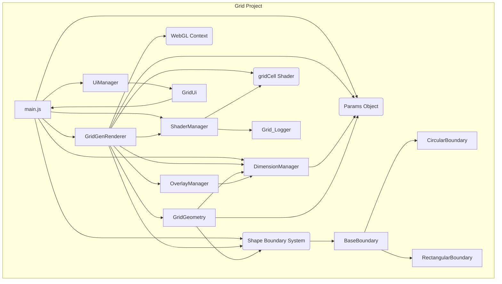

# Architecture: Grid (Template - Verified 2024-08-03)

**Purpose:** Definitive state and principles of the `Grid` project, serving as the template for migration.

**Core Principles:**

- **Stateless Components:** Components receive necessary state via method parameters (e.g., `dimensions`, `gridConfig`) rather than relying heavily on internal state set at construction.
- **Clear Dependencies:** Dependencies are managed explicitly (either injected or instantiated internally where appropriate).
- **Decoupled Rendering:** Visual boundary rendering is separated (`boundaryRenderer`), Grid rendering (`gridGenRenderer`).
- **Centralized Configuration:** Master `gridParams` object owned by `Main`.
- **Modern JS:** Uses ES6 classes, modules, `const`/`let`.
- **Event-Driven Communication:** Utilizes a singleton `eventBus` provided by `util/eventManager.js` for decoupled communication between components. Components subscribe to events relevant to their function. Key event flows include:
  - `uiControlChanged` (Payload: `{paramPath, value}`): Emitted by UI panels (`newGridUi.js`). Subscribed by `Main` to update the central `gridParams` object.
  - `gridParamsUpdated` (Payload: `{gridParams, dimensions}`): Emitted by `Main` after `gridParams` state is updated (incorporating dimension changes). Subscribed by various components (`UiManager`, `BoundaryManager`, `GridGenRenderer`, `BoundaryRenderer`) to trigger necessary updates based on the new state.

**Key Components & State:**

- **`main.js`:** Entry point. Owns the master `gridParams` object. Creates core managers and renderers. Subscribes to `uiControlChanged` via `eventBus` to receive UI updates. Calls `dimensionManager.checkAndApplyDimensionChanges`. Emits `gridParamsUpdated` via `eventBus` to notify components of state changes.
- **`coreGrid/`:**
  - `dimensionManager.js`: Manages dimensions. Instantiated by `Main`.
  - `boundaryManager.js`: Manages boundaries. Instantiated by `Main`. Subscribes to `gridParamsUpdated`.
  - `gridGeometry.js`: Generates grid cells. Instantiated internally by `GridGenRenderer`.
  - `boundary/`: Shape boundary definitions.
- **`renderer/`:**
  - `gridGenRenderer.js`: Instanced grid renderer. Instantiated by `Main`, receives `dimensionManager`, `boundaryManager`. Subscribes to `gridParamsUpdated`.
  - `baseRenderer.js`: Minimal base class.
  - `boundaryRenderer.js`: DOM-based physics boundary renderer. Instantiated by `Main`, receives `boundaryManager`, `canvas`. Subscribes to `gridParamsUpdated`.
- **`overlays/`:**
  - `overlayManager.js`: Manages DOM overlays. Instantiated internally by `GridGenRenderer`.
- **`simulation/boundary/`:** Physics boundary definitions.
- **`shader/`:** Shader manager and source.
- **`ui/`:**
  - `uiManager.js`: Manages UI panels (e.g., creating `newGridUi`). Subscribes to `gridParamsUpdated` via `eventBus` to update UI elements based on state changes.
  - `panels/newGridUi.js`: Specific UI panel for controlling grid parameters. Emits `uiControlChanged` via `eventBus` when a control value changes.
- **`util/eventManager.js`:** Provides the singleton `eventBus` instance used throughout the application for event-based communication.

```mermaid
graph LR
    subgraph "Grid Project Architecture"

        %% Core State & Managers
        Grid_Main["main.js (Entry Point)"] -- Owns --> Grid_Params["gridParams (Master State)"]
        Grid_Main -- Creates --> Grid_DimensionManager[DimensionManager]
        Grid_Main -- Creates --> Grid_BoundaryManager[BoundaryManager]
        Grid_Main -- Creates --> Grid_ShaderManager[ShaderManager]
        Grid_Main -- Creates --> Grid_UiManager[UiManager]
        Grid_Main -- Creates --> Grid_GridGenRenderer[GridGenRenderer]
        Grid_Main -- Creates --> Grid_BoundaryRenderer[BoundaryRenderer]

        %% Event Bus Hub
        Grid_EventBus[(eventBus - Singleton @ util/eventManager.js)]

        %% UI -> Main Event Flow
        subgraph "UI Interaction"
            Grid_GridUi[newGridUi.js] -- "Emits 'uiControlChanged' {paramPath, value}" --> Grid_EventBus
            Grid_EventBus -- "Notifies 'uiControlChanged'" --> Grid_Main
        end

        %% Main -> Components Event Flow
        subgraph "State Update Notification"
            Grid_Main -- Updates --> Grid_Params
            Grid_Main -- "Emits 'gridParamsUpdated' {gridParams, dimensions}" --> Grid_EventBus
            Grid_EventBus -- "Notifies 'gridParamsUpdated'" --> Grid_UiManager
            Grid_EventBus -- "Notifies 'gridParamsUpdated'" --> Grid_BoundaryManager
            Grid_EventBus -- "Notifies 'gridParamsUpdated'" --> Grid_BoundaryRenderer
            Grid_EventBus -- "Notifies 'gridParamsUpdated'" --> Grid_GridGenRenderer
        end

        %% Component Subscriptions & Dependencies
        Grid_Main -- "Subscribes to 'uiControlChanged'" --> Grid_EventBus
        Grid_UiManager -- "Subscribes to 'gridParamsUpdated'" --> Grid_EventBus
        Grid_BoundaryManager -- "Subscribes to 'gridParamsUpdated'" --> Grid_EventBus
        Grid_BoundaryRenderer -- "Subscribes to 'gridParamsUpdated'" --> Grid_EventBus
        Grid_GridGenRenderer -- "Subscribes to 'gridParamsUpdated'" --> Grid_EventBus

        %% Dependencies & Data Usage
        Grid_DimensionManager -- Updates --> Grid_Dimensions[Dimensions Data]
        Grid_DimensionManager -- Reads --> Grid_Params
        Grid_DimensionManager -- Interacts --> Grid_Canvas[(Canvas)]
        Grid_DimensionManager -- Interacts --> Grid_GLContext[(WebGL Context)]

        Grid_BoundaryManager -- Reads --> Grid_Params
        Grid_BoundaryManager -- Reads --> Grid_Dimensions

        Grid_GridGenRenderer -- Reads --> Grid_Params
        Grid_GridGenRenderer -- Reads --> Grid_Dimensions
        Grid_GridGenRenderer -- Uses --> Grid_DimensionManager
        Grid_GridGenRenderer -- Uses --> Grid_BoundaryManager
        Grid_GridGenRenderer -- Uses --> Grid_ShaderManager
        Grid_GridGenRenderer -- Uses --> Grid_GLContext
        Grid_GridGenRenderer -- Creates --> Grid_GridGeometry[GridGeometry]
        Grid_GridGenRenderer -- Creates --> Grid_OverlayManager[OverlayManager]

        Grid_BoundaryRenderer -- Reads --> Grid_Params
        Grid_BoundaryRenderer -- Uses --> Grid_BoundaryManager
        Grid_BoundaryRenderer -- Interacts --> Grid_Canvas

        Grid_UiManager -- Creates --> Grid_GridUi

        Grid_GridGeometry -- Reads --> Grid_Params
        Grid_GridGeometry -- Reads --> Grid_Dimensions

        Grid_OverlayManager -- Reads --> Grid_Params
        Grid_OverlayManager -- Reads --> Grid_Dimensions
        Grid_OverlayManager -- Interacts --> Grid_Canvas

        Grid_ShaderManager -- Loads --> Grid_Shaders[/shader/]
    end
```

## Component Dependency Diagrams (Mermaid Syntax - 2024-04-06)

**Grid Project Dependencies:**

