# Architecture: Grid (Template - Verified 2024-08-03)

**Purpose:** Definitive state and principles of the `Grid` project, serving as the template for migration.

**Core Principles:**

- **Stateless Components:** Components receive necessary state via method parameters (e.g., `dimensions`, `gridConfig`) rather than relying heavily on internal state set at construction.
- **Clear Dependencies:** Dependencies are managed explicitly (either injected or instantiated internally where appropriate).
- **Decoupled Rendering:** Visual boundary rendering is separated (`boundaryRenderer`), Grid rendering (`gridGenRenderer`).
- **Centralized Configuration:** Master `gridParams` object owned by `Main`.
- **Modern JS:** Uses ES6 classes, modules, `const`/`let`.
- **Event-Driven Communication:** Uses a singleton `eventBus` (`util/eventManager.js`) for decoupled communication. Key flows:
  - `uiControlChanged` (Payload: `{paramPath, value}`): Emitted by UI panels, subscribed by `Main` to update `gridParams`.
  - `gridParamsUpdated` (Payload: `{gridParams, dimensions}`): Emitted by `Main` after state update, subscribed by `UiManager`, `BoundaryManager`, `GridGenRenderer`, `BoundaryRenderer` to trigger component updates.

**Key Components & State:**

- **`main.js`:** Entry point. Owns `gridParams`. Subscribes to `uiControlChanged`. Calls `dimensionManager.checkAndApplyDimensionChanges`, then emits `gridParamsUpdated`.
- **`coreGrid/`:**
  - `dimensionManager.js`: Manages dimensions. Instantiated by `Main`.
  - `boundaryManager.js`: Manages boundaries. Instantiated by `Main`. Subscribes to `gridParamsUpdated`.
  - `gridGeometry.js`: Generates grid cells. Instantiated internally by `GridGenRenderer`.
  - `boundary/`: Shape boundary definitions.
- **`renderer/`:**
  - `gridGenRenderer.js`: Instanced grid renderer. Instantiated by `Main`, receives `dimensionManager`, `boundaryManager`. Subscribes to `gridParamsUpdated`.
  - `baseRenderer.js`: Minimal base class.
  - `boundaryRenderer.js`: DOM-based physics boundary renderer. Instantiated by `Main`, receives `boundaryManager`, `canvas`. Subscribes to `gridParamsUpdated`.
- **`overlays/`:**
  - `overlayManager.js`: Manages DOM overlays. Instantiated internally by `GridGenRenderer`.
- **`simulation/boundary/`:** Physics boundary definitions.
- **`shader/`:** Shader manager and source.
- **`ui/`:**
  - `uiManager.js`: Manages UI panels. Subscribes to `gridParamsUpdated`.
  - `panels/newGridUi.js`: Specific UI panel. Emits `uiControlChanged`.
- **`util/eventManager.js`:** Provides singleton `eventBus`.

```mermaid
graph LR
    subgraph Grid Project
        Grid_Main[main.js] -- Owns --> Grid_Params[gridParams Object]
        Grid_Main -- Creates --> Grid_DimensionManager[DimensionManager]
        Grid_Main -- Creates --> Grid_BoundaryManager[BoundaryManager]
        Grid_Main -- Creates --> Grid_ShaderManager[ShaderManager]
        Grid_Main -- Creates --> Grid_UiManager[UiManager]
        Grid_Main -- Creates --> Grid_BoundaryRenderer[BoundaryRenderer]
        Grid_Main -- Creates --> Grid_GridGenRenderer[GridGenRenderer]

        Grid_GridGenRenderer -- Injects --> Grid_DimensionManager
        Grid_GridGenRenderer -- Injects --> Grid_BoundaryManager
        Grid_BoundaryRenderer -- Injects --> Grid_BoundaryManager

        Grid_EventBus[(eventBus)]

        Grid_GridUi[GridUi] -- Emits 'uiControlChanged' --> Grid_EventBus
        Grid_EventBus -- Notifies 'uiControlChanged' --> Grid_Main
        Grid_Main -- Updates --> Grid_Params
        Grid_Main -- Emits 'gridParamsUpdated' --> Grid_EventBus

        Grid_EventBus -- Notifies 'gridParamsUpdated' --> Grid_UiManager
        Grid_EventBus -- Notifies 'gridParamsUpdated' --> Grid_BoundaryManager
        Grid_EventBus -- Notifies 'gridParamsUpdated' --> Grid_BoundaryRenderer
        Grid_EventBus -- Notifies 'gridParamsUpdated' --> Grid_GridGenRenderer

        Grid_UiManager -- Subscribes --> Grid_EventBus
        Grid_BoundaryManager -- Subscribes --> Grid_EventBus
        Grid_BoundaryRenderer -- Subscribes --> Grid_EventBus
        Grid_GridGenRenderer -- Subscribes --> Grid_EventBus

        Grid_BoundaryManager -- Uses --> Grid_Params
        Grid_BoundaryManager -- Uses --> Grid_Dimensions(Dimensions Data)

        Grid_GridGenRenderer -- Uses --> Grid_GL(WebGL Context)
        Grid_GridGenRenderer -- Uses --> Grid_ShaderManager
        Grid_GridGenRenderer -- Uses --> Grid_Params
        Grid_GridGenRenderer -- Uses --> Grid_Dimensions(Dimensions Data)
        Grid_GridGenRenderer -- Instantiates/Uses --> Grid_GridGeometry[GridGeometry]
        Grid_GridGenRenderer -- Instantiates/Uses --> Grid_OverlayManager[OverlayManager]
        Grid_GridGenRenderer -- Uses --> Grid_BoundaryManager

        Grid_GridGeometry -- Uses --> Grid_Params
        Grid_GridGeometry -- Uses --> Grid_Dimensions(Dimensions Data)

        Grid_OverlayManager -- Uses --> Grid_Canvas(Canvas Element)
        Grid_OverlayManager -- Uses --> Grid_Dimensions(Dimensions Data)
        Grid_OverlayManager -- Uses --> Grid_Params

        Grid_BoundaryRenderer -- Uses --> Grid_Canvas(Canvas Element)
        Grid_BoundaryRenderer -- Uses --> Grid_BoundaryManager
        Grid_BoundaryRenderer -- Uses --> Grid_Params

        Grid_UiManager -- Creates --> Grid_GridUi

        Grid_DimensionManager -- Calculates --> Grid_Dimensions(Dimensions Data)
        Grid_DimensionManager -- Uses --> Grid_Params
        Grid_DimensionManager -- Interacts --> Grid_Canvas(Canvas Element)
        Grid_DimensionManager -- Interacts --> Grid_GL(WebGL Context)

        Grid_ShaderManager -- Loads --> Grid_Shaders[Shaders]
    end
```

