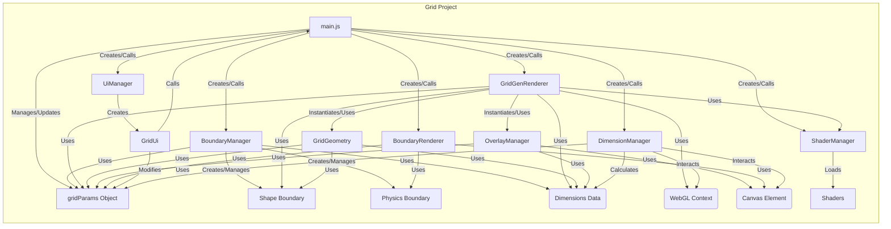

# Architecture: Grid (Template - Verified 2024-08-01)

**Purpose:** Definitive state and principles of the `Grid` project, serving as the template for migration.

**Core Principles:**

- **Stateless Components:** Components receive necessary state via method parameters (e.g., `dimensions`, `gridConfig`) rather than relying heavily on internal state set at construction.
- **Clear Dependencies:** Dependencies like `ShaderManager`, `OverlayManager`, `GridGeometry` are managed explicitly (either injected or instantiated internally where appropriate).
- **Decoupled Rendering:** Visual boundary rendering is separated into `boundaryRenderer` (DOM-based). Grid rendering (`gridGenRenderer`) focuses on instanced cell drawing.
- **Centralized Configuration:** Uses `gridConfig` object for parameters.
- **Modern JS:** Uses ES6 classes, modules, `const`/`let`.

**Key Components & State:**

- **`main.js`:** Entry point, orchestrates component creation and updates.
- **`coreGrid/`:**
  - `dimensionManager.js`: Manages physical vs. render dimensions, aspect ratio, scaling.
  - `boundaryManager.js`: Manages `shapeBoundary` (visual, render coords) and `physicsBoundary` (simulation, normalized coords). Creates/updates boundaries based on config.
  - `gridGeometry.js`: Generates grid cell rectangles based on `gridConfig`, `shapeBoundary`, and `dimensions`. Stateless `generate` method.
  - `boundary/`: Contains `baseBoundaryShape.js`, `circularBoundaryShape.js`, `rectangularBoundaryShape.js` (visual grid boundary definitions).
- **`renderer/`:**
  - `gridGenRenderer.js`: Efficient instanced grid renderer. Takes `gridConfig`, boundaries, dimensions via `setGrid`. Uses `GridGeometry` and `OverlayManager` internally. _Current state: Uniform cell color._
  - `baseRenderer.js`: Minimal base class holding `gl` and `shaderManager`.
  - `boundaryRenderer.js`: Renders physics boundary using DOM elements, positioned relative to canvas.
- **`overlays/`:**
  - `overlayManager.js`: Manages DOM overlays (text, cell centers) positioned over the canvas. Takes `dimensions` for updates. Uses `getBoundingClientRect` for accurate positioning.
- **`simulation/boundary/`:**
  - Contains physics boundary definitions (`baseBoundaryPs.js`, `circularBoundaryPs.js`, `rectangularBoundaryPs.js`, `boundaryPsUtils.js`). No direct drawing logic.
- **`shader/`:**
  - `shaderManager.js`: Simplified manager. Loads shaders from JS modules.
  - `shaders/`: Contains `gridCell.js`, `particles.js` (shader source embedded in JS).
- **`ui/`, `util/`, `visualization/`:** Present but not deeply analyzed in this phase.

