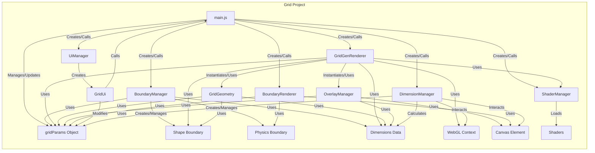

# Grid Project Architecture

_Date: 2024-08-01_

This document summarizes the key architectural decisions, refactoring outcomes, and design principles established during the `Grid` project development and analysis (`notebook.md`).

**Core Principles & Verified State of `Grid/src`:**

1.  **Stateless Component Interactions (Passing Values):** Components interact by passing data values (e.g., dimension objects) rather than holding references to stateful manager instances.

    - _Focus: C# Refactor (Promotes portability)_
    - _Verified:_ `DimensionManager`, `BoundaryManager`, `GridGenRenderer` interactions follow this pattern.

2.  **Centralized, Nested Parameter Management:** A single `gridParams` object in `main.js` holds configuration, organized with nested sub-objects (`gridSpecs`, `shadow`, `flags`, `renderSize`). Calculated/runtime stats are sourced from components, not stored in `gridParams`.

    - _Focus: C# Refactor (Simplifies state management)_
    - _Verified:_ `main.js` and `GridUi` reflect this structure.

3.  **Decoupled Boundary Scaling:** The scaling of the `shapeBoundary` (used for grid generation) is fixed at 1.0. The `physicsBoundary` scales independently based on `gridParams.gridSpecs.scale`, including smooth aspect ratio adjustments.

    - _Focus: JS Only (Enables visualization outside canvas)_
    - _Verified:_ `BoundaryManager` implements this logic.

4.  **DOM-based Physics Boundary Visualization:** The `physicsBoundary` is visualized using a styled DOM `div` (`BoundaryRenderer`), allowing it to extend beyond the canvas edges. WebGL drawing for this boundary is removed.

    - _Focus: JS Only (Enables visualization outside canvas)_
    - _Verified:_ `BoundaryRenderer` exists and is used; `GridGenRenderer` and physics boundary classes lack WebGL draw calls for it.

5.  **Simplified and Externally Loaded Shaders:** Only essential shaders (`gridCell`, `circle`, `rectangle`) remain. They are loaded dynamically from external `.js` files by `ShaderManager`, eliminating inline definitions and unused shaders.

    - _Focus: Clean & Simple; Standardized Loading_
    - _Verified:_ `ShaderManager` and `shader/shaders/` directory reflect this.

6.  **Efficient Instanced Rendering:** The core grid visualization uses WebGL instanced rendering (`gl.drawArraysInstanced` with the `gridCell` shader) for performance.

    - _Focus: Performance_
    - _Verified:_ `GridGenRenderer` implements this.

7.  **Clear Component Responsibilities:** Functionality is divided into distinct, well-defined components (`DimensionManager`, `BoundaryManager`, `GridGeometry`, `OverlayManager`, `BoundaryRenderer`, `GridGenRenderer`, `ShaderManager`).

    - _Focus: C# Refactor (Aids understanding and porting)_
    - _Verified:_ Project structure and `main.js` orchestration reflect this.

8.  **Correct Overlay Positioning:** HTML overlays (`OverlayManager`) are accurately positioned and scaled relative to grid cells by using `canvas.getBoundingClientRect()` to account for differences between canvas attributes and actual render size.

    - _Focus: Tricky but Necessary (Ensures UI fidelity)_
    - _Verified:_ `OverlayManager` uses the correct calculation.

9.  **CSS-Driven Static Styling:** Static visual presentation is primarily handled via external CSS files and classes, minimizing inline styles in JavaScript.

    - _Focus: Clean & Simple_
    - _Verified:_ `ui/css/` directory structure and JS files show CSS class usage.

10. **Cleaned-Up Commenting Style:** Code comments focus on explaining the "why" of non-obvious logic, avoiding redundant explanations of the "what". Outdated comments have been removed.
    - _Focus: Readability & Maintainability_
    - _Verified:_ Codebase generally adheres to the established protocol.

**Conclusion:** The `Grid/src` codebase is confirmed to be a stable, refined, and portable implementation reflecting these principles, ready to serve as the template for the `Sim` migration.

