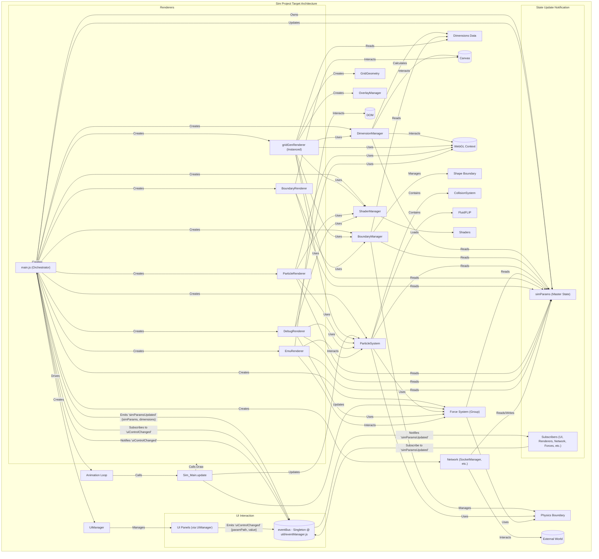

# Architecture: Sim (Pre-Migration State - 2024-08-01)

This document describes the Sim project's characteristics and the strategy for migrating the Grid rendering system into it.

## Sim Project Characteristics & Migration Strategy

**Key `Sim` Characteristics (Pre-Migration):**

- **Simulation Core:** Rich particle physics (`ParticleSystem`, `CollisionSystem`, `FluidFLIP`).
- **Force System:** Extensive forces (`TurbulenceField`, `VoronoiField`, `GravityForces`, `MouseForces`, `EmuForces`, `MicInputForces`).
- **Rendering:** Multiple specialized renderers (`ParticleRenderer`, `GridRenderer`, `DebugRenderer`, `EmuRenderer`) driven by a continuous `requestAnimationFrame` loop. Current `GridRenderer` is inefficient (per-cell draw) and has hardcoded boundary logic.
- **Boundary System:** Physics-focused boundary classes (`BaseBoundary`, `CircularBoundary`, `RectangularBoundary`) used for particle collision/wrapping.
- **UI:** Comprehensive `lil-gui` based system (`UiManager`, panels) controlling individual simulation components.
- **Network:** WebSocket integration (`SocketManager`, `ExternalInputConnector`) for external control and data.
- **Parameters:** Configuration is often distributed or hardcoded, lacking a central `params` object for grid/rendering.

**Migration & Refactoring Strategy (Grid -> Sim):**

1.  **Goals:**
    - Replace `Sim/src/renderer/gridRenderer.js` with an efficient, instanced renderer based on the refactored `Grid/src` system.
    - Maintain functional equivalence of the core grid cell geometry calculation for future C# porting.
    - Integrate cleanly with `Sim`'s existing physics, UI, and animation loop.
2.  **Core Component Integration:**
    - Introduce `Grid`-like `DimensionManager`, `GridGeometry`, `coreGrid/boundary` (shape boundary), `OverlayManager`, and `ShaderManager` (or consolidate `Sim`'s existing one) into `Sim`'s structure.
    - Create a new `SimGridRendererInstanced` class based on `Grid/src/renderer/gridGenRenderer.js`.
3.  **Parameter Management:**
    - Introduce a dedicated `gridParams` object within `Sim` (likely managed by `main.js`) to configure the new grid system, mirroring the structure used in `Grid/src`.
4.  **Renderer Development (`SimGridRendererInstanced`):**
    - Adapt constructor and update methods to integrate with `Sim`'s `main.js` and animation loop.
    - Use `Sim`'s existing physics boundary (`simulation/boundary/`) for any necessary physics interactions, not the boundary system from `Grid/src/simulation/boundary/`.
    - **Crucially:** Adapt the `GridGeometry` component (or create a `SimGridGeometry` subclass/wrapper) to ensure its output matches the cell geometry generated by the original `Sim/src/renderer/gridRenderer.js::generateRectangles`, particularly regarding coordinate space, scaled radius for classification, and explicit filtering of 'outside' cells.
5.  **UI Integration:**
    - Create a new `GridUi` panel within `Sim`'s `UiManager` to control the new `gridParams` object.
6.  **Deprecation Decisions:**
    - `debugRenderer.js`: **Keep** for its unique debug views.
    - `gridRenderer.js`: **Keep active initially**, then **deprecate and remove** once `SimGridRendererInstanced` is fully functional and validated, potentially including integration for visualizing particle density if required.

# Architecture: Sim (Target State - Pre-Migration)

**Purpose:** Outline the target architecture for the `Sim` project after migrating components from the `Grid` template.

**Core Principles (Inherited from Grid):**

- **Stateless Components:** Components receive necessary state via method parameters.
- **Clear Dependencies:** Explicit dependency management.
- **Decoupled Rendering:** Separation of grid, boundary, and potentially particle rendering.
- **Centralized Configuration:** Use of `gridParams` (or equivalent) object, potentially expanded for simulation-specific needs (`simParams`).
- **Modern JS:** ES6 classes, modules, `const`/`let`.
- **Event-Driven Communication:** Utilizes a singleton `eventBus` provided by `util/eventManager.js` for decoupled communication between components. Components subscribe to events relevant to their function. Key event flows include:
  - `uiControlChanged` (Payload: `{paramPath, value}`): Emitted by various UI panels. Subscribed by `Main` to update the central `simParams` object.
  - `simParamsUpdated` (Payload: `{simParams, dimensions}`): Emitted by `Main` after `simParams` state is updated. Subscribed by various components (`UiManager`, renderers, potentially forces, `SocketManager`) to trigger updates.
  - Potential network/external input events managed via `eventBus`.

**Key Components & Target State:**

- **`main.js`:** Orchestrates `Grid` components, `ParticleSystem`, specific `Sim` renderers, forces, network, and UI. Owns the master `simParams` object. Subscribes to `uiControlChanged`. Emits `simParamsUpdated`.
- **`coreGrid/` (Migrated from Grid):**
  - `dimensionManager.js`
  - `boundaryManager.js`
  - `gridGeometry.js`
  - `boundary/` (Shape boundaries)
- **`renderer/`:**
  - `gridGenRenderer.js` (Migrated from Grid): Target for core grid rendering. **Needs adaptation** to accept and visualize data from `ParticleSystem` (likely via a refactored `gridRenderModes.js` or similar data provider).
  - `baseRenderer.js` (Migrated from Grid): Minimal base class.
  - `boundaryRenderer.js` (Migrated from Grid): Handles physics boundary visualization via DOM.
  - `particleRenderer.js` (Existing Sim): Remains for rendering particles directly.
  - `debugRenderer.js` (Existing Sim): Remains for specific debug overlays (velocity field, etc.).
  - `emuRenderer.js` (Existing Sim): Remains for Emu-specific rendering.
  - `gridRenderModes.js` (Refactored Sim): Adapted from legacy `LEGACY_gridRenderModes.js` to interface with `gridGenRenderer` and `ParticleSystem`, providing data for visualization.
- **`overlays/`:**
  - `overlayManager.js` (Migrated from Grid): Manages DOM overlays.
- **`simulation/core/` (Existing Sim):**
  - `particleSystem.js`: Core simulation engine. Needs integration with migrated `Grid` components (e.g., receive boundaries from `BoundaryManager`).
  - `fluidFLIP.js`: FLIP simulation component.
- **`simulation/boundary/` (Migrated from Grid):**
  - Contains physics boundary definitions (`*Ps.js` files).
- **`shader/` (Migrated from Grid Structure):**
  - `shaderManager.js` (Grid version): Manages shaders.
  - `shaders/`: Contains JS modules for shaders (`gridCell.js`, potentially adapted `particles.js`, and shaders needed for `particleRenderer`, `debugRenderer`, etc.).
- **`input/`, `network/`, `presets/`, `sound/`, `ui/`, `util/` (Existing Sim):** Retained, interfaces potentially updated for migrated components and event bus integration (e.g., `UiManager` subscribes to `simParamsUpdated`, `SocketManager` may subscribe/emit events).

**Key Migration Tasks:**

1.  Replace `Sim`'s missing/legacy `coreGrid`, `overlays`, `simulation/boundary`, and `shader` components with the `Grid` versions.
2.  Integrate `ParticleSystem` with the migrated `Grid` components (`BoundaryManager`, etc.).
3.  Adapt `gridGenRenderer` to consume data from `ParticleSystem` for visualization (requiring a refactored `gridRenderModes` or equivalent data provider).
4.  Update `main.js` to instantiate and connect the migrated components correctly.
5.  Ensure existing `Sim` renderers (`particleRenderer`, `debugRenderer`) function correctly with the new structure (e.g., using the migrated `ShaderManager`).

## Core Components & Dependencies

- **`main.js`**: Entry point, orchestrates initialization, main loop.
  - Dependencies: `ShaderManager`, `DimensionManager`, `BoundaryManager`, `ParticleSystem`, `GridGenRenderer`, `ParticleRenderer`, `BoundaryRenderer`, `UiManager`, `ExternalInputConnector`, etc.
  - Manages global state objects: `gridParams`, `simParams`, `debugFlags`.
- **`DimensionManager`**: Manages canvas physical and render dimensions.
  - Dependencies: `gridParams.screen`, `gridParams.renderSize`.
- **`BoundaryManager`**: Manages `ShapeBoundary` (render) and `PhysicsBoundary` (simulation).
  - Dependencies: `initialgridParams`, `initialgridDimensions`, `dimensionManager`, `debugFlags`. Subscribes to `simParamsUpdated`, `gridParamsUpdated`.
- **`GridGenRenderer`**: Renders the grid based on modes.
  - Dependencies: `gl`, `shaderManager`, `gridParams`, `dimensionManager`, `boundaryManager`, `particleSystem`, `gridRenderModes`, `debugFlags`.
  - Instantiates: `GridGeometry` (requires `debugFlags`), `OverlayManager`, `Gradients` (requires `debugFlags`).
- **`ParticleRenderer`**: Renders particles.
  - Dependencies: `gl`, `shaderManager`, `debugFlags`. Subscribes to `simParamsUpdated`.
- **`BoundaryRenderer`**: Renders physics boundary using DOM overlay.
  - Dependencies: `containerElement`, `boundaryManager`, `canvasElement`, `debugFlags`. Subscribes to `simParamsUpdated`.
- **`ParticleSystem`**: Core simulation logic, manages particles and forces.
  - Dependencies: `turbulenceField`, `voronoiField`, `boundaryManager`, `simParams`, `mouseForces`.
- **`UiManager`**: Handles UI creation and interaction (uses `lil-gui`).
  - Dependencies: `main` instance (for `simParams`, `gridParams`, `debugFlags`).
  - Instantiates: `PresetManager` (requires UI components, `debugFlags`), various UI panels.
  - Panels: `SimUi`, `GridUi`, `DebugUi`, `PresetsUi`, `ParamUi`, etc.
- **`eventBus`**: Centralized event management.

## Key Architectural Principles

- **Dependency Injection:** Pass necessary dependencies (managers, params, `debugFlags`) during instantiation.
- **Event-Driven Updates:** Use `eventBus` (`simParamsUpdated`, `gridParamsUpdated`, `uiControlChanged`) for cross-component communication and state synchronization.
- **Parameter Objects:** Use `gridParams` and `simParams` for configuration, managed by `main.js` and updated via `eventBus`.
- **Separation of Concerns:**
  - `coreGrid`: Geometry, dimensions, boundaries (shape/render).
  - `simulation`: Physics, forces, particles, boundaries (physics).
  - `renderer`: WebGL drawing logic (grid, particles, boundaries).
  - `ui`: User interface elements.
- **Debug Flags:** Centralized `debugFlags` object in `main.js` passed down to components for conditional logging.

