# Sim Project Architecture

_Date: 2024-08-01_

This document describes the Sim project's characteristics and the strategy for migrating the Grid rendering system into it.

## Sim Project Characteristics & Migration Strategy

**Key `Sim` Characteristics (Pre-Migration):**

- **Simulation Core:** Rich particle physics (`ParticleSystem`, `CollisionSystem`, `FluidFLIP`).
- **Force System:** Extensive forces (`TurbulenceField`, `VoronoiField`, `GravityForces`, `MouseForces`, `EmuForces`, `MicInputForces`).
- **Rendering:** Multiple specialized renderers (`ParticleRenderer`, `GridRenderer`, `DebugRenderer`, `EmuRenderer`) driven by a continuous `requestAnimationFrame` loop. Current `GridRenderer` is inefficient (per-cell draw) and has hardcoded boundary logic.
- **Boundary System:** Physics-focused boundary classes (`BaseBoundary`, `CircularBoundary`, `RectangularBoundary`) used for particle collision/wrapping.
- **UI:** Comprehensive `lil-gui` based system (`UiManager`, panels) controlling individual simulation components.
- **Network:** WebSocket integration (`SocketManager`, `ExternalInputConnector`) for external control and data.
- **Parameters:** Configuration is often distributed or hardcoded, lacking a central `params` object for grid/rendering.

**Migration & Refactoring Strategy (Grid -> Sim):**

1.  **Goals:**
    - Replace `Sim/src/renderer/gridRenderer.js` with an efficient, instanced renderer based on the refactored `Grid/src` system.
    - Maintain functional equivalence of the core grid cell geometry calculation for future C# porting.
    - Integrate cleanly with `Sim`'s existing physics, UI, and animation loop.
2.  **Core Component Integration:**
    - Introduce `Grid`-like `DimensionManager`, `GridGeometry`, `coreGrid/boundary` (shape boundary), `OverlayManager`, and `ShaderManager` (or consolidate `Sim`'s existing one) into `Sim`'s structure.
    - Create a new `SimGridRendererInstanced` class based on `Grid/src/renderer/gridGenRenderer.js`.
3.  **Parameter Management:**
    - Introduce a dedicated `gridParams` object within `Sim` (likely managed by `main.js`) to configure the new grid system, mirroring the structure used in `Grid/src`.
4.  **Renderer Development (`SimGridRendererInstanced`):**
    - Adapt constructor and update methods to integrate with `Sim`'s `main.js` and animation loop.
    - Use `Sim`'s existing physics boundary (`simulation/boundary/`) for any necessary physics interactions, not the boundary system from `Grid/src/simulation/boundary/`.
    - **Crucially:** Adapt the `GridGeometry` component (or create a `SimGridGeometry` subclass/wrapper) to ensure its output matches the cell geometry generated by the original `Sim/src/renderer/gridRenderer.js::generateRectangles`, particularly regarding coordinate space, scaled radius for classification, and explicit filtering of 'outside' cells.
5.  **UI Integration:**
    - Create a new `GridUi` panel within `Sim`'s `UiManager` to control the new `gridParams` object.
6.  **Deprecation Decisions:**
    - `debugRenderer.js`: **Keep** for its unique debug views.
    - `gridRenderer.js`: **Keep active initially**, then **deprecate and remove** once `SimGridRendererInstanced` is fully functional and validated, potentially including integration for visualizing particle density if required.

```mermaid
graph LR
    subgraph Sim Project Target State
        Sim_Main[main.js] -- Manages --> Sim_AnimationLoop[Animation Loop]
        Sim_Main[main.js] -- Manages --> Sim_GridParams[gridParams Object]
        Sim_Main[main.js] -- Creates/Configures --> Sim_CoreSystems

        subgraph Sim_CoreSystems
            direction LR
            Sim_Main -- Creates --> Sim_DimensionManager[DimensionManager]
            Sim_Main -- Creates --> Sim_BoundaryManager[BoundaryManager]
            Sim_Main -- Creates --> Sim_ShaderManager[ShaderManager]
            Sim_Main -- Creates --> Sim_UiManager[UiManager]
            Sim_Main -- Creates --> Sim_ParticleSystem[ParticleSystem]
            Sim_Main -- Creates --> Renderers_Group[Renderers]
            Sim_Main -- Creates --> ForceSystem_Group[Force System]
            Sim_Main -- Creates --> Sim_ExternalInputConnector[ExternalInputConnector]
        end

        subgraph Renderers_Group[Renderers]
        end

        subgraph ForceSystem_Group[Force System]
        end

        subgraph UI_Group [UI Panels]
        end

        Sim_AnimationLoop -- Calls --> Sim_Main.render

        Sim_Main.render -- Updates --> ForceSystem_Group
        Sim_Main.render -- Updates --> Sim_ParticleSystem
        Sim_Main.render -- Calls Draw --> Sim_SimGridRendererInstanced[SimGridRendererInstanced]
        Sim_Main.render -- Calls Draw --> Sim_ParticleRenderer[ParticleRenderer]
        Sim_Main.render -- Calls Draw --> Sim_DebugRenderer[DebugRenderer]
        Sim_Main.render -- Calls Draw --> Sim_EmuRenderer[EmuRenderer]

        Sim_DimensionManager -- Calculates --> Sim_Dimensions[Dimensions Data]
        Sim_DimensionManager -- Uses --> Sim_GridParams

        Sim_BoundaryManager -- Manages --> Sim_ShapeBoundary[Shape Boundary]
        Sim_BoundaryManager -- Manages --> Sim_PhysicsBoundary[Physics Boundary]
        Sim_BoundaryManager -- Uses --> Sim_GridParams
        Sim_BoundaryManager -- Uses --> Sim_Dimensions[Dimensions Data]

        Sim_ParticleSystem -- Uses --> Sim_PhysicsBoundary
        Sim_ParticleSystem -- Uses --> ForceSystem_Group
        Sim_ParticleSystem -- Uses --> Sim_GridParams
        Sim_ParticleSystem -- Contains --> Sim_CollisionSystem[CollisionSystem]
        Sim_ParticleSystem -- Contains --> Sim_FluidFLIP[FluidFLIP]

        ForceSystem_Group -- Interact --> Sim_ParticleSystem
        ForceSystem_Group -- Use --> Sim_PhysicsBoundary
        ForceSystem_Group -- Use --> Sim_GridParams

        Sim_UiManager -- Manages --> UI_Group
        Sim_UiManager -- Creates --> Sim_SimGridUi[SimGridUi]
        Sim_UiManager -- Creates --> Sim_ExistingPanels[Existing Sim Panels]

        UI_Group -- Modifies --> Sim_GridParams
        UI_Group -- Modifies --> ForceSystem_Group
        UI_Group -- Modifies --> Sim_ParticleSystem
        UI_Group -- Modifies --> Sim_BoundaryManager

        Sim_ExternalInputConnector -- Connects --> Sim_SocketManager[SocketManager]
        Sim_ExternalInputConnector -- Routes To --> ForceSystem_Group

        Sim_SimGridRendererInstanced -- Uses --> Sim_GL[WebGL Context]
        Sim_SimGridRendererInstanced -- Uses --> Sim_ShaderManager
        Sim_SimGridRendererInstanced -- Uses --> Sim_GridParams
        Sim_SimGridRendererInstanced -- Uses --> Sim_Dimensions[Dimensions Data]
        Sim_SimGridRendererInstanced -- Contains --> Sim_GridGeometry[GridGeometry]
        Sim_SimGridRendererInstanced -- Contains --> Sim_OverlayManager[OverlayManager]
        Sim_SimGridRendererInstanced -- Uses --> Sim_ShapeBoundary
        Sim_SimGridRendererInstanced -- Uses --> Sim_ParticleSystem

        Sim_ParticleRenderer -- Uses --> Sim_GL
        Sim_ParticleRenderer -- Uses --> Sim_ShaderManager
        Sim_ParticleRenderer -- Uses --> Sim_ParticleSystem

        Sim_ShaderManager -- Loads --> Sim_Shaders[Shaders List]
    end
```

