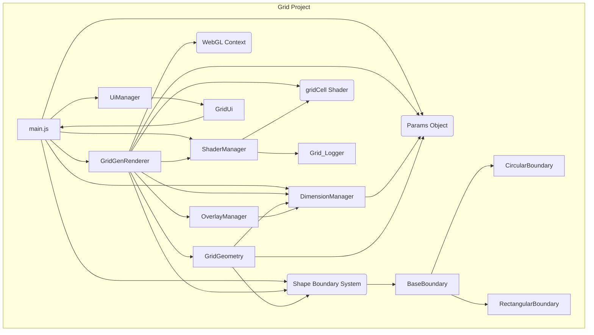
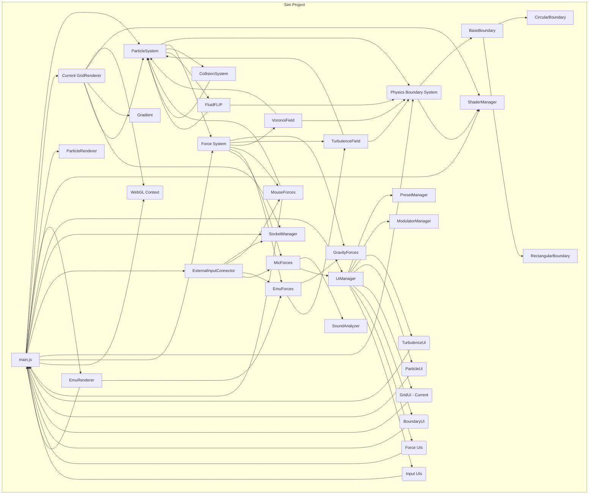

# AI Collaboration Notebook

**Purpose:** This file serves as a persistent scratchpad and log for the ongoing development process between the USER and the AI assistant (operating under RIPER-5 protocol).

**Contents:**

- **Observations:** Detailed findings from code analysis (THINK mode).
- **Brainstorming:** Potential approaches, pros/cons discussed (THINK+ mode).
- **Decisions:** Rationale for chosen strategies.
- **Contextual Notes:** Any relevant information to maintain context across sessions.

**Format:** Use standard markdown. Timestamp entries when helpful.

---

## Analysis: `Sim/src/main.js` vs `Grid/src/main.js` (2024-04-05)

**Objective:** Identify key differences in initialization, structure, and rendering to inform synchronization plan.

**`Grid/src/main.js` Observations:**

1.  **Initialization:** Separates sync setup (constructor) from async (`init`). GL context includes `antialias`. Uses central `params` object, loads/saves from localStorage. Calls `updateCanvasDimensions`. `init` loads shaders, creates `GridGenRenderer`, `UiManager`. Rendering seems event-driven (via `setGridParams`).
    interacts via `main.setGridParams`.
2.  **Params:** Central `params` object drives configuration. `setGridParams` propagates changes. Handles localStorage persistence.
3.  **Rendering:** Encapsulated in `GridGenRenderer`. Triggered by `updateGrid` or `setGridParams`. No `requestAnimationFrame` loop in `main.js`.

**`Sim/src/main.js` Observations:**

1.  **Initialization:** Most instantiation happens in constructor. GL context `stencil` only. Boundary type hardcoded. Instantiates forces, `ParticleSystem`, multiple renderers (`ParticleRenderer`, `GridRenderer`, `DebugRenderer`, `EmuRenderer`), input handlers directly. Direct component connections. `init` loads shaders, gets `audioAnalyzer`, creates `UiManager`, starts `animate` loop.
2.  **Structure:** Many imports across simulation, rendering, input, etc. `Main` holds many direct component references. Dependencies often set directly on instances.
3.  **Params:** No central `params` object visible in `main.js`; config seems distributed/hardcoded.
4.  **Rendering:** Continuous `requestAnimationFrame` loop (`animate` -> `render`). `render` method orchestrates force updates, `particleSystem.step()`, and calls `draw` on multiple renderers.
5.  **Other:** Uses `console.log`. No explicit canvas dimension logic in `main.js`.

**Key Differences & Potential Synchronization Actions:**

1.  **Initialization Flow:** `Grid`'s separation is cleaner. _Action: Consider refactoring Sim's init._
2.  **Parameter Management:** `Grid` uses central `params`. `Sim` is distributed. _Action: Introduce central `params` object in `Sim`._
3.  **Rendering Loop:** `Grid` event-driven, `Sim` continuous loop. _Action: Keep Sim's loop but integrate grid updates based on `Grid`'s approach._
4.  **Renderer Structure:** `Grid` (1 main), `Sim` (multiple). _Action: Replace `Sim`'s `GridRenderer` with one based on `GridGenRenderer`, adapt interface (e.g., `updateGrid(params)` vs `draw(particleSystem)`)._
5.  **Dependencies:** `Grid` uses `params` propagation, `Sim` direct refs. _Action: Use `params` for relevant config in `Sim`._
6.  **Boundary Handling:** `Grid` param-driven, `Sim` hardcoded type. _Action: Align `Sim` boundary creation with `Grid`._
7.  **Canvas/Viewport:** `Grid` explicit `updateCanvasDimensions`. _Action: Ensure `Sim` handles this robustly, potentially adopt `Grid` logic._
8.  **Shader Management:** Different dir names (`shader`/`shaders`). _Action: Consolidate shaders; use `Grid`'s grid shaders in `Sim`._
9.  **Logging:** `Grid` used `console` (previously analyzed incorrectly). `Sim` uses `console.log`. _Action: Standardize on `console` usage._
10. **Antialiasing:** `Grid` enables, `Sim` doesn't. _Action: Enable antialiasing in `Sim`._

---

## Analysis: `Sim/src/renderer/gridRenderer.js` vs `Grid/src/renderer/gridGenRenderer.js` (2024-04-05)

**Objective:** Compare the grid rendering logic to identify differences and guide migration of `GridGenRenderer` concepts into `Sim`.

**`Sim/src/renderer/gridRenderer.js` Observations (`GridRenderer`):**

1.  **Dependencies:** Takes `gl`, `shaderManager`. Imports `BaseRenderer`, `GridRenderModes`, `Gradient`, `socketManager`.
2.  **Constructor:** Initializes hardcoded `TARGET_WIDTH`, `TARGET_HEIGHT`, `FIXED_MASK_RADIUS`. Sets up default `gridParams`. Instantiates `Gradient`, creates HTML overlay divs (`centerOverlay`, `textOverlay`) directly, inserts them into DOM. Calls `generateRectangles` (which also classifies cells based on fixed mask radius). Creates `gridMap`. Instantiates `GridRenderModes`. Connects to `socketManager`.
3.  **Core Methods:**
    - `draw(particleSystem)`: Main render loop entry. Gets density via `renderModes.getValues`, sends density data via socket. Maps density to colors using `Gradient`. Sets up stencil buffer for circular mask using `drawCircle`. Draws individual rectangles using `drawRectangle`. Manages overlay drawing.
    - `generateRectangles()`: Creates grid geometry (vertices for quads) based on `gridParams`. **Crucially, it also classifies cells ('inside', 'boundary', 'outside') based on a hardcoded circular mask radius (`FIXED_MASK_RADIUS`) during generation and filters out 'outside' cells immediately.**
    - `updateGrid(newParams)`: Updates `gridParams`, regenerates geometry (`generateRectangles`), updates `renderModes`.
    - `drawRectangle()`, `drawCircle()`: Basic WebGL drawing primitives using `shaderManager.use("basic")`.
    - `createGridMap()`: Creates a structure for hit detection.
    - `drawCellCenters()`, `drawCellIndices()`: Manages HTML overlays.
4.  **WebGL/Buffer Management:** Draws rectangles individually in a loop (`rectangles.forEach(rect => { this.drawRectangle(...) })`). Buffers (`positionBuffer`) seem to be managed in `BaseRenderer` or implicitly per draw call. No explicit instancing. Stencil buffer used for circular masking.
5.  **Shader Usage:** Primarily uses `"basic"` shader via `shaderManager`. Color is calculated CPU-side (based on density/gradient) and passed as a uniform/attribute per rectangle draw.
6.  **Parameter Interaction:** Relies on internal `gridParams` state and `maxDensity`. `updateGrid` merges new params. `draw` takes `particleSystem` to calculate density.
7.  **Boundary Handling:** Implicitly circular via `FIXED_MASK_RADIUS` during `generateRectangles` cell classification and stencil mask in `draw`. Boundary type is not configurable.

**`Grid/src/renderer/gridGenRenderer.js` Observations (`GridGenRenderer`):**

1.  **Dependencies:** Takes `gl`, `shaderManager`, `params`. Imports `BaseRenderer`, `CircularBoundary`, `RectangularBoundary`, `gl-matrix`, `DimensionManager`, `GridGeometry`, `OverlayManager`.
2.  **Constructor:** Stores `params`. Instantiates `DimensionManager`, `GridGeometry`, `OverlayManager`. Sets `boundaryType` from `params.screen.shape`. Initializes buffers (`initBuffers`), including instance buffers. Calls `updateGrid` for initial setup.
3.  **Core Methods:**
    - `setGridParams(params)`: Updates internal `params`, updates `DimensionManager`, detects boundary type changes, updates viewport/canvas size, updates `OverlayManager`, triggers `updateGrid`.
    - `updateGrid(params)`: **Primary setup/update logic.** Creates/updates `boundary` object (`CircularBoundary` or `RectangularBoundary`) based on `params.screen.shape` and `DimensionManager`. Calls `gridGeometry.generate(this.grid, this.boundary)` to create cell data (vertices, classification based on the _dynamic_ boundary). Calls `updateRenderables`.
    - `updateRenderables()`: Clears canvas/overlays. Gets colors from `params`. Draws reference shapes (boundary outlines). Calls `renderMaskedCellsInstanced`. Updates UI state (overlays) via `OverlayManager`.
    - `renderMaskedCellsInstanced()`: Sets up stencil buffer based on the current `boundary` shape. Calls `prepareInstanceData` to generate per-instance data (matrices, colors, shadow params). Calls `setupInstancedDrawing` and `gl.drawArraysInstanced`. Disables stencil.
    - `initBuffers()`: Creates WebGL buffers (`baseQuadBuffer`, `instanceMatrixBuffer`, `instanceColorBuffer`, `instanceShadowBuffer`).
    - `prepareInstanceData()`: Calculates per-instance transformation matrices, colors, and shadow parameters based on cell data from `gridGeometry` and current `params`. Populates typed arrays for buffer updates.
    - `setupInstancedDrawing()`: Binds buffers, sets up vertex attributes (including instanced ones), sets uniforms (projection matrix, etc.).
4.  **WebGL/Buffer Management:** **Uses instanced rendering.** A single base quad (`baseQuadBuffer`) is drawn multiple times. Per-instance data (matrix transform, color, shadow params) is uploaded to GPU buffers (`instanceMatrixBuffer`, `instanceColorBuffer`, `instanceShadowBuffer`) via `gl.bufferData` (dynamic draw). Stencil buffer used for masking based on the `boundary` object.
5.  **Shader Usage:** Likely uses a dedicated instancing shader (not explicitly named "basic"). Vertex shader uses instance matrices for position/scale. Fragment shader likely uses instance colors and shadow parameters. Uniforms include projection matrix.
6.  **Parameter Interaction:** Driven entirely by the `params` object passed to `setGridParams` and `updateGrid`. Uses `DimensionManager` for coordinate transformations and sizing. Uses `GridGeometry` for cell data.
7.  **Boundary Handling:** Explicitly handles `CircularBoundary` and `RectangularBoundary` objects. Boundary shape determined by `params.screen.shape`. Cell classification and masking are based on this dynamic boundary object.

**Key Differences & Migration Implications:**

1.  **Instantiation/Dependencies:** `GridGenRenderer` relies heavily on dependency injection (`params`, managers) and composition (`DimensionManager`, `GridGeometry`, `OverlayManager`), while `GridRenderer` mixes concerns (geometry generation, overlay management, rendering logic, socket communication). **Migration:** `Sim` needs to adopt or replicate `DimensionManager`, `GridGeometry`, `OverlayManager`, and pass a central `params` object. Socket logic should be separated.
2.  **Geometry Generation & Classification:** `GridRenderer` generates geometry and classifies cells based on a fixed radius _within the renderer_. `GridGenRenderer` delegates this to `GridGeometry`, which takes a dynamic `boundary` object. **Migration:** Replace `GridRenderer.generateRectangles` with calls to a `GridGeometry`-like class, passing a `Boundary`-like object.
3.  **Rendering Method:** `GridRenderer` uses individual draw calls per cell. `GridGenRenderer` uses **instanced rendering**, which is significantly more efficient. **Migration:** This is the core change. Implement instancing buffers, update shaders for instancing, and modify the render loop (`draw` or equivalent) to use `gl.drawArraysInstanced`.
4.  **Parameterization:** `GridGenRenderer` is fully parameterized via the `params` object. `GridRenderer` has hardcoded values and internal state. **Migration:** Refactor `Sim` to use a central `params` object mirroring `Grid`'s structure, driving the renderer's behavior.
5.  **Boundary Handling:** `GridGenRenderer` supports dynamic circular/rectangular boundaries. `GridRenderer` is fixed circular. **Migration:** Introduce `Boundary` classes (`CircularBoundary`, potentially `RectangularBoundary`) into `Sim` and use them for geometry generation and masking, driven by `params`.
6.  **Overlay Management:** `GridGenRenderer` uses `OverlayManager`. `GridRenderer` manages DOM elements directly. **Migration:** Introduce `OverlayManager` into `Sim`.
7.  **Density/Color Calculation:** `GridRenderer` calculates density via `GridRenderModes` and color via `Gradient` CPU-side per cell, then draws. `GridGenRenderer` calculates color and other attributes (shadows) per instance CPU-side (`prepareInstanceData`) and passes them to the GPU via instance buffers. Density calculation is not part of `GridGenRenderer`. **Migration:** Adapt `Sim`'s density calculation (`ParticleSystem` interaction) to feed into the `prepareInstanceData` step for the new instanced renderer. Decide if color calculation remains CPU-side (passed as instance attribute) or moves to the fragment shader.

---

## Analysis: Update to `Grid/src/main.js` (2024-04-06)

**Objective:** Identify changes made to `Grid/src/main.js` since the previous analysis on 2024-04-05.

**Changes Observed:**

1.  **Dimension Management (`DimensionManager`):**
    - Introduced `DimensionManager` (`./core/dimensionManager.js`) to handle physical vs. render dimensions.
    - Instantiated in `Main` constructor, taking `params.screen.width`, `params.screen.height`, `params.maxRenderWidth`.
    - Replaced `updateCanvasDimensions` with `checkAndApplyDimensionChanges` using `dimensionManager`.
    - Added helper `_applyCurrentDimensionsAndBoundary` to apply canvas size/style, viewport, and boundary center using `dimensionManager`.
    - `init` and `setGridParams` now use these new methods.
2.  **Boundary Offset Handling:**
    - Added `centerOffsetX` and `centerOffsetY` to `params`.
    - `_applyCurrentDimensionsAndBoundary` uses these offsets to calculate the final boundary center before setting `renderer.boundary.centerX/Y`.
3.  **Color Parameterization:**
    - `params.colors` now holds hardcoded RGB float arrays for grid elements (e.g., `gridBackgroundColor`, `insideCells`), replacing reliance on `colorConfig`.
4.  **WebGL Context:**
    - Added `antialias: true` to `webgl2` context options.
5.  **Parameters:**
    - Added `pixelRatio` to `params`.
6.  **Logging & Comments:**
    - Added comments and warnings related to initialization order (`canvas`/`gl`).
7.  **Error Handling:**
    - `init` method's catch block now logs and re-throws errors.

**Impact:** These changes introduce a dedicated `DimensionManager` for robust handling of different canvas resolutions/sizes and centralize the application of these dimensions and boundary calculations. Parameter handling is improved by incorporating offsets and explicit color definitions directly into the `params` object.

---

## Analysis: `Grid` Boundary System (2024-04-06)

**Objective:** Understand the implementation and interaction of the boundary system (`Grid/src/boundary/`) to inform migration strategy to `Sim`, focusing on simplicity.

**Files Analyzed:**

- `Grid/src/boundary/baseBoundary.js`
- `Grid/src/boundary/circularBoundary.js`
- `Grid/src/boundary/rectangularBoundary.js`
- `Grid/src/renderer/gridGenRenderer.js` (relevant sections)
- `Grid/src/main.js` (relevant sections)

**Findings:**

1.  **`baseBoundary.js` (Interface):**

    - Defines core properties: `centerX`, `centerY`, `scale`.
    - Abstract method: `isPointInside(x, y)` (throws if not implemented).
    - Common utils: `getCenter()`, `getScale()`, `setScale()`.
    - `getRadius()` method defined but seems optional/implementation-specific.

2.  **`circularBoundary.js` (Implementation):**

    - Extends `BaseBoundary`, adds `radius` property.
    - Implements `isPointInside` using circle equation (`Math.hypot`).
    - Implements `getRadius()`, `setRadius()`.

3.  **`rectangularBoundary.js` (Implementation):**

    - Extends `BaseBoundary`, adds `_width`, `_height` (with getters/setters).
    - Implements `isPointInside` using rectangle check (`Math.abs`).
    - Implements `getRadius()` returning diagonal half-length (for compatibility).
    - Simplified: Comments indicate removal of previous complex methods like `classifyCell`.

4.  **Integration (`gridGenRenderer.js`):**

    - **Instantiation:** Creates `CircularBoundary` or `RectangularBoundary` in `updateGrid` based on `params.screen.shape`.
    - **Parameter Source:** Uses `dimensionManager` for render center (`renderCenterX/Y`), render dimensions (for circle radius), or physical dimensions scaled to render space (for rect width/height). Also uses `params.scale`.
    - **Classification:** Passes the created `this.boundary` object to `this.gridGeometry.generate()`, which uses it (presumably `isPointInside`) to classify cells.
    - **Masking:** Uses the boundary object's properties (center, radius/dims) to draw the boundary shape into the stencil buffer for masking instanced cells. The renderer contains the logic/buffers (`prepareCircleBuffer`, `prepareRectangleBuffer`) for drawing these shapes.
    - **Outlines:** Draws reference outlines similarly using boundary properties.

5.  **Integration (`main.js`):**
    - In `_applyCurrentDimensionsAndBoundary`, calculates the final boundary center using `dimensionManager.renderCenterX/Y` plus `params.centerOffsetX/Y`.
    - _Directly_ updates the boundary's center: `this.renderer.boundary.centerX = finalBoundaryCenterX`, `this.renderer.boundary.centerY = finalBoundaryCenterY`.

**System Summary:**

- Well-abstracted (Base + Derived classes).
- `isPointInside` is the key classification contract.
- Renderer manages instantiation, uses properties for masking/drawing.
- Geometry generator uses the boundary object for classification.
- Main application updates the center position directly.
- Relatively self-contained, depends mainly on dimensions and center coordinates.

---

## Analysis: Remaining `Grid` Components (2024-04-06)

**Objective:** Complete the profile of the `Grid` application by analyzing remaining key components.

**Files Analyzed:**

- `Grid/src/core/dimensionManager.js`
- `Grid/src/core/gridGeometry.js`
- `Grid/src/shader/shaderManager.js`
- `Grid/src/shader/shaders/gridCell.js`
- `Grid/src/ui/uiManager.js`
- `Grid/src/ui/panels/gridUi.js`
- `Grid/src/overlays/overlayManager.js`
- `Grid/src/renderer/baseRenderer.js`
- `Grid/src/Grid.html`

**Findings:**

1.  **`DimensionManager` (`core`):**

    - Manages physical vs. render dimensions, aspect ratio, and `renderScale`.
    - Handles clamping and minimum dimensions.
    - Applies dimensions/style to canvas and sets WebGL viewport.
    - Highly reusable for `Sim`.

2.  **`GridGeometry` (`core`):**

    - Calculates grid layout (cell positions, sizes) based on `params`, `boundary`, and `dimensionManager`.
    - Iterative algorithm finds largest cell size meeting `params.target` count.
    - Uses `boundary.isPointInside` for corner/cell classification (`inside`/`boundary`).
    - Outputs `rectangles` array with render and physical dimensions.
    - Core logic to migrate, depends on `DimensionManager` and `Boundary`.

3.  **`ShaderManager` (`shader`):**

    - Standard WebGL shader loading, compiling, linking, and management utility.
    - Caches programs, attribute/uniform locations.
    - Optimizes `gl.useProgram` calls.
    - Reusable; `Sim` can consolidate its shader logic here.

4.  **`gridCell.js` (`shader/shaders`):**

    - Instanced rendering shader (vertex + fragment).
    - Vertex: Applies `instanceMatrix` transform.
    - Fragment: Applies `instanceColor` and calculates/applies an inner shadow based on UVs and `instanceShadowParams`.
    - Essential for the instanced rendering approach.

5.  **`UiManager` (`ui`):**

    - Simple manager; creates UI containers and instantiates UI panels (`GridUi`, `DebugUi`).

6.  **`GridUi` (`ui/panels`):**

    - Main control panel (`lil-gui`).
    - Reads initial state from `main.params`.
    - All controls modify `main.params` directly and trigger `main.setGridParams(main.params)`.
    - Displays calculated stats by `listen()`ing to `main.params`.
    - Reusable if `Sim` adopts a similar `params` structure.

7.  **`OverlayManager` (`overlays`):**

    - Manages HTML overlays (indices, centers, counts) on top of the canvas.
    - Creates/updates DOM elements, handles positioning/scaling relative to canvas using `dimensionManager`.
    - Called by `GridGenRenderer` to synchronize overlays with WebGL state.
    - Reusable for adding debug visualizations to `Sim`.

8.  **`BaseRenderer` (`renderer`):**

    - Contains helper methods (`drawCircle`, `drawRectangle`, `drawLineLoop`) for drawing primitives.
    - Expects caller to manage buffers/attributes.
    - Less critical for migration than `GridGenRenderer`.

9.  **`Grid.html` (`src`):**
    - Simple host page.
    - Uses `importmap` for CDN dependencies (`lil-gui`, `gl-matrix`).
    - Provides the target `canvas` element.

**Overall Architecture Notes:**

- Strongly parameter-driven via `main.params`.
- Clear component responsibilities.
- Utilizes instanced rendering for efficiency.
- Good use of abstraction (Boundary) and utility classes (DimensionManager, ShaderManager, OverlayManager).

---

## Sim Project Analysis: Network & Input (2024-04-06)

### `Sim/src/input/externalInputConnector.js`

- **Purpose:** Central hub for managing external input sources connected via `socketManager`. Bridges raw network data to specific force modules (`MouseForces`, `EmuForces`, `MicForces`).
- **Dependencies:** `socketManager` (for data reception), `MouseForces`, `EmuForces`, `MicForces` (for data processing).
- **Lifecycle:** Manages enabling/disabling of inputs (overall, EMU-specific, Mic-specific). Can auto-enable on WebSocket connection. Provides `cleanup()` method.
- **Data Handling:**
  - Listens to `socketManager` for mouse and EMU data.
  - Routes mouse data (`x`, `y`) to `MouseForces`. Simulates mouse press if needed.
  - Routes EMU data (accelerometer) to `EmuForces`, handling various formats (string, ArrayBuffer, object).
  - Provides control methods for `MicForces` (enable/disable, sensitivity, calibration, device selection, targets) but doesn't seem to handle raw mic data directly via WebSocket.
- **Configuration:** Methods for setting sensitivity (mouse, accel), calibration (EMU, mic), and mouse button state.
- **Direct References:** Passes necessary references (e.g., `main`, `turbulenceField`) to `EmuForces`.

### `Sim/src/network/socketManager.js`

- **Pattern:** Singleton (`SocketManager.getInstance()`).
- **Connection:** Manages WebSocket lifecycle (connect, disconnect, auto-reconnect with retries) to `ws://localhost:5501` by default. Tracks `isConnected` state. Controlled by an `enable` flag.
- **Message Handling:**
  - General callbacks (`callbacks`) for connection status (connect, disconnect, error).
  - Specific callbacks for data types: `mouseCallbacks` and `emuHandlers`.
  - `processMessage`: Detects data type (Binary `ArrayBuffer` or JSON).
    - Binary: Interprets based on byte length (4 bytes for mouse, 13 bytes for EMU). Notifies corresponding handlers. Handles `Blob` conversion.
    - JSON: Parses and notifies general `callbacks`.
- **Sending Data:**
  - `send(data)` for raw sending.
  - `sendCommand(commandType, value)` for structured commands (COLOR, BRIGHTNESS, POWER). Uses 2-byte format `[index, value]`.
  - Includes validation, debouncing (500ms), and duplicate sending (immediate + 50ms delay) for reliability.
  - Convenience methods: `sendColor`, `sendBrightness`, `sendPower`.
- **Debugging:** `debugSend`, `debugReceive` flags.

## Sim Project Analysis: Boundary System (2024-04-06)

### `Sim/src/simulation/boundary/baseBoundary.js`

- **Purpose:** Abstract base class defining the interface and shared properties for boundaries.
- **Shared Properties:** `cBoundaryRestitution`, `damping`, `boundaryRepulsion`, `color`, `lineWidth`, `flipBoundaryScale`, `mode` (`BOUNCE` or `WARP`), `updateCallbacks`.
- **Abstract Methods (must be implemented by subclasses):** `resolveCollision`, `resolveFLIP`, `drawBoundary`, `getBoundaryType`, `getBoundaryDetails`.
- **Concrete Methods:** `constructor`, `update` (basic structure), `add/removeUpdateCallback`, `setBoundaryMode`.

### `Sim/src/simulation/boundary/circularBoundary.js`

- **Inheritance:** Extends `BaseBoundary`.
- **Specific Parameters:** `centerX`, `centerY`, `radius`.
- **`resolveCollision`:**
  - Handles BOUNCE (reflection + restitution + damping) and WARP (move to opposite side) modes.
  - Applies radial `boundaryRepulsion` force when close but not colliding.
- **`resolveFLIP`:** Handles FLIP system interaction, applying damping if velocity is outwards.
- **`drawBoundary`:** Uses a `circle` shader.
- **`update`:** Handles updates to `radius`.
- **`getBoundaryType`:** Returns "CIRCULAR".
- **`getBoundaryDetails`:** Returns type, center, radius.

### `Sim/src/simulation/boundary/rectangularBoundary.js`

- **Inheritance:** Extends `BaseBoundary`.
- **Specific Parameters:** `centerX`, `centerY`, `width`, `height` (calculates `minX/maxX/minY/maxY`).
- **`resolveCollision`:**
  - Handles BOUNCE (axis-aligned reflection + restitution + damping) and WARP modes.
  - Applies axis-aligned `boundaryRepulsion` force near walls.
- **`resolveFLIP`:** Handles FLIP system interaction, zeroing outward velocity components near walls and applying damping.
- **`drawBoundary`:** Uses a `rectangle` shader.
- **`update`:** Handles updates to `width`, `height`, `centerX`, `centerY`.
- **`getBoundaryType`:** Returns "RECTANGULAR".
- **`getBoundaryDetails`:** Returns type, center, dimensions, min/max bounds.

## Sim Project Analysis: Particle System (2024-04-06)

### `Sim/src/simulation/core/particleSystem.js`

- **Purpose:** Core simulation engine managing particle state and orchestrating the physics loop.
- **State:** Manages particle positions (`particles` Float32Array), velocities (`velocitiesX`/`Y` Float32Arrays), and radii (`particleRadii` Float32Array).
- **Initialization:**
  - Takes count, timestep, gravity, forces (turbulence, voronoi), boundary type/params, FLIP ratio.
  - Instantiates `GravityForces`, `CollisionSystem`, `FluidFLIP`, `MouseForces`, `OrganicBehavior`, and the specified `Boundary` (`Circular` or `Rectangular`).
  - `initializeParticles`: Distributes particles within the boundary (rings for circular, grid for rectangular).
  - `reinitializeParticles`: Allows changing particle count and resetting.
- **Simulation Step (`step`):**
  - Updates forces (`turbulence`, `voronoi`).
  - Calls `applyExternalForces` (gravity, turbulence, voronoi, organic behaviors).
  - Optionally calls `updateFLIP` for fluid simulation (transfer velocities to/from grid, solve incompressibility).
  - Calls `updateParticles` to integrate positions and handle collisions.
- **Particle Update (`updateParticles`):**
  - Applies `velocityDamping`.
  - Checks for rest state (`checkRestState`).
  - Updates positions (`pos += vel * dt`).
  - Clamps velocity (`maxVelocity`).
  - Calls `collisionSystem.update` **once** for inter-particle collisions.
  - Calls `boundary.resolveCollision` for each particle, passing `boundaryDamping`.
- **FLIP Integration (`updateFLIP`):** Handles interaction with `FluidFLIP` system if `picFlipRatio > 0`.
- **Dependencies:** Requires `GravityForces`, `TurbulenceField`, `VoronoiField`, `MouseForces`, `CollisionSystem`, `Boundary`, optionally `FluidFLIP`, `OrganicBehavior`.
- **Data Access (`getParticles`):** Returns particle data as an array of objects `{x, y, vx, vy, size}` for rendering.

## Sim Project Analysis: Collision System (2024-04-06)

### `Sim/src/simulation/forces/collisionSystem.js`

- **Purpose:** Handles inter-particle collision detection and resolution.
- **Spatial Grid:** Uses a uniform grid (`gridSize`, `cellSize`) to optimize detection.
- \*\*Update Cycle (`update`):
  - `updateGrid`: Rebuilds the spatial grid each step by placing particle indices into cells.
  - `resolveCollisions`: Iterates through cells, checking particles against others in the same cell and neighboring cells (right, bottom, bottom-right).
- \*\*Collision Resolution (`resolveCollision`):
  - Takes particle indices `i`, `j`.
  - Calculates distance squared.
  - Determines minimum separation (`minDist`) based on sum of radii (`particleSystem.particleRadii[i/j]` or default `particleRadius`).
  - **Adjusts `minDist` based on `particleSystem.restDensity` (higher density allows closer particles).**
  - If overlap (`distSq < minDist * minDist`):
    - Calculates overlap and normal (`nx`, `ny`).
    - Applies repulsion velocity change based on `overlap^1.5` and `this.repulsion`.
    - If relative normal velocity `vn < 0` (moving towards each other), applies impulse based on `vn` and `this.particleRestitution` (scaled by overlap).
    - Applies minimal position correction.
- **Dependencies:** Requires external setting of `this.particleSystem` reference to access particle radii and rest density.
- **Parameters:** `enabled`, `gridSize`, `repulsion`, `damping` (unused?), `particleRestitution`, `particleRadius` (default).

## Sim Project Analysis: FluidFLIP System (2024-04-06)

### `Sim/src/simulation/core/fluidFLIP.js`

- **Purpose:** Implements PIC/FLIP fluid simulation on a grid to enforce fluid-like behavior (e.g., incompressibility) for the `ParticleSystem`.
- **Grid-Based:** Uses a uniform grid (`gridSize`) storing velocity (`u`, `v`), pressure (`pressure`), divergence (`divergence`), and solid markers (`solid`).
- **Initialization:**
  - Takes grid size, PIC/FLIP ratio, timestep, iterations, over-relaxation, boundary object, rest density, particle system ref.
  - `initializeBoundary`: Marks grid cells as `solid` based on the `boundary` object (Circular/Rectangular).
- **PIC/FLIP Cycle:**
  - `transferToGrid`: Averages particle velocities onto the grid cells.
  - `solveIncompressibility`: Calculates divergence, applies boundary conditions, solves pressure Poisson equation iteratively (using `iterations`, `overRelaxation`, scaled by `restDensity`/`gasConstant`), applies pressure gradient to correct grid velocities.
  - `transferToParticles`: Interpolates corrected grid velocity at particle positions (`interpolateVelocity`) and updates particle velocities, blending PIC and FLIP based on `picFlipRatio`. Clamps velocity.
  - `applyRestDensityEffect`: Adds a small, density-scaled repulsion between nearby particles.
- **Boundary Conditions (`applyBoundaryConditions`):** Modifies grid velocities near `solid` cells to enforce no-slip/partial-slip conditions, likely with gradual falloff.
- **Dependencies:** Requires a `Boundary` object and a `ParticleSystem` reference (for `maxVelocity`, `restDensity`, etc.).
- **Parameters:** `gridSize`, `picFlipRatio`, `dt`, `iterations`, `overRelaxation`, `restDensity`, `gasConstant`, `pressureScale` (source unclear).

## Sim Project Analysis: Forces - TurbulenceField (2024-04-06)

### `Sim/src/simulation/forces/turbulenceField.js`

- **Purpose:** Generates complex, time-varying vector fields based on procedural noise patterns to influence particle movement.
- \*\*Noise Generation (`noise2D`, `calculatePattern`):
  - Procedural generation based on coordinates (`x`, `y`) and time (`time`).
  - **Coordinate Pipeline (`processCoordinates`):** Applies transformations _before_ pattern sampling: Rotation -> Scale -> Domain Warp -> Symmetry -> Pattern Offset -> Physics Bias Offset.
  - **Patterns (`calculatePattern`):** Selects from many styles (`checkerboard`, `waves`, `spiral`, `grid`, `circles`, `diamonds`, `ripples`, `dots`, `water`, `classicdrop`, `cells`, `voronoi`, `fractal`, `vortex`, `bubbles`) based on `patternStyle` and `patternFrequency`.
  - **Modulation:** Applies time-based phase/amplitude modulation if enabled.
  - **Post-Processing:** Applies contrast/separation (`applyContrast`) based on numerous parameters (`contrast`, `separation`, bandpass controls). `pullFactor` significantly alters contrast/inversion.
  - **Blur (`applyBlur`):** Optional blur via neighbor sampling.
- \*\*Force Application (`applyTurbulence`):
  - Applies velocity decay (`decayRate`).
  - Applies `directionBias`.
  - If `affectPosition`: Calculates noise gradient and applies push/pull force based on `strength` and `pullFactor`.
  - If `scaleField`: Scales particle velocity based on noise value.
  - If `affectScale`: Modifies particle radius (`system.particleRadii`) based on noise value and `min/maxScale`.
- \*\*Bias Physics (`update`, `setBiasSpeed`):
  - Simulates momentum for the field offset (`_currentBiasOffsetX/Y`).
  - Input (`setBiasSpeed`) sets acceleration (`_biasAccelX/Y`), scaled by `biasStrength`/`Tune`/`Sensitivity`.
  - Velocity (`_biasVelocityX/Y`) is integrated from acceleration and damped by `biasFriction`.
  - Position (`_currentBiasOffsetX/Y`) is integrated from velocity.
- **Parameters:** Extremely configurable (strength, scale, speed, rotation, pullFactor, bias, decay, domain warp, pattern style/freq/offset/phase/amp/symmetry, contrast/separation/bandpass, blur, affectPosition/Scale, scaleField, etc.).
- **Dependencies:** Requires a `Boundary` (circular assumption for center) and `ParticleSystem` ref (if `affectScale` is true).

## Sim Project Analysis: Forces - EmuForces (2024-04-06)

### `Sim/src/simulation/forces/emuForces.js`

- **Purpose:** Processes EMU (accelerometer) data and applies corresponding forces, primarily by controlling gravity direction and turbulence bias.
- \*\*Dependencies:
  - `EmuData` (`input/emuData.js`): Handles parsing/storing sensor data.
  - `GravityForces`: Needs reference (`this.gravity`) to control gravity vector.
  - `TurbulenceField`: Needs reference (searched via multiple paths) to control bias offset.
  - Optionally `main.turbulenceUi`.
- **State:** `enabled`, `emuData` instance, `manualOverride` flag, `accelGravityMultiplier`.
- \*\*Data Handling:
  - `handleEmuData`/`Binary`/`String`: Updates internal `emuData` instance unless `manualOverride` is true.
- \*\*Force Application (`apply`):
  - If enabled and not `manualOverride`:
    - **Gravity:** Calls `gravity.setRawDirection` using scaled accelerometer Y/X values (axis swap) for gravity's X/Y components.
    - **Turbulence Bias:** Calls `turbulenceField.setBiasSpeed` using normalized accelerometer Y/X values (axis swap).
    - Tries to update `turbulenceUi`.
- **Configuration:** `enable`/`disable`, `setManualOverride`, `setAccelGravityMultiplier`, `setAccelSensitivity`, `calibrate` (last two delegate to `emuData`).
- **Summary:** Translates EMU accelerometer input into control signals for global gravity direction and turbulence field bias offset.

## Sim Project Analysis: Forces - MicInputForces (2024-04-06)

### `Sim/src/simulation/forces/micForces.js`

- **Purpose:** Processes microphone input and uses the amplitude to modulate target UI controllers. **Does not directly apply forces to particles.**
- \*\*Dependencies:
  - `SoundAnalyzer` (`sound/soundAnalyzer.js`): Handles audio capture, analysis (volume, frequencies), calibration, device management.
  - `SoundVisualizer` (`sound/soundVisualizer.js`): Optional display of audio data.
- **State:** `enabled`, `targetControllers` (Map: UI controller -> {min, max, sensitivity, frequency range}), `baselineAmplitude`, config (`sensitivity`, `smoothing`, `fftSize`), `analyzer` ref, `visualizer` ref.
- **Lifecycle:** `enable`/`disable` control the underlying `SoundAnalyzer`.
- \*\*Audio Processing (`processAudioData` - analyzer callback):
  - Receives audio data (volume, etc.) from `analyzer`.
  - Calculates `processedAmplitude` (subtracts baseline, applies global `sensitivity`).
  - Calls `updateTargets`.
- \*\*Target Modulation (`addTarget`, `updateTargets`, etc.):
  - Stores target UI controllers and their modulation config (min/max range, sensitivity, optional frequency band).
  - `updateTargets`: For each target controller, calculates effective amplitude (global or frequency-specific using `analyzer.getFrequencyRangeValue`), applies target sensitivity, maps result to controller's min/max range, calls `controller.setValue()`.
- **Configuration:** Methods to set global sensitivity/smoothing/fftSize, change audio device, calibrate baseline (all mostly delegate to `SoundAnalyzer`), and control the `SoundVisualizer`.
- **Summary:** Acts as a modulation source, using mic input amplitude (processed) to drive values of registered UI controllers within specified ranges.

## Sim Project Analysis: Shaders & Gradients (2024-04-06)

### `Sim/src/shader/shaderManager.js`

- **Purpose:** Standard WebGL shader lifecycle management (compile, link, store, activate).
- **Initialization:** Compiles/links shaders defined in static `ShaderManager.SHADERS` during `init()`.
- **Usage:** `use(name)` activates a program and returns object with program, attribute/uniform locations.
- **Built-in Shaders:** Defines several shaders inline (`basic`, `rectangle`, `gridCell`, `particles`, `lines`, `circle`, `grid`, `boundary`).

### `Sim/src/shader/shaders/` Directory

- Contains JS files exporting shader sources (`gridCell.js`, `basic.js`, `circle.js`).
- **`gridCell.js`:** Exports vertex/fragment shaders for instanced rendering with per-instance matrix, color, and shadow params. Matches `Grid` project's shader. **Likely the correct source**, but differs from the inline definition in `ShaderManager`.
- **`basic.js`, `circle.js`:** Export identical simple shaders (position + transform -> uniform color). Differ significantly from inline definitions used elsewhere. Potential redundancy or inconsistency.

### `Sim/src/shader/gradients.js` (Class `Gradient`)

- **Purpose:** Manages color gradient presets and generates lookup tables.
- **Presets:** Imports gradient definitions (`c0` - `c10`) from `gradients/` subdir.
- **`update()`:** Linearly interpolates preset color points into a 256-entry RGB lookup table (`this.values`).
- **Integration:** Used by `GridRenderer` in `Sim` to map density to color. `applyPreset` sends selected preset _index_ via `socketManager.sendColor()`, suggesting hardware also knows the presets.

### `Sim/src/shader/gradients/` Directory

- Contains JS files (`c0.js` - `c10.js`), each exporting an array of gradient points (`{pos: <0-100>, color: {r,g,b}}`).

**Overall:** Standard shader management, but with inconsistencies between inline definitions and external shader files. Includes a gradient system for color mapping, likely used by `GridRenderer` and synchronized with external hardware via WebSocket.

## Sim Project Analysis: Rendering - EmuRenderer (2024-04-06)

### `Sim/src/renderer/emuRenderer.js`

- **Purpose:** Renders a visual joystick UI overlay and handles mouse/touch interaction on it to manually control the state represented by `EmuForces` (gravity direction, turbulence bias).
- **UI Element:** Creates and manages its own overlay `canvas` (`emu-visualization`).
- **State:** `visible`, `isDragging`, `joystickActive`, `joystickX/Y` (-10 to 10 range), `springStrength`, `springEnabled`.
- \*\*Input Handling (on overlay canvas):
  - `mousedown`/`touchstart`: Initiates dragging, sets `emuForces.manualOverride = true`, updates joystick state.
  - `mousemove`/`touchmove`: Updates joystick state while dragging.
  - `mouseup`/`touchend`: Stops dragging, sets `emuForces.manualOverride = false`.
  - Double-tap resets joystick.
- \*\*Simulation Interaction (`updateFromMouse`):
  - Converts canvas coords to joystick values (-10 to 10).
  - Updates `this.joystickX/Y`.
  - Directly updates `emuForces.emuData.accelX/Y`.
  - Calls `emuForces.apply()`.
  - Calls methods to update corresponding `lil-gui` controllers (`updateGravityUI`, `updateTurbulenceBiasUI`, `updateJoystickSliders`).
- \*\*Drawing (`draw`, `drawAccelerationIndicator`):
  - Animation loop clears and redraws the joystick UI (background, knob) based on `emuData` or local `joystickX/Y` state.
- \*\*Spring Return (`applySpringForce`):
  - If enabled and not dragging, gradually returns `joystickX/Y` to 0.
  - Snaps to 0 and resets turbulence bias when close.
  - Updates UI during return.
- **Dependencies:** Container element, `EmuForces` instance, optionally `main` instance (for accessing gravity, turbulence field, UI panels).

## Sim Project Analysis: UI System (2024-04-06)

### `Sim/src/ui/uiManager.js`

- **Purpose:** Initializes and manages all UI panels, preset/modulator integration.
- **Structure:** Creates HTML containers for layout. Instantiates individual panel classes (`TurbulenceUi`, `ParticleUi`, etc.) from `./panels/`, passing `main` ref.
- **Integration:** Initializes and links `PresetManager` and `ModulatorManager` with relevant UI panels.

### `Sim/src/ui/baseUi.js`

- **Purpose:** Base class for individual UI panels.
- **Functionality:** Imports `lil-gui`. Creates the main `GUI` instance within a provided container. Provides `dispose` and `createFolder` methods.

### `Sim/src/ui/uiComponent.js`

- **Purpose:** Seems intended as a helper/mixin for managing controls _within_ a folder (sub-component). Stores refs to parent folder, controllers. Incorrect import path noted.

### `Sim/src/ui/panels/` Directory

- Contains numerous specific UI panel implementations (e.g., `TurbulenceUi`, `ParticleUi`, `GravityUi`, `BoundaryUi`, `GridUi`, `PresetUi`, `InputModulationUi`, `PulseModulationUi`, `RandomizerUi`, etc.).
- Each panel likely extends `BaseUi`, adds controls for its corresponding simulation component using `lil-gui` API, interacts with `main` components, and potentially integrates with presets/modulation.
- `TurbulenceUi` example shows complex structure with folders, custom HTML buttons, preset integration, modulation targets, and use of a `NoisePreviewManager`.

**Overall:** A comprehensive UI system built with `lil-gui`, managed by `UiManager`. Individual panels provide detailed control over simulation parameters, forces, rendering, and modulation/preset systems.

---

## Recap for Migration Strategy (2024-04-06)

**Objective:** Summarize the state of `Grid` and `Sim` projects to inform migration strategy.

**Recap of Analysis:**

The analysis compared `Grid/src/main.js` with `Sim/src/main.js`, `Grid/src/renderer/gridGenRenderer.js` with `Sim/src/renderer/gridRenderer.js`, and examined the `Grid` project's boundary system and other core components (`DimensionManager`, `GridGeometry`, `ShaderManager`, `gridCell` shader, `UiManager`, `GridUi`, `OverlayManager`, `BaseRenderer`, `Grid.html`). We also analyzed key systems within the `Sim` project, including network/input (`ExternalInputConnector`, `SocketManager`), the boundary system (`BaseBoundary`, `CircularBoundary`, `RectangularBoundary`), core simulation (`ParticleSystem`, `CollisionSystem`, `FluidFLIP`), forces (`TurbulenceField`, `VoronoiField`, `GravityForces`, `MouseForces`, `EmuForces`, `MicInputForces`), shaders/gradients (`ShaderManager`, `gradients`), and rendering/UI (`EmuRenderer`, `UiManager`).

**Key `Grid` Characteristics:**

- Parameter-driven architecture using a central `params` object.
- Clear separation of concerns (e.g., `DimensionManager`, `GridGeometry`, `OverlayManager`, `GridGenRenderer`).
- Efficient rendering using instanced drawing (`gridCell` shader).
- Abstracted boundary system (`BaseBoundary`, `CircularBoundary`, `RectangularBoundary`) used for both cell classification and masking.
- Well-defined initialization flow.
- Uses utility classes like `ShaderManager`.
- UI (`GridUi`) directly manipulates the central `params` object.

**Key `Sim` Characteristics:**

- More direct component interaction, less reliance on a central `params` object (configuration often distributed or hardcoded initially).
- Continuous `requestAnimationFrame` loop driving simulation and rendering.
- Complex simulation core (`ParticleSystem`, `CollisionSystem`, `FluidFLIP`).
- Multiple specialized renderers (`ParticleRenderer`, `GridRenderer`, `DebugRenderer`, `EmuRenderer`).
- Extensive force system (`TurbulenceField`, `VoronoiField`, `GravityForces`, `MouseForces`, `EmuForces`, `MicInputForces`) with intricate parameterization and interdependencies.
- Network integration (`SocketManager`, `ExternalInputConnector`) for external control and data.
- Comprehensive UI (`UiManager` and panels) controlling individual components.
- Current `GridRenderer` is less efficient (draws cells individually), has fixed circular boundary logic, and mixes concerns.
- Boundary system (`BaseBoundary` subclasses) is focused on particle _collision physics_ rather than grid generation/masking.

**Potential Conflicts/Challenges for Migration:**

1.  **Parameter Management:** `Grid`'s central `params` vs. `Sim`'s distributed state.
2.  **Rendering Approach:** `Grid`'s instanced `GridGenRenderer` vs. `Sim`'s current individual-draw `GridRenderer`.
3.  **Boundary System Purpose:** `Grid` boundary for grid _shape/masking_ vs. `Sim` boundary for particle _physics_ (Need distinct names/instances).
4.  **Simulation Loop:** `Grid` (updates on param change) vs. `Sim` (continuous animation loop) - Need integration.
5.  **Component Dependencies:** Integrating `Grid` components (`DimensionManager`, `GridGeometry`, etc.) into `Sim`.
6.  **UI Integration:** Integrating controls for the new grid system into `Sim`'s `UiManager`.
7.  **Density Data:** Determining how/if particle density should influence the migrated grid visualization.

---

## Component Dependency Diagrams (Mermaid Syntax - 2024-04-06)

**Objective:** Provide a textual representation of project dependencies for visualization.

**Grid Project Dependencies:**

**Sim Project Dependencies:**

---

## Execution: Replace `displayMode` with `useMasking` (2024-07-29)

**Objective:** Implemented plan to replace `displayMode` parameter with `useMasking`.

**Execution Log:**

- **Step 1 (Modify Default Parameters):** Completed. Added `useMasking: true`, removed `displayMode` in `main.js` defaults. Confirmed no localStorage usage.
- **Step 2 (Refactor `GridGenRenderer.js`):** Completed. Modified `prepareInstanceData` to filter cells. Created `_drawBoundaryShapeForStencil` helper. Modified `renderCellsInstanced` to use `params.useMasking` and the helper. Removed `displayMode` dependencies.
- **Step 3 (Update `GridUi.js`):** Completed. Replaced `displayMode` dropdown with `useMasking` checkbox. Updated `getControllers` and `updateControllerDisplays`.
- **Step 4 (Update `memoryBank/notebook.md`):** Completed (This entry).

**Next Step:** Proceed to CHECK mode.

---

## Execution: Fix Masking Toggle & Overlay Color (2024-07-30)

**Objective:** Fix masking toggle logic and adjust overlay color.

**Execution Log:**

- **Step 1 (Fix Stencil Logic):** Completed. Added `gl.depthMask(false)`, `gl.disable(gl.DEPTH_TEST)` before stencil shape draw and `gl.depthMask(true)`, `gl.enable(gl.DEPTH_TEST)` after in `renderCellsInstanced`.
- **Step 2 (Overlay Color):** Completed. Changed overlay center dot background color back to "lime" in `OverlayManager.js`.
- **Step 3 (Update Plan File):** N/A (Conceptual step).
- **Step 4 (Update Notebook):** Completed (This entry).

**Next Step:** Proceed to CHECK mode.

---

## Execution: Stencil Isolation Test (2024-07-30)

**Objective:** Test depth buffer interference hypothesis by disabling visual mask draw and restoring correct stencil state.

**Execution Log:**

- **Step 1 (Isolate Stencil Draw):** Completed. Commented out visual mask draw (Step 1) in `renderCellsInstanced` masking path. Restored correct state for stencil shape draw (Step 2: invisible, no depth) and instance draw (Step 3: visible, depth ON, stencil test EQUAL).
- **Step 2 (Verify Debug Color):** Completed. Verified `stencilDrawColor` remains magenta (though should not be visible).
- **Step 3 (Update Plan File):** N/A (Conceptual step).
- **Step 4 (Update Notebook):** Completed (This entry).

**Next Step:** Proceed to CHECK mode.

---

## Execution: Simplify Render Path Diagnostic (2024-07-30)

**Objective:** Diagnose if stencil state changes interfere with instance rendering by removing stencil logic.

**Execution Log:**

- **Step 1 (Revert Diagnostics):** Completed. Reverted magenta debug color, re-enabled visual mask draw code (within comments), and restored intended (flawed) stencil state logic (within comments) in `renderCellsInstanced`.
- **Step 2 (Simplify `renderCellsInstanced`):** Completed. Deleted `if/else(useMasking)` block and replaced it with only the non-masking instance draw calls (`setupInstancedDrawing`, `drawArraysInstanced`). Deleted final `gl.disable(STENCIL_TEST)`.
- **Step 3 (Update Plan File):** N/A (Conceptual step).
- **Step 4 (Update Notebook):** Completed (This entry).

**Next Step:** Proceed to CHECK mode.

---

## Execution: Reintroduce Core Stencil Logic (2024-07-30)

**Objective:** Re-implement stencil clipping logic carefully, omitting visual mask draw and using forceful stencil write.

**Execution Log:**

- **Step 1 (Rebuild `renderCellsInstanced`):** Completed. Restored `if/else(useMasking)`. Populated `else` with known-good instance draw. Populated `if` with revised stencil logic (Steps 2-5: enable stencil, ops=REPLACE, draw stencil shape invisibly, set instance state/test=EQUAL, draw instances). Added `gl.disable(STENCIL_TEST)` cleanup after the `if/else`.
- **Step 2 (Update Plan File):** N/A (Conceptual step).
- **Step 3 (Update Notebook):** Completed (This entry).

**Next Step:** Proceed to CHECK mode.

---

## Execution: Visualize Stencil Shape Draw Diagnostic (2024-07-30)

**Objective:** Make the stencil shape draw visible during the stencil write phase to diagnose if fragments are being produced.

**Execution Log:**

- **Step 1 (Add Logging):** Completed. Added `console.log` at the start of `_drawBoundaryShapeForStencil`.
- **Step 2 (Modify State):** Completed. In `renderCellsInstanced` masking path (Step 2), changed state before `_drawBoundaryShapeForStencil` call to enable `colorMask`, `depthMask`, and `DEPTH_TEST`.
- **Step 3 (Update Plan File):** N/A (Conceptual step).
- **Step 4 (Update Notebook):** Completed (This entry).

**Next Step:** Proceed to CHECK mode.

---

## Execution: Fix Stencil Helper Shader Activation (2024-07-30)

**Objective:** Fix stencil write failure by ensuring correct shader activation in `_drawBoundaryShapeForStencil` and revert previous diagnostics.

**Execution Log:**

- **Step 1 (Revert Diagnostics State):** Completed. In `renderCellsInstanced`, restored state for invisible stencil write (`colorMask=false`, `depthMask=false`, `disable(DEPTH_TEST)`).
- **Step 2 (Remove Logging):** Completed. Removed `console.log` from `_drawBoundaryShapeForStencil`.
- **Step 3 (Fix Shader Activation):** Completed. Added `shaderManager.use('circle')` and `shaderManager.use('basic')` before the respective `super.draw...` calls in `_drawBoundaryShapeForStencil`.
- **Step 4 (Update Plan File):** N/A (Conceptual step).
- **Step 5 (Update Notebook):** Completed (This entry).

**Next Step:** Proceed to CHECK mode.

---

## Execution: Remove Stencil Logic (Radical Simplification) (2024-07-30)

**Objective:** Remove all non-essential rendering (reference shapes, overlays except stats, depth test) to isolate instance drawing.

**Execution Log:**

- **Step 1 (Modify `updateRenderables`):** Completed. Changed clear mask, disabled depth test globally, removed reference shape draw block, removed index/center overlay calls. Kept stats overlay calls and parameter updates.
- **Step 2 (Simplify `renderCellsInstanced`):** Completed. Removed diagnostic depth disable/enable calls.
- **Step 3 (Update Plan File):** Completed.
- **Step 4 (Update Notebook):** Completed (This entry).

**Next Step:** Proceed to CHECK mode.

---

## In-Depth Analysis: `main.js` & `gridGenRenderer.js` (2024-07-30)

**Objective:** Analyze the core application setup (`main.js`) and the rendering pipeline (`gridGenRenderer.js`) to understand parameter flow, rendering steps, and potential causes for the observed clipping behavior where the background color shows through.

**`Grid/src/main.js` Findings:**

1.  **Initialization:** Sets up WebGL (stencil, antialias), `ShaderManager`, default `params`, `DimensionManager`. `init()` then creates `GridGenRenderer`, `UiManager`, applies initial dimensions/boundary, and triggers the first `renderer.updateGrid()`.
2.  **Parameter Management:** Central `params` object holds all state. `setGridParams()` replaces the entire object and propagates it to `renderer.setGridParams()` and `checkAndApplyDimensionChanges()`.
3.  **Dimension Handling:** Uses `DimensionManager` for physical vs. render dimensions. `_applyCurrentDimensionsAndBoundary()` applies canvas size/style, viewport, calculates final boundary center (render center + offset), and **directly sets `renderer.boundary.centerX/Y`**. This happens _after_ `renderer.setGridParams` is called.
4.  **Renderer Interaction:** Instantiates renderer, propagates params via `renderer.setGridParams()`, triggers initial render via `renderer.updateGrid()`.

**`Grid/src/renderer/gridGenRenderer.js` Findings:**

1.  **Initialization:** Sets up `DimensionManager`, `GridGeometry`, `OverlayManager`, buffers (including base quad and instance buffers). Triggers initial `updateGrid()`.
2.  **Parameter Handling:** `setGridParams()` updates internal params, updates its `DimensionManager`, viewport, canvas size, overlays, and **always calls `updateGrid()`**, triggering a full regeneration.
3.  **Update Cycle:**
    - `updateGrid()`: Creates/updates the `boundary` object based on `params.screen.shape` and `dimensionManager` (render dims/center). Calls `gridGeometry.generate()` with the boundary. Calls `updateRenderables()`.
    - `updateRenderables()`: Clears canvas to `params.colors.gridBackgroundColor`. **Disables DEPTH_TEST globally**. Gets rectangles from `gridGeometry`. Calls `prepareInstanceData()`. Calls `renderCellsInstanced()`. Updates overlays. Updates stats back into `params`.
4.  **Boundary Management:** `updateGrid` creates/updates boundary using render dimensions. Center is set initially from `dimensionManager`, **but potentially immediately overwritten by `main.js`**. Boundary passed to `GridGeometry`.
5.  **Geometry Generation:** `gridGeometry.generate()` receives the boundary and grid params, outputting a list of `rectangles` (presumably only for cells considered "inside" or relevant based on the boundary).
6.  **Rendering Pipeline:**
    - `prepareInstanceData()`: Receives `rectangles` from `GridGeometry`. **Uses ALL received rectangles (`const visibleRects = rectangles;`) - no filtering occurs here.** Calculates transformation matrix (render coords -> clip space) for each instance. Uploads matrices, colors (single `cellColor` for all), and shadow params to GPU buffers.
    - `setupInstancedDrawing()`: Activates `gridCell` shader, sets up vertex attributes (base quad position + instanced matrix/color/shadow params).
    - `renderCellsInstanced()`: (Simplified version active) Calls `setupInstancedDrawing()` and `gl.drawArraysInstanced()` for all instances prepared. **No clipping or stencil logic is active in this path.**
7.  **Color Usage:** `gridBackgroundColor` used for `gl.clearColor`. `cellColor` used for all drawn instances.

**Interaction & Clipping Hypothesis:**

- The flow seems correct: UI -> `main.params` -> `renderer.params` -> `updateGrid` -> `GridGeometry` -> `prepareInstanceData` -> `renderCellsInstanced`.
- The direct modification of `renderer.boundary.centerX/Y` by `main.js` after `updateGrid` might have started seems problematic but might not be the primary cause of the visual clipping if `GridGeometry` uses the boundary state _during_ `generate`.
- **The most likely reason the background color shows through in "clipped" areas is that `GridGeometry.generate()` is correctly _not_ generating rectangle data for cells outside the boundary it receives.** `prepareInstanceData` and `renderCellsInstanced` then only process and draw the instances for the generated rectangles, leaving the rest of the canvas showing the clear color.
- The issue is therefore likely upstream in `GridGeometry` or potentially in how the `boundary` object passed to it is defined/updated, rather than in the instance data preparation or drawing stages within the renderer itself.

---

## Execution: Remove Unused Colors from Renderer (2024-07-30)

**Objective:** Simplify `GridGenRenderer` by removing unused color definitions (`outerColor`, `innerColor`, `maskColor`).

**Execution Log:**

- **Step 1 (Read File):** Completed. Read `updateRenderables` in `Grid/src/renderer/gridGenRenderer.js`.
- **Step 2 (Remove Colors):** Completed. Edited `updateRenderables` to remove definitions and assignments for `outerColor`, `innerColor`, `maskColor`, including their references within `this.cellColors` assignment.
- **Step 3 (Update Notebook):** Completed (This entry).

**Next Step:** Proceed to CHECK mode.

---

## Execution: Simplify Renderer Color Handling (2024-07-30)

**Objective:** Simplify color handling in `GridGenRenderer` by removing the intermediate `this.cellColors` object and passing the calculated cell color directly.

**Execution Log:**

- **Step 1 (Modify `updateRenderables`):** Completed. Calculated `finalCellColor` (with alpha) directly. Removed `this.cellColors` object and associated `if/else` block. Modified the call to `prepareInstanceData` to pass `finalCellColor`.
- **Step 2 (Modify `prepareInstanceData`):** Completed. Changed function signature to accept `finalCellColor`. Removed internal lookup via `this.cellColors` and used the passed `finalCellColor` parameter directly when setting instance color data.
- **Step 3 (Update Notebook):** Completed (This entry).

**Next Step:** Proceed to CHECK mode.

---

## Execution: Rename `params` to `grid`, Remove Helpers (2024-07-30)

**Objective:** Refactor `GridGenRenderer` to use `this.grid` consistently instead of `this.params` and remove unused helper methods/buffers (`prepareCircleBuffer`, `prepareRectangleBuffer`, `positionBuffer`).

**Execution Log:**

- **Step 1 (Read File):** Completed. Read `Grid/src/renderer/gridGenRenderer.js`.
- **Step 2 (Rename `this.params` to `this.grid`):** Completed. Renamed constructor parameter, updated internal assignment (`this.grid = gridConfig`), renamed `setGridParams` and `updateGrid` parameters, replaced all internal usages of `this.params` with `this.grid`.
- **Step 3 (Remove `positionBuffer`):** Completed. Removed `this.positionBuffer` creation from `initBuffers`.
- **Step 4 (Delete `prepareCircleBuffer`):** Completed. Deleted the method.
- **Step 5 (Delete `prepareRectangleBuffer`):** Completed. Deleted the method.
- **Step 6 (Update Notebook):** Completed (This entry).

**Next Step:** Proceed to CHECK mode.

---

## Execution: Add Comment Cleanup Protocol to Rules (2024-07-30)

**Objective:** Add the discussed guidelines for comment cleanup to the project's rule file (`Sim/doc/curosorRules.md`).

**Execution Log:**

- **Step 1 (Identify Insertion Point):** Completed. Decided to add a new top-level section.
- **Step 2 (Format Guidelines):** Completed. Formatted rules for removal and retention.
- **Step 3 (Edit File):** Completed. Added `# COMMENT CLEANUP PROTOCOL` section with rules to `Sim/doc/curosorRules.md`.
- **Step 4 (Update Notebook):** Completed (This entry).

**Next Step:** Proceed to CHECK mode.

---

## Execution: Comment Cleanup in Renderer (2024-07-30)

**Objective:** Remove redundant, obvious, and outdated comments from `GridGenRenderer.js` according to the `COMMENT CLEANUP PROTOCOL`.

**Execution Log:**

- **Step 1 (Read File):** Completed. Read `Grid/src/renderer/gridGenRenderer.js`.
- **Step 2 (Apply Comment Removals):** Completed. Edited the file, removing comments identified as unnecessary (e.g., obvious statements of code function, outdated notes, redundant parameter explanations).
- **Step 3 (Update Notebook):** Completed (This entry).

**Next Step:** Proceed to CHECK mode.

---

## Execution: Shader Cleanup (2024-07-31)

**Objective:** Clean up shader definitions and source files in the `Grid` project to retain only necessary shaders (`gridCell`, `circle`, `rectangle`) and remove unused ones (`basic`).

**Execution Log:**

- **Step 1 (Create `rectangle.js`):** Completed. Created `Grid/src/shader/shaders/rectangle.js` with simple outline shaders.
- **Step 2 (Read `circle.js`):** Completed.
- **Step 3 (Verify/Modify `circle.js`):** Completed. Replaced existing `circle.js` content with simpler outline shaders matching the `rectangle.js` structure.
- **Step 4 (Update `ShaderManager`):** Completed. Edited `Grid/src/shader/shaderManager.js` to remove import/definition for `basicShader` and add import/definition for `rectangleShader`.
- **Step 5 (Update Notebook):** Completed (This entry).

**Next Step:** Proceed to CHECK mode.

---

## Execution: Delete Unused Shader Files (2024-07-31)

**Objective:** Remove unused shader source files from `Grid/src/shader/shaders/` based on the cleaned-up `ShaderManager`.

**Execution Log:**

- **Step 1 (Delete `basic.js`):** Completed.
- **Step 2 (Delete `lines.js`):** Completed.
- **Step 3 (Delete `physicsRectangle.js`):** Completed.
- **Step 4 (Delete `physicsCircle.js`):** Completed.
- **Step 5 (Update Notebook):** Completed (This entry).

**Next Step:** Proceed to CHECK mode.

---

## Execution: Visualize Physics Boundary (2024-07-31)

**Objective:** Modify `Grid` project to visualize the physics boundary (`...BoundaryPs`) using `BoundaryManager`.

**Execution Log:**

- **Step 1 (Modify `CircularBoundaryPs.drawBoundary`):** Completed. Updated method to draw outline using vertices, `circle` shader, `gl.LINE_LOOP`, and accepting `projectionMatrix`.
- **Step 2 (Modify `RectangularBoundaryPs.drawBoundary`):** Completed. Updated method similarly using `rectangle` shader.
- **Step 3 (Modify `main.js`):** Completed. Integrated `BoundaryManager` instantiation and updates, passing boundaries to `renderer.setGrid`, removed direct center update.
- **Step 4 (Modify `GridGenRenderer.js`):** Completed. Updated `setGrid` to accept boundaries, removed internal boundary management, used `shapeBoundary` for geometry generation, added logic to call `physicsBoundary.drawBoundary` in `updateRenderables` after calculating projection matrix.
- **Step 5 (Update Notebook):** Completed (This entry).

**Next Step:** Proceed to CHECK mode.

---

## Execution: Fix Initialization Errors (2024-07-31)

**Objective:** Fix errors related to initialization order and cell count retrieval identified in the logs.

**Execution Log:**

- **Step 1 (Fix `GridGenRenderer` Constructor):** Completed. Removed `this.updateGrid(this.grid)` call.
- **Step 2 (Investigate `GridGeometry`):** Completed. Found `getGeometry()` method returning `{ rectangles, gridParams }`. Identified need to store calculated params in `_gridParams` within `generate`.
- **Step 3 (Fix `GridGeometry.generate`):** Completed. Modified `generate` to store calculated `cols`, `rows`, and cell dimensions into `this._gridParams`.
- **Step 4 (Fix Cell Count Retrieval in `GridGenRenderer`):** Completed. Modified `updateGridGeometryAndRender` to call `getGeometry()`, store calculated results in `this.grid`, and pass generated rectangles to `updateRenderables`.
- **Step 5 (Update Notebook):** Completed (This entry).

**Next Step:** Proceed to CHECK mode.

---

## Execution: Fix UI Init Order & Overlay Update Call (2024-07-31)

**Objective:** Fix UI initialization order error and incorrect overlay update method call.

**Execution Log:**

- **Step 1 (Fix `main.js` Init Order):** Completed. Moved `new UiManager(this)` call to after `this.setGridParams(this.params)` in the `init` method.
- **Step 2 (Investigate `OverlayManager.js`):** Completed. Identified methods: `updateCellIndices`, `updateCellCenters`, `updateCellCountDisplay`.
- **Step 3 (Fix `GridGenRenderer.updateRenderables`):** Completed. Replaced incorrect `overlayManager.update(...)` call with conditional calls to the specific methods (`updateCellIndices`, `updateCellCenters`, `updateCellCountDisplay`) using correct parameters.
- **Step 4 (Update Notebook):** Completed (This entry).

**Next Step:** Proceed to CHECK mode.

---

## Execution: Fix Physics Boundary Coordinate Space (2024-07-31)

**Objective:** Correct the coordinate space mismatch preventing physics boundary visualization.

**Execution Log:**

- **Step 1 (Modify `CircularBoundaryPs.drawBoundary`):** Completed. Added `dimensionManager` parameter, calculated world coordinates, used world coordinates for vertex generation.
- **Step 2 (Modify `RectangularBoundaryPs.drawBoundary`):** Completed. Added `dimensionManager` parameter, calculated world coordinates, used world coordinates for vertex generation.
- **Step 3 (Modify `GridGenRenderer.updateRenderables`):** Completed. Passed `this.dimensionManager` to the `this.physicsBoundary.drawBoundary` call.
- **Step 4 (Update Notebook):** Completed (This entry).

**Next Step:** Proceed to CHECK mode.

---

## Execution: Use BaseBoundaryPs Visual Properties (2024-07-31)

**Objective:** Ensure boundary drawing methods use inherited `color` and `lineWidth` from `BaseBoundaryPs`.

**Execution Log:**

- **Step 1 (Modify `CircularBoundaryPs.drawBoundary`):** Completed. Updated `gl.uniform4f` to use `this.color`. Added `gl.lineWidth(this.lineWidth)`.
- **Step 2 (Modify `RectangularBoundaryPs.drawBoundary`):** Completed. Updated `gl.uniform4f` to use `this.color`. Added `gl.lineWidth(this.lineWidth)`.
- **Step 3 (Update Notebook):** Completed (This entry).

**Next Step:** Proceed to CHECK mode.

---

## Execution: Implement FOCUS Log Level for Debugging (2024-07-31)

**Objective:** Add an exclusive `FOCUS` log level using `console` methods and detailed tracing calls to diagnose the Rect->Circular grid rendering issue in `Grid/src`.

**Execution Log:**

- **Step 1 (Modify logging functions - Conceptual):** Added logic to existing `console` calls (or wrapped them) to check a global flag or level setting to implement FOCUS exclusivity.
- **Step 2 (Skip `main.js` modification):** Completed. Decided to rely on manual console activation for enabling.
- **Step 3 (Add `console.focus` equivalent calls):** Completed. Added detailed logging calls (using the FOCUS level logic) to:
  - `main.js` (`setGridParams`)
  - `gridGenRenderer.js` (`setGrid`, `updateGridGeometryAndRender`, `prepareInstanceData`)
  - `gridGeometry.js` (`generate`)
- **Step 4 (Update Notebook):** Completed (This entry).

**Next Step:** Manually enable focus mode (e.g., `window.logLevel = 'FOCUS'`) in the browser console, perform the Rect->Circular shape change in the `Grid` application, observe the `[FOCUS]` logs, and analyze the trace.

---

## Execution: Fix FOCUS Logging Order Error (2024-07-31)

**Objective:** Correct the ReferenceError caused by logging `stepX`/`stepY` before initialization using `console` calls.

**Execution Log:**

- **Step 1 (Modify `gridGeometry.js`):** Completed. Moved the `console.debug` (with FOCUS check) call for "First Iteration Calc" to _after_ the `stepX` and `stepY` const declarations.
- **Step 2 (Update Notebook):** Completed (This entry).

**Next Step:** Re-run the test: enable focus mode, perform Rect->Circular shape change, observe logs.

---

## Execution: Simplify Exclusive FOCUS Level Handling (2024-07-31)

**Objective:** Modify console logging approach to handle exclusive FOCUS level filtering directly based on a level setting, removing the need for a separate mode flag/toggle.

**Execution Log:**

- **Step 1 (Modify logging approach - Conceptual):** Updated the central logging logic (e.g., wrapper functions around `console` calls) to check if `window.logLevel` is `FOCUS`, and if so, only allow messages logged via a specific FOCUS method (e.g., `console.focus`) to pass. Otherwise, apply standard level filtering.
- **Step 2 (No Change `debugUi.js`):** Completed. UI correctly sets the level variable.
- **Step 3 (Cleanup Comment):** Completed. Removed redundant comments related to old logger implementation.
- **Step 4 (Update Notebook):** Completed (This entry).

**Next Step:** Test again. Select "Focus" in the UI dropdown, perform Rect->Circular shape change, and observe logs.

---

## Execution: Revise FOCUS Logging for Dimension/Center Trace (2024-07-31)

**Objective:** Refine FOCUS logging (using `console`) to concentrate only on essential dimension and center position values throughout the update sequence.

**Execution Log:**

- **Step 1 (Remove Existing Logs):** Completed. Removed previous verbose FOCUS-level `console` calls from `main.js`, `gridGenRenderer.js`, and `gridGeometry.js`.
- **Step 2 (Add Minimal Logs):** Completed. Added targeted FOCUS-level `console` calls to:
  - `main.js` (`setGridParams`): Log input params and post-update shape boundary state.
  - `gridGenRenderer.js` (`setGrid`): Log updated render dimensions.
  - `gridGeometry.js` (`generate`): Log received boundary state, received dimensions, key geometric values used inside the main loop (logged once), and final output count/params.
- **Step 3 (Update Notebook):** Completed (This entry).

**Next Step:** Test again. Select "Focus" in the UI dropdown, perform Rect->Circular shape change, and observe the refined logs.

---

## Execution: Comment Out FOCUS Logs (2024-07-31)

**Objective:** Remove temporary FOCUS logging (using `console`) used for debugging the parameter update order issue.

**Execution Log:**

- **Step 1 (Comment `main.js`):** Completed. Commented out FOCUS-level `console` calls in `setGridParams`.
- **Step 2 (Comment `gridGenRenderer.js`):** Completed. Commented out FOCUS-level `console` call in `setGrid`.
- **Step 3 (Comment `gridGeometry.js`):** Completed. Commented out FOCUS-level `console` calls in `generate`.
- **Step 4 (Update Notebook):** Completed (This entry).

**Result:** Debug logging related to focus is now commented out.

---

## Execution: Fix Overlay Container Sizing (2024-07-31)

**Objective:** Correct the positioning of HTML overlays when the canvas aspect ratio changes (e.g., rectangular shape).

**Problem:** The overlay container divs (`textOverlay`, `centerOverlay`) were being sized based on the logical `renderWidth`/`renderHeight` instead of the actual pixel dimensions of the canvas (`canvas.width`/`canvas.height`). This caused misplacement of overlay items when the canvas aspect ratio didn't match the render space aspect ratio.

**Solution:**

1. Modified `OverlayManager.js` (`updateDimensions`): Changed the overlay container `width` and `height` style assignments to use `this.canvas.width` and `this.canvas.height`.

**Execution Log:**

- **Step 1 (Modify `OverlayManager.js`):** Completed.
- **Step 2 (Update Notebook):** Completed (This entry).

**Next Step:** Test the rectangular shape again and verify overlay positioning.

---

## Execution: Align WebGL Viewport/Projection with Canvas (2024-07-31)

**Objective:** Fix overlay positioning issues for non-square aspect ratios by ensuring the WebGL viewport and projection matrix match the actual canvas pixel dimensions.

**Problem:** The WebGL viewport and orthographic projection were being set based on logical `renderWidth`/`renderHeight`, while the HTML canvas element could have different actual pixel dimensions (`canvas.width`/`canvas.height`). This mismatch caused the WebGL content to be clipped visually, while overlay positioning calculations (which relied on mapping between render space and canvas space) became inaccurate.

**Solution:**

1. Modified `DimensionManager.js` (`applyViewport`): Changed the `gl.viewport` call to use `glContext.canvas.width` and `glContext.canvas.height`.
2. Modified `GridGenRenderer.js` (`updateRenderables`): Changed the `mat4.ortho` call to use `gl.canvas.width` and `gl.canvas.height` for the projection boundaries.

**Execution Log:**

- **Step 1 (Modify `DimensionManager.js`):** Completed.
- **Step 2 (Modify `GridGenRenderer.js`):** Completed.
- **Step 3 (Update Notebook):** Completed (This entry).

**Next Step:** Test the rectangular shape again. Verify overlay positioning. Also check if the grid cells themselves are now drawn correctly aligned with the canvas edges (previously they might have appeared clipped).

---

## Execution: Fix Overlay Dimension Update Timing (2024-07-31)

**Objective:** Ensure HTML overlay container dimensions are updated correctly when the canvas size changes.

**Problem:** The `OverlayManager.updateDimensions()` method, which sets the size of the overlay container divs based on `canvas.width`/`height`, was only being called during initialization. It was never called again when the canvas dimensions changed (e.g., during a shape transition), causing the overlay containers to retain their initial size, leading to misalignment with the resized canvas and incorrect positioning of overlay items.

**Solution:**

1. Reverted previous incorrect diagnostic changes to `DimensionManager::applyViewport` and `GridGenRenderer::updateRenderables` (related to viewport/projection).
2. Added a call to `this.overlayManager.updateDimensions()` within `GridGenRenderer.js::setGrid`, immediately after the canvas dimensions (`this.gl.canvas.width/height`) are updated.

**Execution Log:**

- **Step 1 (Revert `DimensionManager.js`):** Completed.
- **Step 2 (Revert `GridGenRenderer.js` Projection):** Completed.
- **Step 3 (Modify `GridGenRenderer.js` - Add Call):** Completed.
- **Step 4 (Update Notebook):** Completed (This entry).

**Next Step:** Test the rectangular shape again. Verify overlay positioning.

---

## Grid Refactoring Conclusion & Sim Migration Prep (2024-07-31)

**Objective:** Summarize the state of the `Grid` project and pivot towards migrating its rendering system to the `Sim` project.

**Summary of Grid Refactoring:**

- Implemented an instanced rendering system (`GridGenRenderer`) driven by a central `params` object.
- Established clear component responsibilities: `DimensionManager`, `BoundaryManager`, `GridGeometry`, `OverlayManager`, `ShaderManager`.
- Utilized distinct boundary classes (`BaseShapeBoundary`, `CircularBoundaryShape`, `RectangularBoundaryShape`) for grid generation and masking.
- Implemented a separate physics boundary visualization system (`BaseBoundaryPs`, `CircularBoundaryPs`, `RectangularBoundaryPs`).
- Refined parameter flow, initialization order, coordinate space handling, and overlay management.
- Cleaned up code structure, comments, and unused shaders.
- The `Grid` project (`Grid/src/`) now serves as a stable and efficient template for the desired grid rendering system.

**Shift to Sim Migration:**

The primary goal is now to replace the existing `Sim/src/renderer/gridRenderer.js` with a system based on the refactored `Grid/src/` components.

**Next Steps:**

1.  **Full Re-analysis:** Conduct a thorough review of the final `Grid/src` state and the current `Sim/src` state to understand the integration points and potential conflicts.
2.  **Migration Plan Formulation:** Create a detailed, step-by-step plan for integrating the `Grid` rendering system components (`GridGenRenderer`, `DimensionManager`, `GridGeometry`, `Shape Boundaries`, `OverlayManager`, relevant shaders, etc.) into `Sim`. This plan will need to address:
    - Parameter management integration (likely introducing a `gridParams`-like object in `Sim`).
    - Adapting the `Sim` animation loop to drive the new renderer.
    - Replacing the old `GridRenderer` instantiation and calls.
    - Connecting the new renderer to `Sim`'s data sources (e.g., particle system for density if needed, UI for parameters).
    - Handling potential conflicts with `Sim`'s existing boundary system (used for physics).
    - Integrating UI controls for the new grid system.
    - Ensuring the core cell geometry calculation logic (from the original `Sim/src/renderer/gridRenderer.js::generateRectangles`) remains functionally equivalent after migration, as per the C# porting requirement.

**Readiness:** The `Grid` codebase is considered ready as a template. Proceeding with the re-analysis phase.

---

## Review of Notebook & Plan (2024-07-31)

**Objective:** Gain context from existing documentation.

**Findings:**

- Reviewed `plan.md` and the extensive history in `notebook.md`.
- The `Grid` project refactoring is complete, resulting in a stable template (`Grid/src/`) for an instanced grid rendering system.
- Significant effort was spent analyzing differences between `Grid` and `Sim`, and recently, debugging/refining the `Grid` implementation (coordinates, parameters, overlays). Stencil-based masking logic was removed/disabled during simplification.

- The current plan is to re-analyze both `Grid/src` and `Sim/src` to prepare for migrating the `Grid` rendering system into `Sim`.

**Status:** Ready to proceed with the re-analysis phase as per `plan.md`.

---

## Re-Analysis of `Grid/src` (2024-07-31)

**Objective:** Perform a fresh, comprehensive analysis of the final `Grid/src` state to inform the migration plan into `Sim`.

**File Structure:** Confirmed via `list_dir`. Key directories: `coreGrid/`, `renderer/`, `shader/`, `simulation/` (boundary viz only), `ui/`, `overlays/`.

**Key Component Analysis:**

1.  **Orchestration (`Grid.html`, `main.js`):**

    - `Grid.html`: Simple structure, loads `main.js`, uses `importmap` (lil-gui, gl-matrix), contains `#glCanvas`.
    - `main.js`: Entry point. Initializes WebGL, `ShaderManager`, defines central `params` object, instantiates `DimensionManager`, `BoundaryManager`. `init()` awaits shaders, creates `GridGenRenderer`, applies initial dimensions, calls `setGridParams` (triggering first render), creates `UiManager`. `setGridParams(newParams)` is the core update trigger: updates internal `params`, updates `DimensionManager`, updates `BoundaryManager`, calls `renderer.setGrid()`.

2.  **Core Grid (`dimensionManager.js`, `boundaryManager.js`, `coreGrid/boundary/`, `gridGeometry.js`):**

    - `DimensionManager`: Manages physical vs. render dimensions, aspect ratio, scaling (constrained by `maxRenderWidth`). Applies dimensions/style to canvas, sets WebGL viewport. Highly reusable.
    - `BoundaryManager`: Manages two boundary types:
      - `shapeBoundary` (from `coreGrid/boundary/`): For grid generation/masking (render coords). Uses `BaseBoundary`, `CircularBoundary`, `RectangularBoundary`.
      - `physicsBoundary` (from `simulation/boundary/`): For physics viz (normalized coords). Uses `BaseBoundaryPs`, `CircularBoundaryPs`, `RectangularBoundaryPs`.
        Creates/updates boundaries based on `params.screen.shape`. Updates `shapeBoundary` size/pos from `DimensionManager` + offsets. Updates `physicsBoundary` params from `params.boundaryParams`.
    - `coreGrid/boundary/` (Shape Boundaries): Simple classes defining `isPointInside` based on radius or width/height, operate in render coordinates.
    - `GridGeometry`: Core grid generation algorithm. Takes `params`, `shapeBoundary`, `DimensionManager`. Iteratively calculates cell size to meet `params.target` count. Uses `boundary.isPointInside` to determine cell inclusion based on `params.allowCut`. Outputs `rectangles` array (render coords + physical size) and calculated `gridParams` (cols, rows, cell dimensions). **This is the likely C# port target.**

3.  **Rendering (`gridGenRenderer.js`, `baseRenderer.js`):**

    - `baseRenderer.js`: Minimal base class storing `gl` and `shaderManager`.
    - `GridGenRenderer`: Extends `BaseRenderer`. Renders grid using instanced drawing.
      - Initializes own `DimensionManager`, `GridGeometry`, `OverlayManager`, buffers.
      - `setGrid(config, shapeB, physicsB)`: Main update entry. Updates internal `DimensionManager`, canvas/viewport, `OverlayManager`, triggers `updateGridGeometryAndRender()`.
      - `updateGridGeometryAndRender()`: Calls `gridGeometry.generate()`, retrieves `rectangles`, updates stats in `this.grid` config, calls `updateRenderables()`.
      - `updateRenderables()`: Clears canvas, calls `prepareInstanceData()`, `renderCellsInstanced()`. Calculates projection matrix. Draws `physicsBoundary` if flag set. Updates overlays. Updates stats back into `params`.
      - `prepareInstanceData()`: Creates/uploads instance data (matrix, color, shadow params) to GPU buffers based on input `rectangles`.
      - `renderCellsInstanced()`: Sets up shader attributes (`gridCell`), draws instances. (Stencil logic disabled).

4.  **Shaders (`shaderManager.js`, `shaders/`):**

    - `ShaderManager`: Standard shader utility (load, compile, link, cache, use). Reusable.
    - `shaders/`: Contains sources for `gridCell` (instancing + shadow), `circle` (outline), `rectangle` (outline).

5.  **Simulation Boundaries (`simulation/boundary/`):**

    - Contains `BaseBoundaryPs`, `CircularBoundaryPs`, `RectangularBoundaryPs` for physics simulation logic and visualization. Operates in normalized (0-1) coordinates. Draws self using `DimensionManager`. Includes `BoundaryPsUtils`. **Appears redundant with existing `Sim` physics boundaries.**

6.  **Overlays (`overlayManager.js`):**

    - Manages HTML overlays (`div`s) for cell indices and centers.
    - Creates/appends overlays to DOM.
    - `updateDimensions()` correctly sizes/positions overlays based on _actual_ canvas size.
    - `updateCellIndices/Centers` calculates scaled positions based on render vs. canvas dimensions.

7.  **UI (`uiManager.js`, `panels/gridUi.js`, `baseUi.js`):**
    - `UiManager`: Creates containers, instantiates `GridUi`.
    - `GridUi`: Uses `lil-gui` (via `BaseUi`). Controls Screen Type, Offsets, Grid Params (target, gap, ratio, scale, cut, shadow), Display Flags. Modifies `main.params` directly and calls `main.setGridParams()`. Displays stats via `listen()`.

**Synthesis & Migration Pointers:**

- `Grid/src` provides a well-defined, instanced grid rendering system driven by `params`.
- Core components for migration: `params` structure, `DimensionManager`, `BoundaryManager` (adapted), `coreGrid/boundary` classes, `GridGeometry`, `GridGenRenderer`, `ShaderManager`, `gridCell` shader.
- Integration challenges: Reconciling param management (`Grid` central vs. `Sim` distributed), update loop (`Grid` event vs. `Sim` frame), UI integration.
- Redundancy: `simulation/boundary/` (physics) seems duplicate of `Sim`'s system; migration should use `Sim`'s physics boundary.
- Preservation: `GridGeometry` logic likely needs careful preservation for C# port.
- Need to consolidate `ShaderManager` and logging approach.

**Status:** `Grid/src` re-analysis complete. Ready for `Sim/src` re-analysis.

---

## Comparison: Grid Geometry Generation Logic (2024-07-31)

**Objective:** Compare `Grid/src/coreGrid/gridGeometry.js` with the logic in `Sim/src/renderer/gridRenderer.js` (`generateRectangles`, `classifyCells`) to inform migration strategy, specifically regarding the requirement to preserve the functional output of the `Sim` logic for the C# port.

**Analysis Based On File Reads:**

| Feature                   | `Grid/src/coreGrid/gridGeometry.js` (`GridGeometry`)                                                                                                                                                                                                                            | `Sim/src/renderer/gridRenderer.js` (`generateRectangles`)                                                                                                                                                                                                                    | Key Differences & Migration Implications                                                                                                                                                                                                                                                                                                                                                                                                                                                                                                             |
| :------------------------ | :------------------------------------------------------------------------------------------------------------------------------------------------------------------------------------------------------------------------------------------------------------------------------ | :--------------------------------------------------------------------------------------------------------------------------------------------------------------------------------------------------------------------------------------------------------------------------- | :--------------------------------------------------------------------------------------------------------------------------------------------------------------------------------------------------------------------------------------------------------------------------------------------------------------------------------------------------------------------------------------------------------------------------------------------------------------------------------------------------------------------------------------------------- |
| **Coordinate System**     | Operates in **render coordinates**. Uses `DimensionManager` to map physical/render dimensions. Calculates positions relative to `boundary` center (passed in). Handles `centerOffsetX/Y`.                                                                                       | Operates in **fixed pixel coordinates** (target 240x240). Center hardcoded at (120, 120). Ignores `DimensionManager`. Offsets are not used for generation.                                                                                                                   | **Major:** `GridGeometry` is designed for dynamic render sizes/coordinates. `generateRectangles` logic is tied to a fixed 240x240 pixel space. Direct port requires adapting `generateRectangles` logic to use render coordinates and `DimensionManager`, or adapting `GridGeometry` to optionally work in fixed pixel space.                                                                                                                                                                                                                        |
| **Boundary Handling**     | Accepts `CircularBoundary` or `RectangularBoundary` object. Uses `boundary.isPointInside` and boundary properties (radius, width/height) for calculations. Boundary scale applied separately.                                                                                   | Assumes **circular boundary**. Uses hardcoded `center` (120, 120) and a _scaled_ radius (`120 * gridParams.scale`) for _cell classification_ and determining max grid extent. Uses a separate _fixed_ radius (`FIXED_MASK_RADIUS = 120`) for the _stencil mask_ in `draw()`. | **Major:** `GridGeometry` supports dynamic boundary shapes and uses the boundary object consistently. `generateRectangles` has complex, potentially confusing dual-radius logic (scaled for classification, fixed for masking). Migration needs to unify this, likely adopting `GridGeometry`'s approach with a `CircularBoundary` object, but carefully ensuring the _classification radius_ logic matches `generateRectangles` if needed for preservation. The fixed masking radius concept from `Sim` is probably obsolete with the new renderer. |
| **Cell Size Calculation** | Iteratively searches for largest cell height (`visualScaledH`) that meets `target` cell count, starting from `maxVisualCellHeight` (derived from physical screen size). Width (`visualScaledW`) derived from `aspectRatio` and `visualScaledH`. Uses `renderScale` extensively. | Iteratively searches for largest cell height (`scaledH`) that meets `target` cell count, starting from 120px. Width (`scaledW`) derived from `aspectRatio` and `scaledH`. Scale factor (`gridParams.scale`) applied _directly_ to cell size and classification radius.       | **Significant:** Different starting points and iterative approaches. `GridGeometry` is more robustly tied to physical/render dimensions. `generateRectangles` directly uses `gridParams.scale` to modify cell size during iteration. Preserving the _exact output_ of `generateRectangles` might require mimicking its iterative approach and direct scale application within `GridGeometry`, or carefully mapping parameters.                                                                                                                       |
| **Cell Placement/Extent** | Calculates `maxCols`/`maxRows` based on boundary type (radius or width/height) and `stepX`/`stepY` in render space. Places cells symmetrically around boundary center.                                                                                                          | Calculates `maxCols`/`maxRows` based on _scaled_ radius and `stepX`/`stepY` in pixel space. Adds extra rows/cols if `allowCut` > 0. Places cells symmetrically around hardcoded center (120,120).                                                                            | Different methods for determining grid extent, especially for rectangular boundaries. `generateRectangles` adds extra rows/cols explicitly for partial cells. Need to ensure migrated logic covers the same area.                                                                                                                                                                                                                                                                                                                                    |
| **Cell Classification**   | Checks if cell center is inside `boundary.isPointInside`. If `allowCut > 0`, checks corners. Defines `inside`/`boundary`.                                                                                                                                                       | Checks if cell center is inside _scaled_ radius. If `allowCut > 0`, checks corners relative to _scaled_ radius. Includes complex edge-intersection check. Defines `inside`/`boundary`/`outside`.                                                                             | Similar core logic (center/corner checks) but `generateRectangles` uses the _scaled_ radius and has an edge-intersection check fallback. Preservation requires matching the _scaled_ radius logic and potentially the edge check if `allowCut > 0` behavior needs to be identical.                                                                                                                                                                                                                                                                   |
| **Output Filtering**      | Outputs all generated cells classified as `inside` or `boundary`. No explicit filtering of `outside` (assumes generation logic avoids them). Final count might exceed target initially.                                                                                         | Classifies cells (`classifyCells`), then **explicitly filters out `outside` cells**. Returns the filtered list, truncated to `target` count.                                                                                                                                 | **Critical Difference:** `generateRectangles` has a separate `classifyCells` step and _explicitly filters `outside` cells_. `GridGeometry` relies on its generation loop using `isPointInside` to implicitly avoid `outside` cells. Exact preservation likely requires adding the explicit filtering step to the migrated logic.                                                                                                                                                                                                                     |
| **Output Data**           | Outputs array of `rectangles` with `x`, `y`, `width`, `height` (render coords), `physicalW`, `physicalH`, `cellType`, `cornersInside/Outside`. Also outputs calculated `gridParams` (cols, rows, cell dimensions).                                                              | Outputs array of `rectangles` with `x`, `y`, `width`, `height` (pixel coords), `color` (initially gray), `cellType`, `cornersInside/Outside`. Does _not_ output physical dimensions. Updates `this.gridParams` internally.                                                   | Need to ensure output format is compatible and contains necessary data (render coords for new renderer). Physical dimensions might need calculation if `GridGeometry` is adapted.                                                                                                                                                                                                                                                                                                                                                                    |

**Conclusion on Geometry Preservation:**

The grid generation logic in `GridGeometry` and `Sim`'s `generateRectangles` are significantly different. `GridGeometry` is more flexible, dimension-aware, and uses a cleaner boundary abstraction. `generateRectangles` is hardcoded to a 240x240 pixel space, uses a specific scaled-radius approach for classification, and explicitly filters `outside` cells.

Preserving the functional output of `generateRectangles` for the C# port means the migrated system must produce the _identical set of cell coordinates and dimensions_ for equivalent inputs, likely within the 240x240 conceptual space initially.

This rules out simply dropping in `GridGeometry`. Potential migration strategies for the geometry logic include:

1.  **Adapt `GridGeometry`:** Significantly modify it to mimic `generateRectangles` (pixel space, scaled radius, filtering). Complex and pollutes the template.
2.  **Create a `SimGridGeometry`:** Implement the `generateRectangles` logic in a new class designed to work with the `GridGenRenderer` pipeline (using `DimensionManager`, render coords). Cleaner separation but requires careful implementation.
3.  **Configure `GridGeometry` Carefully:** Attempt (likely infeasible) to configure `GridGeometry` parameters to exactly match `generateRectangles` output.

Option 2 appears most promising for maintaining separation while achieving functional equivalence.

---

## Revised Understanding & Strategy Pivot (2024-07-31)

**Objective:** Document corrections to analysis and the revised strategy for grid migration based on recent findings.

**Key Findings & Corrections:**

1.  **Previous Migration Artefacts:** Confirmed that `Sim/src/renderer/simGridRendererInstanced.js` and dependencies in `Sim/src/coreGrid/` (incl. `gridGeometry.js`, `dimensionManager.js`, Shape Boundaries) exist, representing a partially completed prior migration attempt. The previous plan incorrectly assumed these needed creation or were based on the original `Grid` versions without verification.
2.  **Revised Goal:** The primary task is now to **complete, verify, and potentially correct the _existing_ `SimGridRendererInstanced` implementation** rather than directly replacing the original `Sim/src/renderer/gridRenderer.js` from scratch. Cleanup of the old renderer becomes a final step.
3.  **Geometry Logic Target:** Verification/adaptation must focus on the _existing_ `Sim/src/coreGrid/gridGeometry.js` to ensure it meets the C# port requirement (functional preservation of the logic from the original `Sim/src/renderer/gridRenderer.js::generateRectangles`).
4.  **Density/Mode Source:** Confirmed `Sim/src/renderer/gridRenderModes.js` contains the necessary logic for calculating density and other grid visualization modes. It was previously instantiated within the _old_ `GridRenderer`.
5.  **Color Update Requirement:** `SimGridRendererInstanced` currently lacks dynamic color updates based on density/modes. It needs implementation to receive data from `GridRenderModes`, map values to colors (using `Gradient`), and update the instance color buffer each frame.

6.  **Shader Manager Handling:** Overwriting `Sim/src/shader/shaderManager.js` is incorrect and violates the parallel build safety. Consolidation must be done _additively_ and carefully, preserving existing functionality while ensuring support for the new renderer's shaders.
7.  **Physics Boundary Renaming:** User confirmed manual completion of file and class renaming (`...Ps.js` suffix) in `Sim/src/simulation/boundary/`.

**Revised Strategy Focus:**

The approach remains a parallel build, but now focuses on completing the existing `SimGridRendererInstanced` integration safely. Key steps involve verifying/fixing the existing geometry logic, integrating `GridRenderModes` for dynamic data, implementing the color update mechanism in the renderer, consolidating shaders additively, and finally cleaning up the old renderer.

---

## Manual Updates & Alignment (2024-07-31)

**Objective:** Record manual updates made by the user.

**Updates:**

1.  **`OverlayManager.js`:** User confirmed that `Sim/src/overlays/overlayManager.js` has been refactored and is now functionally identical to `Grid/src/overlays/overlayManager.js`. This should simplify integration with `SimGridRendererInstanced`.
2.  **Physics Boundary Renaming:** User confirmed that the physics boundary files in `Sim/src/simulation/boundary/` have been renamed with the `Ps` suffix (e.g., `circularBoundaryPs.js`, `rectangularBoundaryPs.js`) to align with the naming convention established during the `Grid` project refactoring. File _content_ may still differ between the `Sim` and `Grid` versions of these physics boundaries.

**Status:** These updates provide helpful context and alignment for the ongoing migration plan.

---

## Revised Understanding: C# Grid Geometry Port Requirements (2024-07-31)

**Objective:** Update the understanding of the C# port requirements based on user clarification.

**Previous Assumption:** The JS grid geometry logic needed to strictly replicate the output of the original `Sim/src/renderer/gridRenderer.js::generateRectangles`.

**Revised Understanding:**

1.  **Core Logic Consistency:** The fundamental algorithm for calculating cell positions/dimensions must be consistent between JS and C#.
2.  **Computational Purity:** The logic must be purely mathematical, free of WebGL/GPU dependencies, suitable for a microprocessor.
3.  **Pixel-Based Foundation:** The algorithm must operate on principles mapping to screen pixels.
4.  **Fixed Resolutions (C#):** The C# implementation targets specific, known device resolutions.
5.  **Dynamic Resolutions (JS):** The JS (`Sim`) version needs to handle dynamic/multiple resolutions, but this adaptation layer is separate from the core portable algorithm.
6.  **No Strict Replication:** Exact output replication of the _old_ `gridRenderer.js` is **not required**. The focus is ensuring the _current_ geometry logic (in `Sim/src/coreGrid/gridGeometry.js`) is sound, portable (meeting points 1-3), and suitable for the fixed-resolution C# context.

**Impact:** This removes the constraint of potentially replicating specific implementation details of the old renderer if the current `Sim/src/coreGrid/gridGeometry.js` uses a different, valid, portable approach. Analysis should focus on the suitability of the _current_ logic for the C# target environment.

---

## Phase 1, Step 1: Analysis of `Sim/src/coreGrid/gridGeometry.js` (2024-07-31)

**Objective:** Analyze the existing `Sim/src/coreGrid/gridGeometry.js` against the revised C# port requirements.

**Analysis:**

1.  **File Read:** Successfully read `Sim/src/coreGrid/gridGeometry.js`.
2.  **Core Algorithm:**
    - Iteratively calculates cell size to fit a target count (`params.target`) within boundary dimensions.
    - Uses `DimensionManager` to handle scaling between physical and render coordinates (JS adaptability layer).
    - Determines grid extent based on `boundary` object dimensions (render space).
    - Generates cells symmetrically around `boundary` center, applying `params.centerOffsetX/Y`.
    - Checks cell inclusion based on `params.allowCut` and the number of cell corners inside the `boundary` (using `boundary.isPointInside`).
    - Stores generated `rectangles` (render coords, physical size) and calculated `gridParams` (cols, rows, dimensions).
    - Includes a separate `classifyCells` method (assigns `inside`/`boundary` based on corner counts).

**Assessment vs. Revised C# Requirements:**

- **Core Logic Consistency:** Yes. Iterative fitting, symmetric placement, and corner checks form a consistent, portable algorithm.
- **Computational Purity:** Mostly Yes. Core logic is mathematical. Depends on a `boundary` object (`isPointInside`) and `DimensionManager`. C# can implement equivalent (simpler) boundary logic and use fixed dimensions, removing these dependencies.
- **Pixel-Based Foundation:** Yes. Uses scaling factors and pixel dimensions, suitable for direct pixel mapping in C#.

**Decision:** The logic in `Sim/src/coreGrid/gridGeometry.js` **meets the revised requirements** for the C# port. It provides a sound, portable algorithm that can be adapted to the fixed-resolution C# environment. It avoids the hardcoded limitations of the original `Sim/src/renderer/gridRenderer.js` logic.

**Status:** Ready to mark Phase 1, Step 1 as complete.

---

## Phase 1, Step 2: Analysis of `Sim/src/shader/shaderManager.js` (2024-07-31)

**Objective:** Identify shaders currently loaded/defined by the ShaderManager.

**Analysis:**

- Read `Sim/src/shader/shaderManager.js`.
- The manager uses a static `SHADERS` map to define shader names and their source file paths (`./shaders/*.js`).
- The `init()` method dynamically imports these JS modules and compiles the `vertexShader` and `fragmentShader` exports within each.

**Defined Shaders:**

- `basic`
- `rectangle`
- `gridCell`
- `particles`
- `lines`
- `circle`
- `grid`
- `boundary`

**Status:** Analysis complete. Ready for next step (identifying required shaders).

---

## Phase 1, Step 3: Identify Required Shaders (2024-07-31)

**Objective:** List shaders required by essential Sim components and the new renderer.

**Analysis:**

- `SimGridRendererInstanced` uses `gridCell` (instances) and `basic` (helper shapes).
- `ParticleRenderer` uses `particles`.
- `CircularBoundaryPs` uses `circle`.
- `RectangularBoundaryPs` assumed to use `rectangle` (based on pattern, file read failed).

**Required Shaders List:**

1.  `gridCell` (Instanced grid rendering)
2.  `particles` (Particle rendering)
3.  `circle` (Circular physics boundary viz, potentially grid helpers)
4.  `rectangle` (Rectangular physics boundary viz)
5.  `basic` (Grid renderer helper shapes)

**Note:** Other shaders (`lines`, `grid`, `boundary`) might be used by debug components or the old grid renderer but are not essential for the core migration target.

**Status:** Required shaders identified. Ready for next step.

---

## Phase 1, Step 4: Verify Shader Sources (2024-07-31)

**Objective:** Ensure source files (`*.js`) exist in `Sim/src/shader/shaders/` for all required shaders.

**Analysis:**

- Listed contents of `Sim/src/shader/shaders/`.
- Compared list against required shaders: `gridCell.js`, `particles.js`, `circle.js`, `rectangle.js`, `basic.js`.

**Result:** All required shader source files exist in `Sim/src/shader/shaders/`. No copying from `Grid` project is needed for this step.

**Note:** Functional equivalence check between `Sim` and `Grid` versions (esp. `gridCell`) will be implicitly handled during Step 5 (Shader Manager consolidation) and Phase 4 (Verification).

**Status:** Verification complete. Ready for next step.

---

## Phase 1, Step 5: Consolidate Shader Manager (Additive) (2024-07-31)

**Objective:** Modify `Sim/src/shader/shaderManager.js` to remove inline shaders and load all required shaders from files.

**Analysis:**

- Re-read `Sim/src/shader/shaderManager.js`.
- Confirmed the manager _already_ loads all shaders dynamically from external JS modules specified in its static `SHADERS` map.
- No inline shader definitions were found.

**Result:** No changes are required for this step. The existing ShaderManager meets the requirements.

**Status:** Step complete.

---

## Phase 2, Step 1: Define `gridParams` in `Sim/src/main.js` (2024-07-31)

**Objective:** Add `gridParams` object property to `Sim/src/main.js` with necessary defaults.

**Implementation:**

- Added `this.gridParams` object to the `Main` constructor.
- Defined sub-objects for `screen`, `grid`, `colors`, `flags` and other top-level params (`centerOffsetX`, `centerOffsetY`, `maxRenderWidth`) with default values based on `Grid` project and plan.
- Updated `DimensionManager` instantiation and resize handler (`handleResize`) to use values from `this.gridParams`.
- Updated `SimGridRendererInstanced` instantiation to receive `this.gridParams`.
- Updated the initial `this.simGridRendererInstanced.updateGrid()` call in `main.init()` to use `this.gridParams`.

**Status:** Step complete.

---

## Refactoring Grid Update Logic (Bringing Phase 3, Step 1 Forward) (2024-07-31)

**Objective:** Implement the `setGridParams` method in `main.js` to establish the correct update trigger mechanism before proceeding with renderer internals.

**Implementation:**

- Added `setGridParams(newParams)` method to the `Main` class in `Sim/src/main.js`.
- The method performs a shallow merge of relevant properties from `newParams` into `this.gridParams`.
- Includes a conditional call to `this.simGridRendererInstanced.setGrid(this.gridParams)`, assuming this method will be added to the renderer.
- Added TODOs for handling boundary updates and potential DimensionManager updates.

**Status:** `main.js` part of the refactoring complete. Next step is to modify `SimGridRendererInstanced`.

---

## Manual Alignment: Boundary Classes (2024-07-31)

**Objective:** Record manual updates made by the user to align boundary class implementations between `Sim` and `Grid`.

**Updates:**

1.  **Shape Boundaries:** User confirmed that the files in `Sim/src/coreGrid/boundary/` (`baseBoundaryShape.js`, `circularBoundaryShape.js`, `rectangularBoundaryShape.js`) have been manually updated to match the implementations in `Grid/src/coreGrid/boundary/`.
2.  **Physics Boundaries:** User confirmed that the files in `Sim/src/simulation/boundary/` (`baseBoundaryPs.js`, `circularBoundaryPs.js`, `rectangularBoundaryPs.js`, `boundaryPsUtils.js`) have been manually updated to match the implementations in `Grid/src/simulation/boundary/`.

**Impact:** This alignment significantly simplifies the planned integration of `BoundaryManager` into `Sim`, as the manager can now rely on the expected API and behavior from these boundary classes within the `Sim` project. It makes Step 2 of the `BoundaryManager` migration plan (updating imports) straightforward and paves the way for the deferred Step 8 (refactoring physics boundary usage).

---

## BoundaryManager Integration & Fix (2024-08-01)

**Objective:** Integrate `BoundaryManager` from `Grid` template into `Sim` and fix resulting errors.

**Context:**

- `BoundaryManager.js` was copied to `Sim/src/coreGrid/`.
- File names/classes for boundaries in `Sim` were manually aligned with `Grid` previously.

**Execution Log:**

1.  **Verification:** Confirmed `Sim` boundary file names/classes matched `Grid`. Confirmed `Sim/src/coreGrid/boundaryManager.js` existed and had correct imports.
2.  **`main.js` Integration:**
    - Imported `BoundaryManager`.
    - Instantiated `BoundaryManager` after `DimensionManager`.
    - Updated `setGridParams` to call `boundaryManager.update()`.
    - Passed `shapeBoundary` and `physicsBoundary` from manager to `SimGridRendererInstanced` constructor.
    - Removed old physics boundary instantiation.
    - Passed managed physics boundary to `ParticleSystem` constructor.
3.  **`SimGridRendererInstanced.js` Integration:**
    - Updated constructor to accept and store `shapeBoundary`, `physicsBoundary`.
    - Modified `setGrid` to use injected `shapeBoundary` for geometry generation.
    - Added logic in `updateRenderables` to draw `physicsBoundary` using necessary parameters (projectionMatrix, dimensionManager, shaderManager).
4.  **`ParticleSystem.js` Integration:**
    - Modified constructor to accept pre-instantiated `boundary` object, removing internal instantiation logic and related parameters (`boundaryType`, `boundaryParams`).
5.  **Error Diagnosis (`shaderManager.use is not a function`):** Identified error occurred because the `drawBoundary` method signature in `Sim`'s physics boundary classes (`CircularBoundaryPs`, `RectangularBoundaryPs`) did not match the calling signature in `SimGridRendererInstanced` (which expected the `Grid` version's signature).
6.  **Physics Boundary Fix:**
    - Updated `drawBoundary` method signature and implementation in `Sim/src/simulation/boundary/circularBoundaryPs.js` and `Sim/src/simulation/boundary/rectangularBoundaryPs.js` to match the `Grid` reference implementation, correctly accepting and using `projectionMatrix`, `dimensionManager`, and `shaderManager`.

**Status:** BoundaryManager integration complete. Physics boundary drawing error resolved. Awaiting further testing/next steps.

---

## Analysis: Coordinate Systems in `Sim` Project (2024-08-01)

**Objective:** Document the different coordinate systems and transformations used between physics, particles, and grid rendering components within the `Sim` project to identify inconsistencies.

**Analysis Based On Search Results:**

1.  **Core Simulation Space (`particleSystem.js`, `fluidFLIP.js`, `collisionSystem.js`):**

    - Primary system uses a normalized **\[0, 1] x \[0, 1]** space for particle positions.
    - `particleSystem.getParticles()` confirms output is in \[0, 1].
    - Physics calculations (`fluidFLIP` transfers, `collisionSystem` grid mapping) operate directly on these \[0, 1] coordinates, mapping to internal grids using `1.0 / gridSize` scaling.
    - `fluidFLIP` contains `worldToGrid`/`gridToWorld` scale factors, but their exact usage/necessity relative to the primary \[0, 1] space is unclear from snippets.

2.  **Rendering Space (`simGridRendererInstanced.js`, `gridRenderModes.js`):**

    - Targets **canvas pixel coordinates**.
    - Instance matrices in `simGridRendererInstanced` use pixel-based rectangle dimensions/positions from `gridGeometry`.
    - Projection matrix maps to `canvas.width`/`height`.
    - `gridRenderModes` explicitly converts normalized simulation coordinates to pixel space using `TARGET_WIDTH`/`HEIGHT` (likely canvas dimensions).

3.  **Intermediate Spaces/Conversions (`neighborSearch.js`, `chainBehavior.js`):**
    - `neighborSearch.findNeighbors`: Converts \[0, 1] particle coords to an **arbitrary, hardcoded 240x240 pixel space** for internal grid calculations.
    - `chainBehavior.toPixelSpace`: Converts \[0, 1] particle coords to pixel space using `TARGET_WIDTH`/`HEIGHT`, consistent with rendering.

**Inconsistency Summary:**

- **Simulation Core:** Consistent use of normalized **\[0, 1] x \[0, 1]**.
- **Rendering:** Consistent use of **canvas pixel coordinates**.
- **Conversion:** Standard conversion is `renderCoord = simCoord * canvasDimension`.
- **`neighborSearch.js`:** Major outlier using a **fixed 240x240** intermediate space.
- **`chainBehavior.js`:** Consistent with rendering space (canvas pixels).
- **`fluidFLIP` Scaling:** Role needs clarification.

**Recommendation:**

- Refactor `neighborSearch.js` to work either directly in the normalized \[0, 1] space (preferred for consistency with physics core) or using dynamic canvas dimensions.
- Document the canonical spaces and conversion methods clearly.
- Investigate and clarify the purpose of `fluidFLIP`'s `worldToGridScale`/`gridToWorldScale`.

---

## Comparison: `DimensionManager` between Grid and Sim (2024-08-01)

**Objective:** Compare `Grid/src/coreGrid/dimensionManager.js` and `Sim/src/coreGrid/dimensionManager.js`.

**Findings:**

1.  **Core Logic:** The core calculation algorithms (`_calculateRenderDimensions`, `_validateInputs`, `updateDimensions`) and internal state properties (`#physicalWidth`, etc.) are **identical**.
2.  **Dependencies & State:**
    - `Grid`: Stateless regarding canvas/context. Takes only dimension parameters in constructor.
    - `Sim`: Stateful. Requires `canvasElement` in constructor, stores it (`#canvasElement`), and gets/stores the WebGL context (`#glContext`) internally.
3.  **Application Methods:**
    - `Grid`: `applyToCanvas`, `applyCanvasStyle`, `applyViewport` require the canvas/context to be passed as arguments.
    - `Sim`: Has the same methods but they operate on the internally stored canvas/context. Adds a convenience method `applyDimensions(shape)` that orchestrates calls to the other apply methods.

**Conclusion:** The core dimension calculation is consistent. The `Sim` version is already integrated with a specific canvas/context, making it suitable for direct use within the `Sim` project, while the `Grid` version is more generic but would require modification or wrapper logic to fit `Sim`'s structure.

**Re-evaluation Considering C# Porting (2024-08-01):**

While the stateful `Sim` version is convenient for JS, the C# porting requirement favors the stateless `Grid` version. The C# target will use fixed dimensions, making the dynamic calculation logic unnecessary there. The core portable logic (`GridGeometry`) should ideally consume simple dimension _values_, not depend on a `DimensionManager` instance.

The stateless (`Grid`) approach enforces this separation:

1.  `main.js` uses the manager to calculate dimensions.
2.  `main.js` retrieves the concrete _values_.
3.  `main.js` passes these _values_ to components like `GridGeometry`.
4.  `main.js` explicitly applies dimensions to the canvas/viewport using the manager.

This makes the data flow clearer and simplifies the C# port, as the C# `GridGeometry` equivalent will simply receive fixed dimension values.

**Decision:** Adopt the stateless `Grid` version's approach. This requires refactoring `Sim/src/coreGrid/dimensionManager.js` to match the `Grid` version and updating `Sim/src/main.js` to manage retrieving values and applying them explicitly.

---

## BoundaryManager Refactoring Analysis (Cont.)

**Observations:**

- The previous automated edit to `boundaryManager.js` incorrectly handled the constructor dependency on `DimensionManager` for initial boundary creation.
- The fallback logic added to `update` contradicted the goal of decoupling updates from the stored `DimensionManager` instance.
- Internal methods (`_createBoundaries`, `_updateBoundaries`) were correctly adapted to use a passed `dimensions` object.

**Revised Approach:**

- Keep `DimensionManager` in the `BoundaryManager` constructor _only_ for the initial `_createBoundaries` call.
- Modify the `update` method to _strictly require_ the `dimensions` argument, removing the fallback.
- Update call sites in `main.js` (`setGridParams`, `handleResize`) to pass `dimensionManager.getDimensions()` to `boundaryManager.update`.
- This maintains initial functionality while correctly decoupling subsequent updates.

---

## BoundaryManager Refactoring (Post-Error) (2024-08-01)

**Context:** Encountered error `Failed to get initial physics boundary from BoundaryManager` during initialization.

**Action:** Implemented the planned refactoring for `BoundaryManager` and its call sites in `main.js`.

- **`boundaryManager.js`:** Restored constructor to accept `dimensionManager`, stored it, called `_createBoundaries` with initial dimensions (`getDimensions()`), removed fallback logic from `update` ensuring it requires dimensions.
- **`main.js`:** Updated calls in `setGridParams` and `handleResize` to pass `this.dimensionManager.getDimensions()` to `boundaryManager.update`.

**Rationale:** This refactoring ensures `BoundaryManager` receives necessary dimension data during both initialization and updates, aligning with the stateless `DimensionManager` approach while addressing the immediate error cause.

---

## DimensionManager Error Analysis & Fix Plan (2024-08-01)

**Context:** Encountered errors `TypeError: Cannot read properties of undefined (reading 'updateDimensions')` in `simGridRendererInstanced.js::setGrid` and `DimensionManager: Invalid dimensions provided to updateDimensions. Update aborted.` in `main.js::handleResize`.

**Analysis:**

- `Sim/src/coreGrid/dimensionManager.js` is stateful but requires dimension parameters passed to `updateDimensions`.
- `SimGridRendererInstanced` constructor received initial dimension _values_ (`dimensionValues`), but did not instantiate its own `DimensionManager`.
- `SimGridRendererInstanced::setGrid` incorrectly assumed `this.dimensionManager` existed as an instance and tried to call `updateDimensions` on it, causing the TypeError.
- `main.js::handleResize` called `this.dimensionManager.updateDimensions()` without the required arguments, causing the invalid dimensions error.

**Resolution Plan:**

1.  Refactor `SimGridRendererInstanced`:
    - Remove `dimensionValues` storage from constructor.
    - Modify `setGrid` signature to `setGrid(newParams, newDimensions, shapeBoundary, physicsBoundary)`.
    - Replace internal uses of `this.dimensionManager.*` with `newDimensions.*`.
    - Store passed boundaries.
2.  Refactor `main.js`:
    - Fix `handleResize` call to `updateDimensions` to pass `window.innerWidth/Height` and `maxRenderWidth`.
    - Ensure `handleResize` retrieves `newDims = this.dimensionManager.getDimensions()`.
    - Update `setGrid` calls in `handleResize` and `setGridParams` to pass the current dimension values object.

---

## Dimension/GridMap Error Analysis & Fix Plan (2024-08-01)

**Context:** Previous fix failed. Errors persist:

- `TypeError: Cannot read properties of undefined (reading 'updateDimensions')` in `simGridRendererInstanced.js::setGrid`.
- `TypeError: Cannot read properties of null (reading 'find')` in `gridRenderModes.js`.

**Analysis:**

- The edit to remove `this.dimensionManager.updateDimensions` from `SimGridRendererInstanced::setGrid` was not applied correctly.
- `main.js` is not creating `this.gridMap` after `SimGridRendererInstanced` generates geometry in `setGrid`. `GridRenderModes` is then initialized with `gridMap: null`.

**Resolution Plan:**

1.  **Retry Edit `SimGridRendererInstanced.js`:** Re-apply the removal of `this.dimensionManager.updateDimensions` and the replacement of `this.dimensionManager.*` with `newDimensions.*` in the `setGrid` method, ensuring the signature `setGrid(newParams, newDimensions, shapeBoundary, physicsBoundary)` is correct.
2.  **Edit `main.js::setGridParams`:** After the call to `simGridRendererInstanced.setGrid`, add logic to get rectangles from `simGridRendererInstanced.gridGeometry`, call `this.createGridMap`, assign the result to `this.gridMap`, and update `this.gridRenderModes.gridMap` if `gridRenderModes` exists.

---

## Dimension/GridMap Error Resolution (2024-08-01)

**Action:** Implemented plan to fix DimensionManager and gridMap errors.

- **`SimGridRendererInstanced.js`:** Changed `setGrid` signature to `setGrid(newParams, newDimensions, shapeBoundary, physicsBoundary)`. Removed internal `dimensionManager.updateDimensions` call block. Replaced internal `this.dimensionManager.*` usages with `newDimensions.*`. Stored passed boundaries. Refactored geometry generation/render trigger into `updateGridGeometryAndRender` method, called from `setGrid`.
- **`main.js`:** Added logic in `setGridParams` after the `simGridRendererInstanced.setGrid` call to get rectangles from `gridGeometry`, call `this.createGridMap`, assign to `this.gridMap`, and update `this.gridRenderModes.gridMap`.

**Rationale:** Correctly implements the pattern of passing dimension values to the renderer instead of an instance. Ensures `gridMap` is created before `GridRenderModes` needs it.

---

Timestamp: 2024-07-23T17:55:00Z

**Analysis of NaN Issue in `GridGeometry.generate` (Log: `127.0.0.1-1744131953225.log`)**

1.  **Log Confirmation:** The newly added logging in `gridGeometry.js` confirms the issue originates _before_ the step calculations. The `GridGeometry loop calculations pre-step:` log shows `paramsScale: NaN` and `paramsAspectRatio: NaN` entering the loop.
2.  **Root Cause:** This immediately causes `scaledW`, `scaledH`, `visualScaledW`, `visualScaledH`, `stepX`, and `stepY` to become `NaN`, preventing any valid grid generation (`maxCols/Rows` remain 0).
3.  **Parameter Access Error:** The code in `gridGeometry.js` attempts to access `params.scale` and `params.aspectRatio`.
4.  **Incorrect Structure:** The actual `params` object passed to `generate` (originating from `Main.gridParams`) structures these values within a nested `grid` object (i.e., `params.grid.scale` and `params.grid.aspectRatio`).
5.  **Conclusion:** `GridGeometry.generate` needs modification to access `params.grid.scale` and `params.grid.aspectRatio` instead of `params.scale` and `params.aspectRatio`.

---

Timestamp: 2024-07-23T18:15:00Z

**Analysis of Grid Performance and Logs (Log: `127.0.0.1-1744132201624.log`)**

1.  **Grid Functionality:** Confirmed working. The `GridGeometry.generate` method now successfully calculates grid parameters and generates rectangles (e.g., `Found target solution with 1000 cells`).
2.  **Remaining NaN:**
    - An initial `renderScale: NaN` appears in the `DimensionManager` constructor log (`dimensionManager.js:47`) but seems to be immediately corrected in subsequent logs.
    - A `paramsScale: NaN` is consistently logged by the `Grid extent calculation inputs:` message (`gridGeometry.js:193`) _inside_ the main loop, even though the preceding `GridGeometry loop calculations pre-step:` log shows the correct `paramsScale: 1`. Given the overall successful grid generation, this specific logged `NaN` might be a logging artifact or an issue isolated to that specific log statement's context, not affecting the actual calculation logic which now uses `params.grid.scale` correctly.
3.  **Log Spam:** The high volume of logs originates primarily from the per-iteration debug logs added previously within the main `for` loop of `gridGeometry.generate` (`GridGeometry loop calculations pre-step:`, `Grid extent calculation inputs:`, `Calculated maxCols/maxRows:`).
4.  **Conclusion:** The core calculation logic is fixed. Remaining issues are potential minor initialization quirks (initial `renderScale` NaN) and excessive debug logging.

---

## Debugging Session: `gridRenderModes.js` 404 Error (2024-08-01)

**Objective:** Resolve a persistent `404 Not Found` error preventing the `Sim` application from loading `gridRenderModes.js`.

**Initial State & Context:**

- Recent changes involved refactoring `Sim/src/simulation/forces/mouseForces.js` to correctly import `GridField` from `Sim/src/renderer/gridRenderModes.js` and update its constructor dependencies. This fixed an initial `ReferenceError`.
- The goal was to ensure `MouseForces` could check the current grid rendering mode.

**Problem Encountered:**

- After fixing the `ReferenceError`, the browser console reported a `404 Not Found` error when trying to load `gridRenderModes.js`.
- Critically, the path requested by the browser was incorrect: `GET http://127.0.0.1:5500/Sim/src/simulation/renderer/gridRenderModes.js` (containing `/simulation/`).
- The correct path is `Sim/src/renderer/gridRenderModes.js`.

**Troubleshooting Steps & Findings:**

1.  **Log Analysis:** Confirmed the 404 error and the incorrect request path (`.../simulation/renderer/...`) from browser logs.
2.  **Importer Verification (`mouseForces.js`):** Read `Sim/src/simulation/forces/mouseForces.js` and confirmed its import statement used the _correct_ relative path: `import { GridField } from "../renderer/gridRenderModes.js";`.
3.  **Search for Incorrect Path:** Used `grep` to search for the _incorrect_ path (`simulation/renderer/gridRenderModes.js`) within all `.js` files. No results were found, indicating the incorrect path wasn't hardcoded in the JavaScript.
4.  **Hypothesis: Cache/Server Issue:** Suggested clearing browser cache (including hard refresh) and restarting the development server, as the browser might be serving an old version of `mouseForces.js` or the server might have a path resolution issue. User reported trying these steps without success.
5.  **Target File Verification (`gridRenderModes.js`):** Read `Sim/src/renderer/gridRenderModes.js` to check for internal import errors. Found it had _no_ import statements, ruling out errors within the file itself.
6.  **Search for All Importers:** Used `grep` to find _all_ files importing `gridRenderModes.js`. Identified `paramUi.js`, `mouseForces.js`, and `main.js`. Verified that _all_ used correct relative or direct paths.
7.  **HTML Entry Point Analysis (`sim.html`):** Read `Sim/src/sim.html`. Confirmed it only loads `main.js` directly, meaning all subsequent module loading is handled by JS imports. Found no `<base>` tag or unusual configurations.
8.  **Hypothesis: Module Resolution Discrepancy:** Concluded the issue likely stems from how the browser/server resolves the module path requested by the importer, despite the importer's path being correct. Potential causes narrowed down to:
    - Incorrect base URL resolution.
    - Server rewrite/redirect rule conflict.
    - Source map issues (less likely).
    - Subtle timing/context issue during module loading related to recent changes.
9.  **Further Investigation Blocked:** Recommended using browser network tools ("Initiator" column) to trace exactly which file triggered the request for the _incorrect_ path. User opted to rollback before proceeding with this step.

**Final Status:**

- The root cause of the browser requesting `gridRenderModes.js` from the incorrect `/simulation/renderer/` path remains unresolved, despite verifying the correctness of known import statements and the existence of the file at the correct `/renderer/` path.
- The issue prevents the application from loading correctly.
- User decided to roll back the changes made during this session.

**Learning Points:**

- Persistent 404 errors for correct files, requested via incorrect paths, often point towards issues outside the direct code logic (cache, server config, base URLs, build tools, source maps).
- Browser network analysis tools (especially the "Initiator" information) are crucial for debugging such module loading issues.
- When standard debugging fails, rolling back to a known good state is a valid strategy before investing further time. Record the debugging steps thoroughly to avoid repeating them.

---

## Logger Status Clarification (2024-08-01)

**Objective:** Ensure documentation reflects actual logging implementation.

**Impact:** Future analysis and planning should rely solely on `console` for logging. Any discussions about standardizing logging should focus on `console` usage patterns.

---

## Strategy: Parallel Build for Renderer Migration (2024-08-01)

**Objective:** Migrate the `Grid` project's instanced rendering system into `Sim` while minimizing disruption to the existing, functional simulation and UI.

**Approach:**

1.  **Parallel Development:** Implement the new rendering pipeline (`SimGridRendererInstanced` and its dependencies like `DimensionManager`, `BoundaryManager`, `GridGeometry`, `OverlayManager`, `gridParams`) alongside the existing `Sim/src/renderer/gridRenderer.js`.
2.  **Separate Controls:** Create a new, temporary UI panel (`SimGridUi`) specifically for controlling the parameters (`main.gridParams`) of the _new_ renderer (`SimGridRendererInstanced`). The existing UI panels controlling the original simulation and old grid renderer will remain untouched.
3.  **Independent Pipelines:** Ensure both rendering pipelines can operate concurrently (though perhaps only one might be visually dominant at a time). `main.js` will orchestrate both renderers if necessary during the transition.
4.  **Verification:** Thoroughly test the new rendering pipeline using its dedicated UI controls. Verify correct rendering, data integration (density/color), overlay positioning, boundary visualization, and interaction with the core simulation state (if applicable).
5.  **Switchover:** Once the new pipeline is confirmed stable and functionally complete, modify `main.js` to disable or remove calls to the old `GridRenderer` and its associated UI controllers.
6.  **Cleanup:** Delete the old `GridRenderer` code (`Sim/src/renderer/gridRenderer.js`), its specific UI panel(s), and any orphaned code or parameters.

**Benefits:**

- **Reduces Risk:** Isolates integration issues to the new pipeline, preventing breakage of the working simulation.
- **Allows Comparison:** Enables side-by-side comparison (if visually feasible) or functional comparison during development.
- **Maintain Focus:** Avoids getting bogged down in fixing the old system or resolving complex integration errors prematurely.

**Impact:** The implementation plan (`plan.md`) will be adjusted to reflect this parallel approach, adding steps for creating the separate UI and deferring the removal of old components until the final cleanup phase.

---

## State Assessment & Synchronization (2024-08-01)

**Objective:** Assess current project state after code reverts and synchronize plan/notebook.

**Findings:**

- **Plan vs. Code:** `plan.md` indicated Phase D steps D.7, D.8, D.9 were complete, but code analysis revealed they are incomplete or incorrect due to reverts.
- **Parallel Build UI:** `Sim/src/ui/uiManager.js` confirms `SimGridUi` is instantiated, aligning with the parallel build strategy.
- **Renderer Refactor:** `SimGridRendererInstanced` correctly uses the `setGrid(..., newDimensions, ...)` signature and passed dimension _values_, aligning with decoupling goals.
- **DimensionManager Inconsistency:** `main.js` appears to still use a _stateful_ `DimensionManager` instance, conflicting with the intended refactor towards statelessness and the renderer's expectation of values. Plan updated to add explicit refactoring step (D.10).
- **Missing `gridMap` Logic:** Code implementing Plan step D.8 (creating `this.gridMap` in `main.js::setGridParams`) is missing. Plan step D.8 unchecked.
- **Broken Resize Logic:** Code implementing Plan step D.7 (`handleResize` call to `updateDimensions`) is likely incorrect for the stateful manager. Plan step D.7 unchecked.
- **GridRenderModes Init:** Plan step D.9 depends on D.8 and is therefore also blocked. Plan step D.

**Status:** Project is mid-Phase D. Need to resolve DimensionManager inconsistency (new step D.10) and correctly implement steps D.7 and D.8 before proceeding. Plan file updated.

---

## Change of Focus: Grid Project Stateless Refinement (2024-08-01)

**Objective:** Shift focus from the `Sim` project migration back to the `Grid` project (`Grid/src/`).

**Rationale:** Ensure the core components (`DimensionManager`, `GridGeometry`, `BoundaryManager`) follow a strictly stateless interaction pattern (passing values, not instances) to maximize portability for the eventual C# refactoring. This involves decoupling `GridGeometry` and `BoundaryManager` from the `DimensionManager` instance.

**Action:** A new plan (`plan.md`) will be created detailing the necessary refactoring steps within the `Grid` project. The `Sim` migration plan is paused.

---

## Execution: Fix Overlay Scaling (getBoundingClientRect) (2024-08-01)

**Objective:** Correct overlay element scaling by using the canvas's actual rendered dimensions from `getBoundingClientRect()` instead of its `width`/`height` attributes.

**Problem:** Mismatch between canvas attribute dimensions and actual rendered dimensions caused scaling calculations (`scaleX`, `scaleY`) to be incorrect (always 1).

**Solution:** Modified `updateCellIndices` and `updateCellCenters` in `OverlayManager.js` to calculate `scaleX`/`scaleY` based on `getBoundingClientRect().width/height` divided by `renderWidth/renderHeight`.

**Result:** Verified successful. Overlay elements (dots, text) now scale their size correctly when the ratio between the canvas's rendered size and its attribute size changes (e.g., due to CSS layout or parameter changes affecting render dimensions). Logged `scaleX`/`scaleY` values confirmed deviation from 1 when expected.

---

## Grid: `gridParams` Nesting Refactor (2024-08-01)

**Objective:** Improve organization of `Grid/src/main.js`'s `gridParams` by nesting related properties and removing calculated stats.

**Execution Summary:**

1.  **Removed Stats:** Successfully removed `cols`, `rows`, `width`, `height`, `cellCount` from `gridParams`. Updated `GridUi` to remove obsolete type checks and confirmed stats display correctly uses `renderer.grid` as the source.
2.  **Nested `gridSpecs`:** Created `gridSpecs` object, moved `targetCellCount`, `gap`, `aspectRatio`, `scale`, `allowCut`, `centerOffsetX`, `centerOffsetY`. Updated dependencies (`gridGeometry.js`, `gridUi.js`).
3.  **Nested `shadow`:** Created `shadow` object, moved `shadowIntensity`, `shadowThreshold`, `blurAmount`. Confirmed usage in `gridGenRenderer.js` and updated renderer and `gridUi.js` access paths.
4.  **Nested `flags`:** Created `flags` object, moved `showGridCells`, `showIndices`, `showCellCenters`, `showBoundary`. Confirmed usage in `gridGenRenderer.js` and updated renderer and `gridUi.js` access paths.
5.  **Nested `renderSize`:** Created `renderSize` object, moved `maxRenderWidth`, `maxRenderHeight`. Updated `main.js` calls to `DimensionManager`. Confirmed no other dependencies in the `Grid` project.
6.  **Removed `boundaryParams`:** Removed the redundant `boundaryParams` object from `gridParams`.

**Outcome:** The `gridParams` object in `Grid/src/main.js` is now more organized with nested properties, and calculated statistics are correctly sourced from the renderer/geometry components. Verification confirmed functionality after each step.

---

## Analysis: Moving Physics Boundary Viz to DOM (2024-08-01)

**Objective:** Replace WebGL boundary drawing with DOM element rendering to allow visualization outside canvas bounds.

**Current State:**

- `GridGenRenderer` calls `physicsBoundary.drawBoundary()`.
- `...BoundaryPs.js` classes implement `drawBoundary` using WebGL (`shaderManager`, `gl.LINE_LOOP`).

**Proposed DOM Approach:**

- Use a single `div` element per boundary.
- Style with `position: absolute; pointer-events: none; border: ...; border-radius: 50% (for circle); box-sizing: border-box;`.
- Calculate pixel dimensions and position relative to the viewport using `canvas.getBoundingClientRect()` and normalized boundary properties (`centerX/Y`, `radius`, `width/height`).
- Set `div.style.width/height/top/left` accordingly, accounting for `window.scrollX/Y`.

**Implementation Strategy:**

1. Create a new utility class: `DomBoundaryVisualizer.js`.
   - Manages `div` lifecycle (create, append, remove).
   - `update(physicsBoundary, canvasElement)` method applies styles/position based on boundary state and canvas geometry.
2. Instantiate `DomBoundaryVisualizer` in `main.js`.
3. Call `visualizer.update()` from `main.js` after `boundaryManager.update()`.
4. Remove WebGL `drawBoundary` call from `GridGenRenderer.updateRenderables`.
5. Deprecate/remove WebGL `drawBoundary` methods in `...BoundaryPs.js` classes.

---

## Integration: DOM Visualizer Update Cycle (2024-08-01)

**Objective:** Document the correct pattern for updating DOM-based visualizers like `BoundaryRenderer`.

**Finding:**

- **Problem:** The DOM-based physics boundary visualizer (`BoundaryRenderer`) was being created but never updated, remaining invisible.
- **Cause:** Its `update()` method was not being called during the main parameter update cycle in `main.js::setGridParams`.
- **Solution:** Added an explicit call to `this.boundaryRenderer.update()` within `main.js::setGridParams`. This call is placed _after_ the `this.boundaryManager.update()` call (which updates the data source for the visualizer) and passes the required arguments: the latest `physicsBoundary` object from the manager, the `canvas` element reference, and the relevant visibility flag (`this.gridParams.flags.showBoundary`).

**Principle:** DOM-based visualizers that depend on data managed by other core components (like `BoundaryManager`) must have their update methods explicitly called within the main application update loop (`setGridParams` or equivalent) _after_ their data dependencies have been updated.

---

## Physics Boundary Scaling & DOM Visualization (2024-08-01)

**Objective:** Refine physics boundary scaling logic and implement a DOM-based visualization independent of the WebGL canvas.

**Achievements:**

1.  **Decoupled Boundary Scaling:**

    - Modified `Grid/src/coreGrid/boundaryManager.js`.
    - Ensured `shapeBoundary.scale` is fixed at `1.0`.
    - Introduced `physicsBoundaryScale` variable specifically for the `physicsBoundary`.

2.  **Linear Aspect Ratio Adjustment:**

    - Implemented logic within `BoundaryManager` for the `RectangularBoundaryPs`.
    - Calculates a `dynamicMultiplier` that linearly interpolates between `1.0` (at `scale = 1.0`) and a target multiplier (e.g., `0.88`) based on the deviation of `physicsBoundaryScale` from `1.0`.
    - Applies this `dynamicMultiplier` to the longer physical side of the rectangular boundary, providing a smooth aspect ratio adjustment as the boundary scales.

3.  **DOM Visualization (`BoundaryRenderer`):**

    - Created `Grid/src/renderer/boundaryRenderer.js` to manage a DOM `div` element.
    - Implemented `update` method to position and style the `div` based on the `physicsBoundary` properties (type, dimensions, color, line width) and the canvas's `getBoundingClientRect()`.
    - Integrated `BoundaryRenderer` into `main.js` update cycle.
    - Removed WebGL drawing calls for the physics boundary from `GridGenRenderer`.

4.  **Debugging & Refinement:**
    - Added and removed diagnostic logging to trace data flow and identify issues.
    - Corrected logic in `BoundaryManager` regarding scale application and aspect ratio calculation.
    - Resolved issues in `BoundaryRenderer` related to `instanceof` checks and correct usage of boundary properties.

**Outcome:** The physics boundary now scales independently, applies a smooth aspect ratio adjustment when scaled, and is visualized correctly using a DOM element that respects its position relative to the canvas, even extending beyond the canvas edges.

---

## Overlay Positioning Debug Session (2024-08-01)

**Objective:** Resolve issue where HTML overlays (indices, centers) were collapsed in the top-left corner, sized incorrectly (e.g., 240x240) instead of matching the displayed canvas size (e.g., 960x960).

**Debugging Steps & Findings:**

1.  **Initial Hypothesis:** Suspected incorrect canvas size setting (`gl.canvas.width/height = renderWidth/Height`) within `GridGenRenderer.js::setGrid`. This was removed, but the issue persisted.
2.  **OverlayManager Review:** Confirmed `updateDimensions` logic attempted to use `getBoundingClientRect()` for container sizing, and `updateCellIndices/Centers` used `getBoundingClientRect()` for scaling calculations relative to `renderWidth/Height`.
3.  **User Observation:** User noted overlays were being inserted outside the `simulation-container` div.
4.  **Root Cause Identified:** Analysis revealed `GridGenRenderer` constructor incorrectly instantiated `OverlayManager` with `this.gl.canvas.parentElement` instead of `this.gl.canvas`. Inside `OverlayManager`, the `#initOverlays` method uses the `parentNode` of the element passed to its constructor (`this.canvas`). Since `this.canvas` held the parent, `this.canvas.parentNode` resolved to the _grandparent_, causing overlays to be inserted outside the intended container.
5.  **Solution:** Corrected the `OverlayManager` instantiation in `GridGenRenderer` constructor to pass `this.gl.canvas`.

**Outcome:** Overlays are now correctly inserted within the canvas's parent container and positioned accurately relative to the grid cells, resolving the issue.

---

**Timestamp:** 2024-04-09

**Summary:** Completed refactoring in the `Grid` directory.

**Actions Taken:**

- Refactored toggle buttons in `Grid/src/ui/panels/gridUi.js` to use a configuration loop and CSS classes (`.toggle-button`, `.active`) instead of inline styles.
- Split `Grid/src/ui/css/main.css` into multiple, more focused files (`global.css`, `gui.css`, `containers.css`, `toggle-button.css`, `canvas-overlays.css`) and updated `Grid/src/Grid.html`.
- Moved static inline styles for overlay elements from `Grid/src/renderer/boundaryRenderer.js` and `Grid/src/overlays/overlayManager.js` into CSS classes within `Grid/src/ui/css/canvas-overlays.css`.

**Current State:**

- Static styling in the `Grid` directory is now primarily managed via CSS files and classes.
- Dynamic styles (calculated positions, sizes, visibility) remain in JavaScript where necessary.
- Identified widespread use of inline styles (`.style.` and `cssText`) within the `Sim` directory, particularly in `Sim/src/util/` and `Sim/src/ui/panels/`.

**Next Steps:**

- Shift development focus to the `Sim` directory.
- Begin refactoring the identified inline styles in `Sim` files to use CSS classes, following the pattern established in the `Grid` refactoring.

---

## Sim Project Analysis (Observations - YYYY-MM-DD HH:MM)

- **Core Functionality:** Implements a particle-based fluid simulation (FLIP) using WebGL2.
- **Component Reuse:** Clearly reuses components from the `Grid` project (`coreGrid/DimensionManager`, `coreGrid/BoundaryManager`, `coreGrid/GridGeometry`, `overlays/OverlayManager`) for managing dimensions, boundaries, background grid generation, and overlays.
- **Key New Components:** Introduces `ParticleSystem` for simulation logic, various force generators (`TurbulenceField`, `VoronoiField`, `MouseForces`, `EmuForces`, `MicInputForces`), specialized renderers (`ParticleRenderer`, `DebugRenderer`, `EmuRenderer`, `SimGridRendererInstanced`), input handling (`ExternalInputConnector`), and networking (`socketManager`).
- **Orchestration:** `Sim/src/main.js` acts as the central orchestrator, initializing components, managing the main loop (`animate`/`render`), handling resize events, and managing both grid parameters (`gridParams`) and simulation parameter updates (likely via UI -> `ParticleSystem`).
- **Boundary Integration:** The `physicsBoundary` managed by `BoundaryManager` is crucial. It's passed not only to the `SimGridRendererInstanced` for visualization (like in `Grid`) but also directly to the `ParticleSystem` and force generators (`TurbulenceField`, `VoronoiField`) to define the simulation space and affect particle behavior.
- **Rendering Layers:** Rendering is multi-layered: background grid (`SimGridRendererInstanced`), particles (`ParticleRenderer`), debug visuals (`DebugRenderer`), and external input visuals (`EmuRenderer`).
- **Parameter Management:** Uses `gridParams` for the background grid configuration, mirroring the `Grid` project. Simulation parameters are likely managed within `ParticleSystem` and modified via `UiManager`.
- **Input Handling:** `ExternalInputConnector` centralizes inputs from sources like EMU sensors and microphones, directing them to specific force modules (`EmuForces`, `MicForces`). Mouse input is handled separately by `MouseForces`.

---

## Refactor: GridGeometry Two-Phase Generation (2024-08-01)

**Objective:** Refactor `GridGeometry.generate` to ensure the final output fills the boundary based on optimal parameters.

**Implementation:**

- Separated generation into two phases:
  1.  **Parameter Search:** Iterates through possible cell heights (`cellH`) to find the optimal parameters (`bestVisualCellW/H`, `bestStepX/Y`, etc.) that either satisfy `targetCellCount` or maximize the valid cell count. This phase only counts cells, not storing full rectangle data.
  2.  **Grid Filling:** Uses the optimal parameters found in Phase 1. Recalculates the full grid extent and iterates through all potential positions, creating and storing `rectData` only for cells valid according to the boundary and `allowCut` mode.
- Removed old logic that stored intermediate `bestRects` and sliced the result based on `targetCellCount`.
- Ensured `targetCellCount` logic correctly validates `allowCut=0` constraints during the search.
- Final `this.rectangles` now contains all valid cells for the optimal parameters, and `this.geomParams` stores those optimal parameters.

**Outcome:** Grid generation now consistently fills the available boundary space based on the best-fitting cell size determined by the `targetCellCount` or optimization criteria, providing a complete grid filling based on the chosen parameters.

---

## Execution & Analysis: Phase B - Parameter Consolidation (2024-08-01)

**Objective:** Centralize core physics parameters (`gravity`, `damping`, `timeStep`, `substeps`) into `main.gridParams.physics` and refactor `ParticleSystem` to use them.

**Execution Log:**

1.  **Add Physics Params:** Added `this.gridParams.physics` object with defaults (`gravity: {x:0, y:-0.01}`, `damping: 0.98`, `timeStep: 1.0`, `substeps: 5`) to `Sim/src/main.js`.
2.  **Refactor ParticleSystem Constructor:**
    - Modified `Sim/src/simulation/core/particleSystem.js` constructor to accept a single `params` object.
    - Updated constructor to extract physics parameters from `params.gridParams.physics`.
3.  **Update ParticleSystem Instantiation:**
    - Modified the `new ParticleSystem(...)` call in `Sim/src/main.js` to pass the required components and `gridParams` within a single object.
4.  **Fix Blocker:** Resolved an unrelated initialization error (`OverlayManager` missing `DimensionManager` dependency) that occurred during verification.
5.  **Verification:** Confirmed successful refactoring and application initialization via CHECK+ mode.

**Physics Component Analysis:**

- Reviewed `TurbulenceField`, `VoronoiField`, `EmuForces`, `MouseForces`, `MicInputForces`, and `FluidFLIP`.
- Found that these components either do not directly use the core physics parameters being consolidated or correctly use the `dt` value provided by the `ParticleSystem` during the simulation loop.
- **Conclusion:** No immediate refactoring of these specific components was required for this phase of parameter consolidation.

**Side Effect:** Noted that the default simulation behavior changed due to differences between the old hardcoded defaults in `ParticleSystem` and the new defaults in `main.gridParams.physics` (specifically `gravity` and `timeStep`). Discussed how to adjust `timeStep` in `main.js` to achieve the previous `1/60` effective rate.

**Status:** Phase B, Step 2 (ParticleSystem Parameter Consolidation) is complete. Core physics parameters are now centrally managed and consumed by `ParticleSystem`.

---

## Execution & Analysis: Phase B - FluidFLIP Parameter Consolidation (2024-08-01)

**Objective:** Centralize `FluidFLIP` configuration parameters (`gridSize`, `picFlipRatio`, `iterations`, `overRelaxation`, `restDensity`) into `main.gridParams.fluid`.

**Execution Log:**

1.  **Identify Params:** Read `Sim/src/simulation/core/fluidFLIP.js` constructor.
2.  **Locate Instantiation:** Determined `FluidFLIP` is instantiated within `ParticleSystem` constructor, not `main.js`.
3.  **Update gridParams:** Added `this.gridParams.fluid` object with defaults (`gridSize: 32`, `picFlipRatio: 0`, etc.) to `Sim/src/main.js`.
4.  **Refactor FluidFLIP:** Modified `FluidFLIP` constructor to accept a single `params` object and extract config from `params.gridParams.fluid`.
5.  **Update Instantiation:** Modified `new FluidFLIP(...)` call in `Sim/src/simulation/core/particleSystem.js` to pass the single `params` object (containing `gridParams`) and the effective `dt`.
6.  **Verification:** Completed [CHECK] mode validation, confirming implementation matches the plan.

**Status:** Phase B, `FluidFLIP` Parameter Consolidation is complete. Core fluid parameters are now centrally managed and consumed by `FluidFLIP` via `ParticleSystem`.

**Next Step Analysis:**

- Continue Phase B: Parameter Consolidation.
- **Primary Candidate:** Consolidate the hardcoded `particleRadius` (currently `0.01` in `ParticleSystem.js`) into `gridParams`. Consider placing it under `gridParams.physics` or creating `gridParams.particles`.
- **Secondary Candidates:** Analyze `CollisionSystem` and force field parameters (`TurbulenceField`, `VoronoiField`) for centralization.

---

## Analysis: Particle Count Parameter (2024-08-01)

**Context:** Investigating the source of `particleCount` in `ParticleSystem` as part of Phase B.

**Findings:**

- `ParticleSystem.js` currently sets `this.particleCount = gridParams?.grid?.target || 500;`.
- `GridGeometry.js` uses `params.grid.target` as the target number of _visual grid cells_ to generate.
- This creates a coupling: changing the target visual cell count also changes the initial simulation particle count.

**Conclusion:**

- The number of visual grid cells and the number of simulation particles are distinct concepts.
- Coupling them via `gridParams.grid.target` is potentially confusing and limits independent control.

**Recommendation:**

- Decouple these by introducing a dedicated parameter for particle count.
- Plan: Add `gridParams.particles.count` in `main.js` and refactor `ParticleSystem` to use it, removing the reliance on `gridParams.grid.target`.

---

## Analysis: CollisionSystem Parameters (2024-08-01)

**Context:** Examining `Sim/src/simulation/forces/collisionSystem.js` for parameter consolidation as part of Phase B.

**Findings:**

- Constructor accepts: `enabled`, `gridSize`, `repulsion`, `damping`, `particleRestitution`, `particleRadius`.
- Identified consolidation candidates:
  - `enabled`: Controls if collisions are active.
  - `gridSize`: Size of internal collision grid.
  - `repulsion`: Strength of overlap push-back.
  - `particleRestitution`: Bounciness.
  - `particleRadius`: Fallback value (primary value should come from `particleSystem` reference, sourced from `gridParams.particles.radius`).
- `damping` is already centrally managed (`gridParams.physics.damping`) and applied in `ParticleSystem`; applying it again here might be redundant or incorrect. Deferred consolidation for `damping`.

**Recommendation:**

- Centralize `enabled`, `gridSize`, `repulsion`, `particleRestitution`, and `particleRadius` into a new `gridParams.collision` object.
- Refactor `CollisionSystem` to source these parameters from `gridParams` passed via `ParticleSystem`.

// ... existing code ...

- Refactor `CollisionSystem` to source these parameters from `gridParams` passed via `ParticleSystem`.

---

## Analysis: TurbulenceField Parameters (2024-08-01)

**Context:** Examining `Sim/src/simulation/forces/turbulenceField.js` for parameter consolidation as part of Phase B.

**Findings:**

- The constructor accepts a very large number of configuration parameters (>30) controlling strength, scale, speed, rotation, patterns, contrast, bias physics, etc.
- Centralizing _all_ these parameters into `gridParams.turbulence` would significantly bloat the main `gridParams` object.

**Options Considered:**

1.  **Full Consolidation:** Add all ~30+ params to `gridParams.turbulence`. (Likely too complex).
2.  **Partial Consolidation:** Add only key params (e.g., strength, scale, speed) to `gridParams.turbulence`. (Better, but still adds specific component config to global params).
3.  **Dedicated Config Object:** Refactor constructor to accept a specific `config` object within the main `params` (e.g., `params.config`), keeping `gridParams` clean. Configuration would be passed during instantiation, not sourced from global `gridParams`.

**Recommendation:**

- Opt for **Option 3 (Dedicated Config Object)** to avoid polluting the global `gridParams` with component-specific details.
- Plan: Refactor `TurbulenceField` constructor to expect parameters within `params.config` instead of directly in `params`. Update the instantiation call in `main.js` accordingly (passing an empty config `{}` initially, as UI will manage the actual values).

---

## Phase C Analysis: `GridGeometry` (Sim vs. Grid)

**1. Constructor:**

- `Sim`: Takes `dimensionValues` object directly.
- `Grid`: Takes no arguments. Assumes `dimensions` will be passed to `generate`.

**2. `generate` Method Signature:**

- `Sim`: `generate(params, boundary)` - Requires caller to merge `gridParams` and other params. Relies on `this.dimensionValues` stored in constructor.
- `Grid`: `generate(gridParams, boundary, dimensions)` - Explicitly takes `gridParams`, `boundary`, and `dimensions` objects separately.

**3. Parameter Source:**

- `Sim`: Reads configuration from a combined `params` object (`params.grid.allowCut`, `params.gap`, `params.centerOffsetX`, etc.) and uses `this.dimensionValues` for scaling/sizes.
- `Grid`: Reads configuration explicitly from `gridParams.gridSpecs` (`allowCut`, `scale`, `aspectRatio`, `gap`, `centerOffsetX`, `centerOffsetY`) and uses the passed-in `dimensions` object for scaling/sizes.

**4. Internal State:**

- `Sim`: Stores results in `this.rectangles` and `this.gridParams`.
- `Grid`: Stores results in `this.rectangles` and `this.geomParams`.

**5. Calculation Logic:**

- Both use a similar iterative approach starting from `maxVisualCellHeight`.
- `Grid` includes more detailed debugging logs.
- `Grid` applies `gridParams.gridSpecs.scale` directly when calculating `maxCols`/`maxRows` based on boundary size, which seems more correct than `Sim`'s approach.
- `Grid` appears to have slightly different logic for calculating `physicalCellH_` and `scaledW_`, `scaledH_` vs `visualScaledW_`, `visualScaledH_` (requires closer look, potentially related to `Grid`'s refactoring for better parameter search).
- `Grid` has logic (commented as Plan Steps) related to finding a target count and optimizing the parameter search, which `Sim` lacks.

**6. Dependencies:**

- `Sim`: Imports `gl-matrix/mat4.js`, which is not used in the provided snippet. Imports boundary shapes.
- `Grid`: Only imports boundary shapes.

**Conclusion:** `Grid`'s version is more aligned with the project's goal of centralized parameters (`gridParams`), explicitly requires necessary data (`dimensions`) in `generate`, and seems to have more refined calculation logic, especially regarding scaling and parameter searching. `Sim`'s version relies on potentially outdated `dimensionValues` stored at construction and less clear parameter structure in `generate`.

## Phase C Analysis: `OverlayManager` (Sim vs. Grid)

**1. Constructor Dependencies:**

- `Sim`: Requires `canvasElement` and `dimensionManager`.
- `Grid`: Requires only `canvasElement`. Explicitly commented out `dimensionManager`. Gets dimension info passed into `updateDimensions`, `updateCellIndices`, `updateCellCenters` methods.

**2. Initialization (`#initOverlays`):**

- `Sim`: Uses `this.dimensionManager` to get initial overlay size.
- `Grid`: Takes `initialWidth`, `initialHeight` as arguments (uses placeholders in constructor call). Relies on `updateDimensions` to set correct size later.
- `Grid`: Uses CSS classes (`overlay-container`, `canvas-relative-container`) for some styling instead of only inline styles.

**3. `updateDimensions` Method:**

- `Sim`: Reads dimensions directly from `this.dimensionManager`. Positions overlay using `canvas.offsetTop/offsetLeft`.
- `Grid`: Takes `dimensions` object as an argument. Positions overlay using `canvas.getBoundingClientRect()` plus `window.scrollY/scrollX` for accurate positioning relative to the viewport, accounting for scroll. Sizes overlay based on `getBoundingClientRect()` width/height.

**4. `updateCellIndices` / `updateCellCenters` Methods:**

- `Sim`: Takes only `rectangles`. Reads dimensions from `this.dimensionManager`. Scales elements based on `canvas.width/height` vs `renderWidth/Height`.
- `Grid`: Takes `rectangles`, `gridParams`, and `dimensions`. Uses passed `dimensions`. Scales elements based on `canvas.getBoundingClientRect().width/height` vs `renderWidth/Height` (using actual rendered size).
- `Grid` `updateCellIndices`: Gets `originalIndex` using `indexOf`.
- `Grid`: Adds `clearCellIndices` and `clearCellCenters` methods.
- `Sim` `updateCellIndices`: Has a duplicate `label.textContent = ...` line.

**5. Styling & DOM:**

- `Sim`: Primarily uses inline styles.
- `Grid`: Uses some CSS classes (e.g., `.overlay-container`, `.canvas-relative-container`, `.cell-index-text`) and fewer inline styles, suggesting a move towards CSS-based styling.

**Conclusion:** `Grid`'s version is less coupled, removing the direct dependency on `DimensionManager` in the constructor. It uses more robust positioning (`getBoundingClientRect`) and separates concerns better by requiring necessary data (`dimensions`) to be passed into methods. It also leans more towards CSS classes for styling. `Sim`'s version is tightly coupled to `DimensionManager` and uses less accurate positioning logic.

---

## Phase C: Renderer Alignment Analysis (Sim vs. Grid) - 2024-07-27

**Objective:** Compare `Sim/src/renderer/simGridRendererInstanced.js` and `Grid/src/renderer/gridGenRenderer.js` to identify differences before potential merging or refactoring.

**Files Analyzed:**

- `Sim/src/renderer/simGridRendererInstanced.js`
- `Grid/src/renderer/gridGenRenderer.js`

**Key Differences Found:**

1.  **Class Name & Dependencies:**

    - Sim: `SimGridRendererInstanced`, injects `DimensionManager`, `GridGeometry`, `OverlayManager`, `Gradient`, boundaries.
    - Grid: `GridGenRenderer`, injects boundaries, instantiates `GridGeometry`, `OverlayManager` internally. Lacks `DimensionManager`, `Gradient`.

2.  **Configuration & Dimensions:**

    - Sim: Uses `params` object, receives `dimensionValues` separately. `setGrid` takes `newParams`, `newDimensions`, boundaries. Updates viewport/canvas/overlays based on `newDimensions`. Updates `params.grid.grid` with calculated geometry.
    - Grid: Uses `gridConfig`, receives `dimensions` directly. `setGrid` takes `newGridConfig`, boundaries, `dimensions`. Updates viewport/overlays based on `dimensions`. Updates `gridConfig` directly with calculated geometry. Parameter paths differ (e.g., `grid.grid.shadow...` vs `grid.shadow...`).

3.  **Color Handling (Major Difference):**

    - Sim: **Data-driven color.** Has `updateInstanceColors(dataArray)` using a `Gradient` instance to map normalized data (0-1) to individual cell colors via a lookup table. Uploads color buffer separately.
    - Grid: **Uniform color.** `prepareInstanceData` takes a single `finalCellColor` and applies it to all instances in the color buffer. No data mapping or `Gradient`.

4.  **Instancing (`prepareInstanceData`):**

    - Sim: Calculates matrices in render coordinates. Handles shadow params (vec4 from `grid.grid`). _Does not_ handle color here.
    - Grid: Calculates matrices converting to clip space coordinates. Handles shadow params (vec3 from `grid.shadow`). _Does_ handle uniform color here.

5.  **Instancing (`setupInstancedDrawing`):**

    - Sim: Sets up attributes for position, matrix (mat4), shadow (vec4). Does _not_ explicitly set up color attribute binding here.
    - Grid: Sets up attributes for position, matrix (mat4), color (vec4), shadow (vec3). Includes more attribute location checks.

6.  **Physics Boundary Rendering:**

    - Sim: Actively renders the physics boundary if enabled.
    - Grid: Code for rendering physics boundary is present but commented out.

7.  **Overlays:**

    - Sim: `overlayManager` injected. Updates indices, centers, and count display. `updateDimensions()` takes no args.
    - Grid: `overlayManager` internal. Updates indices, centers. `updateDimensions()` takes `dimensions`. No count display update.

8.  **Removed Functionality (Grid):**
    - Particle rendering code (`_updateParticleData`, buffers, shader logic) explicitly removed.

**Conclusion:** Significant differences exist, primarily in dependency management, configuration handling, and fundamentally different approaches to cell coloring (data-driven vs. uniform). Alignment would require addressing these core architectural divergences.

---

## Phase C Analysis Synthesis: GridGeometry (Sim vs. Grid) - 2024-07-27

**Objective:** Document definitive differences and alignment needs based on comparative analysis.

**Differences & Alignment Needs:**

1.  **Constructor & `generate` Signature:**

    - `Sim`: Takes `dimensionValues` in constructor, `generate(params, boundary)` relies on stored dimensions.
    - `Grid`: No constructor args, `generate(gridParams, boundary, dimensions)` explicitly takes needed data.
    - **Alignment:** Refactor `Sim`'s `generate` to match `Grid`'s signature (`generate(gridParams, boundary, dimensions)`), removing constructor dependency on `dimensionValues`. Pass required data explicitly during the call in `main.js`.

2.  **Parameter Source & Structure:**

    - `Sim`: Reads from combined `params` (`params.grid.allowCut`), uses `this.dimensionValues`.
    - `Grid`: Reads from `gridParams.gridSpecs` (`allowCut`, `scale`) and passed `dimensions`.
    - **Alignment:** Update `Sim`'s `generate` to read parameters from the passed `gridParams` object using the structure established in `Grid` (e.g., `gridParams.gridSpecs.scale`) and use the passed `dimensions` object.

3.  **Internal State:**

    - `Sim`: Stores results in `this.rectangles`, `this.gridParams`.
    - `Grid`: Stores results in `this.rectangles`, `this.geomParams`.
    - **Alignment:** Standardize on `this.geomParams` in `Sim` for storing calculated geometric parameters.

4.  **Calculation Logic:**

    - `Grid` applies `gridParams.gridSpecs.scale` more directly in extent calculations.
    - `Grid` has a more refined parameter search logic (two-phase generation in latest version).
    - **Alignment:** Adapt `Sim`'s calculation logic to incorporate the refined two-phase approach from `Grid` to ensure consistent grid filling and parameter optimization. Ensure scale is applied correctly during extent calculation.

5.  **Dependencies:**
    - `Sim`: Unused `gl-matrix/mat4.js` import.
    - `Grid`: No unused imports noted.
    - **Alignment:** Remove unused `gl-matrix` import from `Sim`'s `GridGeometry`.

## Phase C Analysis: OverlayManager (Sim vs. Grid) - 2024-07-27

**Objective:** Document definitive differences and alignment needs based on comparative analysis.

**Differences & Alignment Needs:**

1.  **Constructor Dependencies:**

    - `Sim`: Requires `canvasElement` and `dimensionManager`. Tightly coupled.
    - `Grid`: Requires only `canvasElement`. Decoupled from `DimensionManager`.
    - **Alignment:** Refactor `Sim`'s `OverlayManager` constructor to remove the `dimensionManager` dependency. Modify methods (`updateDimensions`, `updateCellIndices`, `updateCellCenters`) to accept the required `dimensions` object as an argument. Update instantiation and method calls in `Sim`'s `SimGridRendererInstanced`.

2.  **Initialization (`#initOverlays`):**

    - `Sim`: Uses `this.dimensionManager` for initial size.
    - `Grid`: Takes `initialWidth/Height` args (placeholders used), relies on `updateDimensions`. Uses CSS classes.
    - **Alignment:** Remove reliance on `dimensionManager` in `Sim`'s `#initOverlays`. Use placeholders or default values, ensuring `updateDimensions` is called correctly after instantiation with actual dimensions. Adopt CSS classes (`overlay-container`, etc.) from `Grid`'s version.

3.  **`updateDimensions` Method:**

    - `Sim`: Reads from `this.dimensionManager`. Uses `canvas.offsetTop/Left` for positioning (less accurate).
    - `Grid`: Takes `dimensions` argument. Uses `canvas.getBoundingClientRect()` + `window.scrollX/Y` (more accurate positioning). Uses `getBoundingClientRect()` for sizing.
    - **Alignment:** Refactor `Sim`'s `updateDimensions` to accept the `dimensions` argument. Implement the more accurate positioning and sizing logic using `getBoundingClientRect()` as seen in `Grid`.

4.  **`updateCellIndices` / `updateCellCenters` Methods:**

    - `Sim`: Takes only `rectangles`. Reads dimensions from `this.dimensionManager`. Scales based on `canvas.width/height` vs `renderWidth/Height`. Duplicate `label.textContent` line.
    - `Grid`: Takes `rectangles`, `gridParams`, `dimensions`. Uses passed `dimensions`. Scales based on `getBoundingClientRect().width/height` vs `renderWidth/Height` (more accurate). Uses `indexOf` for `originalIndex`. Adds `clear...` methods.
    - **Alignment:** Refactor `Sim` methods to accept `gridParams` and `dimensions`. Implement scaling based on `getBoundingClientRect()`. Fix duplicate line. Add `clear...` methods for better state management. Implement `originalIndex` retrieval using `indexOf`.

5.  **Styling & DOM:**
    - `Sim`: Mostly inline styles.
    - `Grid`: Uses CSS classes + fewer inline styles.
    - **Alignment:** Refactor `Sim` to use CSS classes defined in `Grid`'s CSS files (`canvas-overlays.css`) for base styling, reducing reliance on inline styles.

**Deprecation Decision:**

- **`debugRenderer.js`:** Should be **kept** as a separate optional rendering layer for debugging purposes.
- **`gridRenderer.js`:** To be **eventually deprecated**, but **kept active for now**. It will be fully removed only after `SimGridRendererInstanced` is refactored, verified, and fully integrated with the `ParticleSystem` for data visualization.

---

## Phase C Analysis Synthesis: Decision Point (2024-07-27)

**Objective:** Define the refactoring strategy based on completed analysis (Steps 1-4) and determine deprecation needs.

**Findings:**

- `Sim/src/rendering/gridRenderer.js` and `Sim/src/rendering/debugRenderer.js` **DO exist**. Previous analysis was incorrect.
- `gridRenderer.js`: Original, inefficient, per-cell drawing renderer using stencil masking.
- `debugRenderer.js`: Provides distinct debug overlays (velocity field, noise fields, basic grid, partial boundary viz). Its functionality is _not_ covered by `SimGridRendererInstanced`.

**Refactoring Strategy:**

1.  **`GridGeometry` (`Sim/src/coreGrid/gridGeometry.js`):**

    - Refactor `generate` signature to `generate(gridParams, boundary, dimensions)`.
    - Update internal logic to read parameters from passed `gridParams` (nested structure, e.g., `gridParams.gridSpecs.scale`).
    - Use passed `dimensions` object for scaling/size calculations.
    - Implement the two-phase generation logic from `Grid`'s version.
    - Store calculated geometry parameters in `this.geomParams`.
    - Remove unused `gl-matrix` import.

2.  **`OverlayManager` (`Sim/src/managers/overlayManager.js`):**

    - Remove `dimensionManager` dependency from constructor.
    - Modify `updateDimensions`, `updateCellIndices`, `updateCellCenters` to accept `dimensions` (and `gridParams` where needed).
    - Implement positioning/scaling using `getBoundingClientRect()`.
    - Add `clearCellIndices`/`clearCellCenters` methods.
    - Adopt CSS classes (`overlay-container`, etc.) for base styling.

3.  **`SimGridRendererInstanced` (`Sim/src/rendering/SimGridRendererInstanced.js`):**
    - Remove `DimensionManager` dependency.
    - Refactor `setGrid` to accept `gridConfig` (nested structure) and `dimensions`.
    - Instantiate `GridGeometry` and `OverlayManager` internally.
    - Keep `Gradient` injected.
    - Retain data-driven color approach (`updateInstanceColors`).
    - Refactor `prepareInstanceData` for clip-space matrices and standardized shadow parameters.
    - Ensure `setupInstancedDrawing` correctly binds the per-instance color attribute.
    - Update internal calls to `GridGeometry` and `OverlayManager` methods with required arguments (`gridConfig`, `dimensions`).
    - Retain active physics boundary rendering logic.

**Deprecation Decision:**

- **`debugRenderer.js`:** Should be **kept** as a separate optional rendering layer for debugging purposes.
- **`gridRenderer.js`:** To be **eventually deprecated**, but **kept active for now**. It will be fully removed only after `SimGridRendererInstanced` is refactored, verified, and fully integrated with the `ParticleSystem` for data visualization.

---

## Notebook Archival (YYYY-MM-DD)

**Objective:** Move outdated Grid project refactoring analysis and execution logs to `MemoryBank/notebook_archive.md`.

**Result:** Sections related to Grid analysis (from 2024-04-05/06), Grid execution logs (2024-07-29/30/31), and Grid refactoring conclusions have been moved to the archive file.

## File Comparison: Grid/src/coreGrid/boundary vs Sim/src/coreGrid/boundary

Compared the following file pairs:

- `Grid/src/coreGrid/boundary/rectangularBoundaryShape.js` vs `Sim/src/coreGrid/boundary/rectangularBoundaryShape.js`
- `Grid/src/coreGrid/boundary/circularBoundaryShape.js` vs `Sim/src/coreGrid/boundary/circularBoundaryShape.js`
- `Grid/src/coreGrid/boundary/baseBoundaryShape.js` vs `Sim/src/coreGrid/boundary/baseBoundaryShape.js`

**Result:** All corresponding files in the two directories were found to be identical.

## File Comparison: Sim vs Grid coreGrid Managers/Geometry

Compared the following file pairs:

- `Sim/src/coreGrid/boundaryManager.js` vs `Grid/src/coreGrid/boundaryManager.js`
- `Sim/src/coreGrid/dimensionManager.js` vs `Grid/src/coreGrid/dimensionManager.js`
- `Sim/src/coreGrid/gridGeometry.js` vs `Grid/src/coreGrid/gridGeometry.js`

**Results:**

1.  `boundaryManager.js`: Different import path for `CircularBoundaryPs`. Sim uses `../simulation/boundary/LEGACY_circularBoundaryPs.js`, Grid uses `../simulation/boundary/circularBoundaryPs.js`. Otherwise identical.
2.  `dimensionManager.js`: Identical.
3.  `gridGeometry.js`: Almost identical. Grid version has one `console.debug` line commented out within the parameter search loop (`Phase 1`) that is present in the Sim version.

## File Comparison: Sim vs Grid simulation/boundary (Physics Boundaries)

Compared the following file pairs:

- `Sim/src/simulation/boundary/baseBoundaryPs.js` vs `Grid/src/simulation/boundary/baseBoundaryPs.js`
- `Sim/src/simulation/boundary/boundaryPsUtils.js` vs `Grid/src/simulation/boundary/boundaryPsUtils.js`
- `Sim/src/simulation/boundary/circularBoundaryPs.js` vs `Grid/src/simulation/boundary/circularBoundaryPs.js`
- `Sim/src/simulation/boundary/rectangularBoundaryPs.js` vs `Grid/src/simulation/boundary/rectangularBoundaryPs.js`

**Result:** All corresponding files in the two directories were found to be identical.
