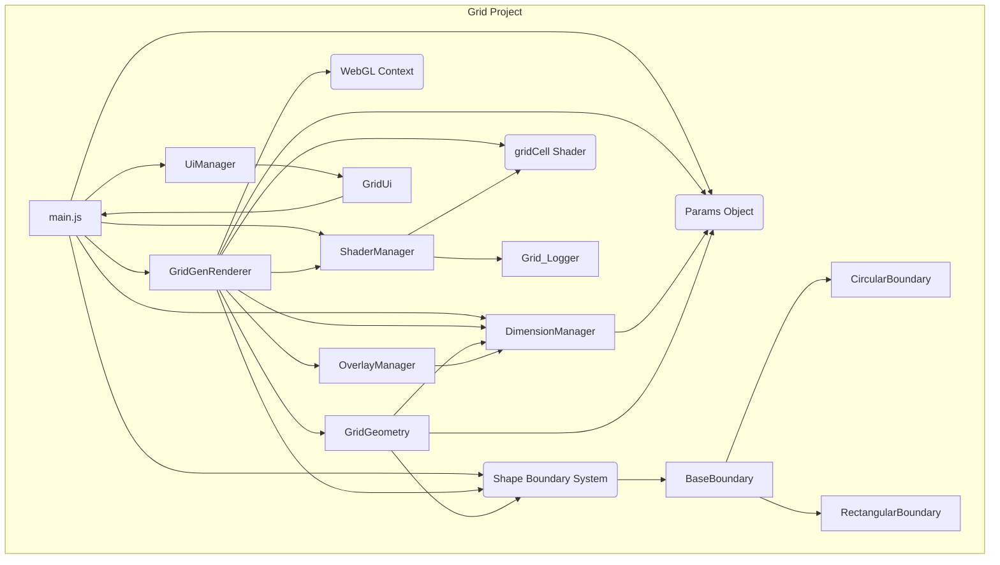

**`Grid/src/main.js` Observations:**

1.  **Initialization:** Separates sync setup (constructor) from async (`init`). GL context includes `antialias`. Uses central `params` object, loads/saves from localStorage. Calls `updateCanvasDimensions`. `init` loads shaders, creates `GridGenRenderer`, `UiManager`. Rendering seems event-driven (via `setGridParams`).
    interacts via `main.setGridParams`.
2.  **Params:** Central `params` object drives configuration. `setGridParams` propagates changes. Handles localStorage persistence.
3.  **Rendering:** Encapsulated in `GridGenRenderer`. Triggered by `updateGrid` or `setGridParams`. No `requestAnimationFrame` loop in `main.js`.

---

**`Grid/src/renderer/gridGenRenderer.js` Observations (`GridGenRenderer`):**

1.  **Dependencies:** Takes `gl`, `shaderManager`, `params`. Imports `BaseRenderer`, `CircularBoundary`, `RectangularBoundary`, `gl-matrix`, `DimensionManager`, `GridGeometry`, `OverlayManager`.
2.  **Constructor:** Stores `params`. Instantiates `DimensionManager`, `GridGeometry`, `OverlayManager`. Sets `boundaryType` from `params.screen.shape`. Initializes buffers (`initBuffers`), including instance buffers. Calls `updateGrid` for initial setup.
3.  **Core Methods:**
    - `setGridParams(params)`: Updates internal `params`, updates `DimensionManager`, detects boundary type changes, updates viewport/canvas size, updates `OverlayManager`, triggers `updateGrid`.
    - `updateGrid(params)`: **Primary setup/update logic.** Creates/updates `boundary` object (`CircularBoundary` or `RectangularBoundary`) based on `params.screen.shape` and `DimensionManager`. Calls `gridGeometry.generate(this.grid, this.boundary)` to create cell data (vertices, classification based on the _dynamic_ boundary). Calls `updateRenderables`.
    - `updateRenderables()`: Clears canvas/overlays. Gets colors from `params`. Draws reference shapes (boundary outlines). Calls `renderMaskedCellsInstanced`. Updates UI state (overlays) via `OverlayManager`.
    - `renderMaskedCellsInstanced()`: Sets up stencil buffer based on the current `boundary` shape. Calls `prepareInstanceData` to generate per-instance data (matrices, colors, shadow params). Calls `setupInstancedDrawing` and `gl.drawArraysInstanced`. Disables stencil.
    - `initBuffers()`: Creates WebGL buffers (`baseQuadBuffer`, `instanceMatrixBuffer`, `instanceColorBuffer`, `instanceShadowBuffer`).
    - `prepareInstanceData()`: Calculates per-instance transformation matrices, colors, and shadow parameters based on cell data from `gridGeometry` and current `params`. Populates typed arrays for buffer updates.
    - `setupInstancedDrawing()`: Binds buffers, sets up vertex attributes (including instanced ones), sets uniforms (projection matrix, etc.).
4.  **WebGL/Buffer Management:** **Uses instanced rendering.** A single base quad (`baseQuadBuffer`) is drawn multiple times. Per-instance data (matrix transform, color, shadow params) is uploaded to GPU buffers (`instanceMatrixBuffer`, `instanceColorBuffer`, `instanceShadowBuffer`) via `gl.bufferData` (dynamic draw). Stencil buffer used for masking based on the `boundary` object.
5.  **Shader Usage:** Likely uses a dedicated instancing shader (not explicitly named "basic"). Vertex shader uses instance matrices for position/scale. Fragment shader likely uses instance colors and shadow parameters. Uniforms include projection matrix.
6.  **Parameter Interaction:** Driven entirely by the `params` object passed to `setGridParams` and `updateGrid`. Uses `DimensionManager` for coordinate transformations and sizing. Uses `GridGeometry` for cell data.
7.  **Boundary Handling:** Explicitly handles `CircularBoundary` and `RectangularBoundary` objects. Boundary shape determined by `params.screen.shape`. Cell classification and masking are based on this dynamic boundary object.

---

## Analysis: Update to `Grid/src/main.js` (2024-04-06)

**Objective:** Identify changes made to `Grid/src/main.js` since the previous analysis on 2024-04-05.

**Changes Observed:**

1.  **Dimension Management (`DimensionManager`):**
    - Introduced `DimensionManager` (`./core/dimensionManager.js`) to handle physical vs. render dimensions.
    - Instantiated in `Main` constructor, taking `params.screen.width`, `params.screen.height`, `params.maxRenderWidth`.
    - Replaced `updateCanvasDimensions` with `checkAndApplyDimensionChanges` using `dimensionManager`.
    - Added helper `_applyCurrentDimensionsAndBoundary` to apply canvas size/style, viewport, and boundary center using `dimensionManager`.
    - `init` and `setGridParams` now use these new methods.
2.  **Boundary Offset Handling:**
    - Added `centerOffsetX` and `centerOffsetY` to `params`.
    - `_applyCurrentDimensionsAndBoundary` uses these offsets to calculate the final boundary center before setting `renderer.boundary.centerX/Y`.
3.  **Color Parameterization:**
    - `params.colors` now holds hardcoded RGB float arrays for grid elements (e.g., `gridBackgroundColor`, `insideCells`), replacing reliance on `colorConfig`.
4.  **WebGL Context:**
    - Added `antialias: true` to `webgl2` context options.
5.  **Parameters:**
    - Added `pixelRatio` to `params`.
6.  **Logging & Comments:**
    - Added comments and warnings related to initialization order (`canvas`/`gl`).
7.  **Error Handling:**
    - `init` method's catch block now logs and re-throws errors.

**Impact:** These changes introduce a dedicated `DimensionManager` for robust handling of different canvas resolutions/sizes and centralize the application of these dimensions and boundary calculations. Parameter handling is improved by incorporating offsets and explicit color definitions directly into the `params` object.

---

## Analysis: `Grid` Boundary System (2024-04-06)

**Objective:** Understand the implementation and interaction of the boundary system (`Grid/src/boundary/`) to inform migration strategy to `Sim`, focusing on simplicity.

**Files Analyzed:**

- `Grid/src/boundary/baseBoundary.js`
- `Grid/src/boundary/circularBoundary.js`
- `Grid/src/boundary/rectangularBoundary.js`
- `Grid/src/renderer/gridGenRenderer.js` (relevant sections)
- `Grid/src/main.js` (relevant sections)

**Findings:**

1.  **`baseBoundary.js` (Interface):**

    - Defines core properties: `centerX`, `centerY`, `scale`.
    - Abstract method: `isPointInside(x, y)` (throws if not implemented).
    - Common utils: `getCenter()`, `getScale()`, `setScale()`.
    - `getRadius()` method defined but seems optional/implementation-specific.

2.  **`circularBoundary.js` (Implementation):**

    - Extends `BaseBoundary`, adds `radius` property.
    - Implements `isPointInside` using circle equation (`Math.hypot`).
    - Implements `getRadius()`, `setRadius()`.

3.  **`rectangularBoundary.js` (Implementation):**

    - Extends `BaseBoundary`, adds `_width`, `_height` (with getters/setters).
    - Implements `isPointInside` using rectangle check (`Math.abs`).
    - Implements `getRadius()` returning diagonal half-length (for compatibility).
    - Simplified: Comments indicate removal of previous complex methods like `classifyCell`.

4.  **Integration (`gridGenRenderer.js`):**

    - **Instantiation:** Creates `CircularBoundary` or `RectangularBoundary` in `updateGrid` based on `params.screen.shape`.
    - **Parameter Source:** Uses `dimensionManager` for render center (`renderCenterX/Y`), render dimensions (for circle radius), or physical dimensions scaled to render space (for rect width/height). Also uses `params.scale`.
    - **Classification:** Passes the created `this.boundary` object to `this.gridGeometry.generate()`, which uses it (presumably `isPointInside`) to classify cells.
    - **Masking:** Uses the boundary object's properties (center, radius/dims) to draw the boundary shape into the stencil buffer for masking instanced cells. The renderer contains the logic/buffers (`prepareCircleBuffer`, `prepareRectangleBuffer`) for drawing these shapes.
    - **Outlines:** Draws reference outlines similarly using boundary properties.

5.  **Integration (`main.js`):**
    - In `_applyCurrentDimensionsAndBoundary`, calculates the final boundary center using `dimensionManager.renderCenterX/Y` plus `params.centerOffsetX/Y`.
    - _Directly_ updates the boundary's center: `this.renderer.boundary.centerX = finalBoundaryCenterX`, `this.renderer.boundary.centerY = finalBoundaryCenterY`.

**System Summary:**

- Well-abstracted (Base + Derived classes).
- `isPointInside` is the key classification contract.
- Renderer manages instantiation, uses properties for masking/drawing.
- Geometry generator uses the boundary object for classification.
- Main application updates the center position directly.
- Relatively self-contained, depends mainly on dimensions and center coordinates.

---

## Analysis: Remaining `Grid` Components (2024-04-06)

**Objective:** Complete the profile of the `Grid` application by analyzing remaining key components.

**Files Analyzed:**

- `Grid/src/core/dimensionManager.js`
- `Grid/src/core/gridGeometry.js`
- `Grid/src/shader/shaderManager.js`
- `Grid/src/shader/shaders/gridCell.js`
- `Grid/src/ui/uiManager.js`
- `Grid/src/ui/panels/gridUi.js`
- `Grid/src/overlays/overlayManager.js`
- `Grid/src/renderer/baseRenderer.js`
- `Grid/src/Grid.html`

**Findings:**

1.  **`DimensionManager` (`core`):**

    - Manages physical vs. render dimensions, aspect ratio, and `renderScale`.
    - Handles clamping and minimum dimensions.
    - Applies dimensions/style to canvas and sets WebGL viewport.
    - Highly reusable for `Sim`.

2.  **`GridGeometry` (`core`):**

    - Calculates grid layout (cell positions, sizes) based on `params`, `boundary`, and `dimensionManager`.
    - Iterative algorithm finds largest cell size meeting `params.target` count.
    - Uses `boundary.isPointInside` for corner/cell classification (`inside`/`boundary`).
    - Outputs `rectangles` array with render and physical dimensions.
    - Core logic to migrate, depends on `DimensionManager` and `Boundary`.

3.  **`ShaderManager` (`shader`):**

    - Standard WebGL shader loading, compiling, linking, and management utility.
    - Caches programs, attribute/uniform locations.
    - Optimizes `gl.useProgram` calls.
    - Reusable; `Sim` can consolidate its shader logic here.

4.  **`gridCell.js` (`shader/shaders`):**

    - Instanced rendering shader (vertex + fragment).
    - Vertex: Applies `instanceMatrix` transform.
    - Fragment: Applies `instanceColor` and calculates/applies an inner shadow based on UVs and `instanceShadowParams`.
    - Essential for the instanced rendering approach.

5.  **`UiManager` (`ui`):**

    - Simple manager; creates UI containers and instantiates UI panels (`GridUi`, `DebugUi`).

6.  **`GridUi` (`ui/panels`):**

    - Main control panel (`lil-gui`).
    - Reads initial state from `main.params`.
    - All controls modify `main.params` directly and trigger `main.setGridParams(main.params)`.
    - Displays calculated stats by `listen()`ing to `main.params`.
    - Reusable if `Sim` adopts a similar `params` structure.

7.  **`OverlayManager` (`overlays`):**

    - Manages HTML overlays (indices, centers, counts) on top of the canvas.
    - Creates/updates DOM elements, handles positioning/scaling relative to canvas using `dimensionManager`.
    - Called by `GridGenRenderer` to synchronize overlays with WebGL state.
    - Reusable for adding debug visualizations to `Sim`.

8.  **`BaseRenderer` (`renderer`):**

    - Contains helper methods (`drawCircle`, `drawRectangle`, `drawLineLoop`) for drawing primitives.
    - Expects caller to manage buffers/attributes.
    - Less critical for migration than `GridGenRenderer`.

9.  **`Grid.html` (`src`):**
    - Simple host page.
    - Uses `importmap` for CDN dependencies (`lil-gui`, `gl-matrix`).
    - Provides the target `canvas` element.

**Overall Architecture Notes:**

- Strongly parameter-driven via `main.params`.
- Clear component responsibilities.
- Utilizes instanced rendering for efficiency.
- Good use of abstraction (Boundary) and utility classes (DimensionManager, ShaderManager, OverlayManager).

---

## Component Dependency Diagrams (Mermaid Syntax - 2024-04-06)

**Grid Project Dependencies:**

---

## Execution: Replace `displayMode` with `useMasking` (2024-07-29)

**Objective:** Implemented plan to replace `displayMode` parameter with `useMasking`.

**Execution Log:**

- **Step 1 (Modify Default Parameters):** Completed. Added `useMasking: true`, removed `displayMode` in `main.js` defaults. Confirmed no localStorage usage.
- **Step 2 (Refactor `GridGenRenderer.js`):** Completed. Modified `prepareInstanceData` to filter cells. Created `_drawBoundaryShapeForStencil` helper. Modified `renderCellsInstanced` to use `params.useMasking` and the helper. Removed `displayMode` dependencies.
- **Step 3 (Update `GridUi.js`):** Completed. Replaced `displayMode` dropdown with `useMasking` checkbox. Updated `getControllers` and `updateControllerDisplays`.
- **Step 4 (Update `memoryBank/notebook.md`):** Completed (This entry).

**Next Step:** Proceed to CHECK mode.

---

## Execution: Fix Masking Toggle & Overlay Color (2024-07-30)

**Objective:** Fix masking toggle logic and adjust overlay color.

**Execution Log:**

- **Step 1 (Fix Stencil Logic):** Completed. Added `gl.depthMask(false)`, `gl.disable(gl.DEPTH_TEST)` before stencil shape draw and `gl.depthMask(true)`, `gl.enable(gl.DEPTH_TEST)` after in `renderCellsInstanced`.
- **Step 2 (Overlay Color):** Completed. Changed overlay center dot background color back to "lime" in `OverlayManager.js`.
- **Step 3 (Update Plan File):** N/A (Conceptual step).
- **Step 4 (Update Notebook):** Completed (This entry).

**Next Step:** Proceed to CHECK mode.

---

## Execution: Stencil Isolation Test (2024-07-30)

**Objective:** Test depth buffer interference hypothesis by disabling visual mask draw and restoring correct stencil state.

**Execution Log:**

- **Step 1 (Isolate Stencil Draw):** Completed. Commented out visual mask draw (Step 1) in `renderCellsInstanced` masking path. Restored correct state for stencil shape draw (Step 2: invisible, no depth) and instance draw (Step 3: visible, depth ON, stencil test EQUAL).
- **Step 2 (Verify Debug Color):** Completed. Verified `stencilDrawColor` remains magenta (though should not be visible).
- **Step 3 (Update Plan File):** N/A (Conceptual step).
- **Step 4 (Update Notebook):** Completed (This entry).

**Next Step:** Proceed to CHECK mode.

---

## Execution: Simplify Render Path Diagnostic (2024-07-30)

**Objective:** Diagnose if stencil state changes interfere with instance rendering by removing stencil logic.

**Execution Log:**

- **Step 1 (Revert Diagnostics):** Completed. Reverted magenta debug color, re-enabled visual mask draw code (within comments), and restored intended (flawed) stencil state logic (within comments) in `renderCellsInstanced`.
- **Step 2 (Simplify `renderCellsInstanced`):** Completed. Deleted `if/else(useMasking)` block and replaced it with only the non-masking instance draw calls (`setupInstancedDrawing`, `drawArraysInstanced`). Deleted final `gl.disable(STENCIL_TEST)`.
- **Step 3 (Update Plan File):** N/A (Conceptual step).
- **Step 4 (Update Notebook):** Completed (This entry).

**Next Step:** Proceed to CHECK mode.

---

## Execution: Reintroduce Core Stencil Logic (2024-07-30)

**Objective:** Re-implement stencil clipping logic carefully, omitting visual mask draw and using forceful stencil write.

**Execution Log:**

- **Step 1 (Rebuild `renderCellsInstanced`):** Completed. Restored `if/else(useMasking)`. Populated `else` with known-good instance draw. Populated `if` with revised stencil logic (Steps 2-5: enable stencil, ops=REPLACE, draw stencil shape invisibly, set instance state/test=EQUAL, draw instances). Added `gl.disable(STENCIL_TEST)` cleanup after the `if/else`.
- **Step 2 (Update Plan File):** N/A (Conceptual step).
- **Step 3 (Update Notebook):** Completed (This entry).

**Next Step:** Proceed to CHECK mode.

---

## Execution: Visualize Stencil Shape Draw Diagnostic (2024-07-30)

**Objective:** Make the stencil shape draw visible during the stencil write phase to diagnose if fragments are being produced.

**Execution Log:**

- **Step 1 (Add Logging):** Completed. Added `console.log` at the start of `_drawBoundaryShapeForStencil`.
- **Step 2 (Modify State):** Completed. In `renderCellsInstanced` masking path (Step 2), changed state before `_drawBoundaryShapeForStencil` call to enable `colorMask`, `depthMask`, and `DEPTH_TEST`.
- **Step 3 (Update Plan File):** N/A (Conceptual step).
- **Step 4 (Update Notebook):** Completed (This entry).

**Next Step:** Proceed to CHECK mode.

---

## Execution: Fix Stencil Helper Shader Activation (2024-07-30)

**Objective:** Fix stencil write failure by ensuring correct shader activation in `_drawBoundaryShapeForStencil` and revert previous diagnostics.

**Execution Log:**

- **Step 1 (Revert Diagnostics State):** Completed. In `renderCellsInstanced`, restored state for invisible stencil write (`colorMask=false`, `depthMask=false`, `disable(DEPTH_TEST)`).
- **Step 2 (Remove Logging):** Completed. Removed `console.log` from `_drawBoundaryShapeForStencil`.
- **Step 3 (Fix Shader Activation):** Completed. Added `shaderManager.use('circle')` and `shaderManager.use('basic')` before the respective `super.draw...` calls in `_drawBoundaryShapeForStencil`.
- **Step 4 (Update Plan File):** N/A (Conceptual step).
- **Step 5 (Update Notebook):** Completed (This entry).

**Next Step:** Proceed to CHECK mode.

---

## Execution: Remove Stencil Logic (Radical Simplification) (2024-07-30)

**Objective:** Remove all non-essential rendering (reference shapes, overlays except stats, depth test) to isolate instance drawing.

**Execution Log:**

- **Step 1 (Modify `updateRenderables`):** Completed. Changed clear mask, disabled depth test globally, removed reference shape draw block, removed index/center overlay calls. Kept stats overlay calls and parameter updates.
- **Step 2 (Simplify `renderCellsInstanced`):** Completed. Removed diagnostic depth disable/enable calls.
- **Step 3 (Update Plan File):** Completed.
- **Step 4 (Update Notebook):** Completed (This entry).

**Next Step:** Proceed to CHECK mode.

---

## In-Depth Analysis: `main.js` & `gridGenRenderer.js` (2024-07-30)

**Objective:** Analyze the core application setup (`main.js`) and the rendering pipeline (`gridGenRenderer.js`) to understand parameter flow, rendering steps, and potential causes for the observed clipping behavior where the background color shows through.

**`Grid/src/main.js` Findings:**

1.  **Initialization:** Sets up WebGL (stencil, antialias), `ShaderManager`, default `params`, `DimensionManager`. `init()` then creates `GridGenRenderer`, `UiManager`, applies initial dimensions/boundary, and triggers the first `renderer.updateGrid()`.
2.  **Parameter Management:** Central `params` object holds all state. `setGridParams()` replaces the entire object and propagates it to `renderer.setGridParams()` and `checkAndApplyDimensionChanges()`.
3.  **Dimension Handling:** Uses `DimensionManager` for physical vs. render dimensions. `_applyCurrentDimensionsAndBoundary()` applies canvas size/style, viewport, calculates final boundary center (render center + offset), and **directly sets `renderer.boundary.centerX/Y`**. This happens _after_ `renderer.setGridParams` is called.
4.  **Renderer Interaction:** Instantiates renderer, propagates params via `renderer.setGridParams()`, triggers initial render via `renderer.updateGrid()`.

**`Grid/src/renderer/gridGenRenderer.js` Findings:**

1.  **Initialization:** Sets up `DimensionManager`, `GridGeometry`, `OverlayManager`, buffers (including base quad and instance buffers). Triggers initial `updateGrid()`.
2.  **Parameter Handling:** `setGridParams()` updates internal params, updates its `DimensionManager`, viewport, canvas size, overlays, and **always calls `updateGrid()`**, triggering a full regeneration.
3.  **Update Cycle:**
    - `updateGrid()`: Creates/updates the `boundary` object based on `params.screen.shape` and `dimensionManager` (render dims/center). Calls `gridGeometry.generate()` with the boundary. Calls `updateRenderables()`.
    - `updateRenderables()`: Clears canvas to `params.colors.gridBackgroundColor`. **Disables DEPTH_TEST globally**. Gets rectangles from `gridGeometry`. Calls `prepareInstanceData()`. Calls `renderCellsInstanced()`. Updates overlays. Updates stats back into `params`.
4.  **Boundary Management:** `updateGrid` creates/updates boundary using render dimensions. Center is set initially from `dimensionManager`, **but potentially immediately overwritten by `main.js`**. Boundary passed to `GridGeometry`.
5.  **Geometry Generation:** `gridGeometry.generate()` receives the boundary and grid params, outputting a list of `rectangles` (presumably only for cells considered "inside" or relevant based on the boundary).
6.  **Rendering Pipeline:**
    - `prepareInstanceData()`: Receives `rectangles` from `GridGeometry`. **Uses ALL received rectangles (`const visibleRects = rectangles;`) - no filtering occurs here.** Calculates transformation matrix (render coords -> clip space) for each instance. Uploads matrices, colors (single `cellColor` for all), and shadow params to GPU buffers.
    - `setupInstancedDrawing()`: Activates `gridCell` shader, sets up vertex attributes (base quad position + instanced matrix/color/shadow params).
    - `renderCellsInstanced()`: (Simplified version active) Calls `setupInstancedDrawing()` and `gl.drawArraysInstanced()` for all instances prepared. **No clipping or stencil logic is active in this path.**
7.  **Color Usage:** `gridBackgroundColor` used for `gl.clearColor`. `cellColor` used for all drawn instances.

**Interaction & Clipping Hypothesis:**

- The flow seems correct: UI -> `main.params` -> `renderer.params` -> `updateGrid` -> `GridGeometry` -> `prepareInstanceData` -> `renderCellsInstanced`.
- The direct modification of `renderer.boundary.centerX/Y` by `main.js` after `updateGrid` might have started seems problematic but might not be the primary cause of the visual clipping if `GridGeometry` uses the boundary state _during_ `generate`.
- **The most likely reason the background color shows through in "clipped" areas is that `GridGeometry.generate()` is correctly _not_ generating rectangle data for cells outside the boundary it receives.** `prepareInstanceData` and `renderCellsInstanced` then only process and draw the instances for the generated rectangles, leaving the rest of the canvas showing the clear color.
- The issue is therefore likely upstream in `GridGeometry` or potentially in how the `boundary` object passed to it is defined/updated, rather than in the instance data preparation or drawing stages within the renderer itself.

---

## Grid Refactoring Conclusion & Sim Migration Prep (2024-07-31)

**Objective:** Summarize the state of the `Grid` project and pivot towards migrating its rendering system to the `Sim` project.

**Summary of Grid Refactoring:**

- Implemented an instanced rendering system (`GridGenRenderer`) driven by a central `params` object.
- Established clear component responsibilities: `DimensionManager`, `BoundaryManager`, `GridGeometry`, `OverlayManager`, `ShaderManager`.
- Utilized distinct boundary classes (`BaseShapeBoundary`, `CircularBoundaryShape`, `RectangularBoundaryShape`) for grid generation and masking.
- Implemented a separate physics boundary visualization system (`BaseBoundaryPs`, `CircularBoundaryPs`, `RectangularBoundaryPs`).
- Refined parameter flow, initialization order, coordinate space handling, and overlay management.
- Cleaned up code structure, comments, and unused shaders.
- The `Grid` project (`Grid/src/`) now serves as a stable and efficient template for the desired grid rendering system.

**Shift to Sim Migration:**

The primary goal is now to replace the existing `Sim/src/renderer/gridRenderer.js` with a system based on the refactored `Grid/src/` components.

**Next Steps:**

1.  **Full Re-analysis:** Conduct a thorough review of the final `Grid/src` state and the current `Sim/src` state to understand the integration points and potential conflicts.
2.  **Migration Plan Formulation:** Create a detailed, step-by-step plan for integrating the `Grid` rendering system components (`GridGenRenderer`, `DimensionManager`, `GridGeometry`, `Shape Boundaries`, `OverlayManager`, relevant shaders, etc.) into `Sim`. This plan will need to address:
    - Parameter management integration (likely introducing a `gridParams`-like object in `Sim`).
    - Adapting the `Sim` animation loop to drive the new renderer.
    - Replacing the old `GridRenderer` instantiation and calls.
    - Connecting the new renderer to `Sim`'s data sources (e.g., particle system for density if needed, UI for parameters).
    - Handling potential conflicts with `Sim`'s existing boundary system (used for physics).
    - Integrating UI controls for the new grid system.
    - Ensuring the core cell geometry calculation logic (from the original `Sim/src/renderer/gridRenderer.js::generateRectangles`) remains functionally equivalent after migration, as per the C# porting requirement.

**Readiness:** The `Grid` codebase is considered ready as a template. Proceeding with the re-analysis phase.

---

## Review of Notebook & Plan (2024-07-31)

**Objective:** Gain context from existing documentation.

**Findings:**

- Reviewed `plan.md` and the extensive history in `notebook.md`.
- The `Grid` project refactoring is complete, resulting in a stable template (`Grid/src/`) for an instanced grid rendering system.
- Significant effort was spent analyzing differences between `Grid` and `Sim`, and recently, debugging/refining the `Grid` implementation (coordinates, parameters, overlays). Stencil-based masking logic was removed/disabled during simplification.

- The current plan is to re-analyze both `Grid/src` and `Sim/src` to prepare for migrating the `Grid` rendering system into `Sim`.

**Status:** Ready to proceed with the re-analysis phase as per `plan.md`.

---

## Re-Analysis of `Grid/src` (2024-07-31)

**Objective:** Perform a fresh, comprehensive analysis of the final `Grid/src` state to inform the migration plan into `Sim`.

**File Structure:** Confirmed via `list_dir`. Key directories: `coreGrid/`, `renderer/`, `shader/`, `simulation/` (boundary viz only), `ui/`, `overlays/`.

**Key Component Analysis:**

1.  **Orchestration (`Grid.html`, `main.js`):**

    - `Grid.html`: Simple structure, loads `main.js`, uses `importmap` (lil-gui, gl-matrix), contains `#glCanvas`.
    - `main.js`: Entry point. Initializes WebGL, `ShaderManager`, defines central `params` object, instantiates `DimensionManager`, `BoundaryManager`. `init()` awaits shaders, creates `GridGenRenderer`, applies initial dimensions, calls `setGridParams` (triggering first render), creates `UiManager`. `setGridParams(newParams)` is the core update trigger: updates internal `params`, updates `DimensionManager`, updates `BoundaryManager`, calls `renderer.setGrid()`.

2.  **Core Grid (`dimensionManager.js`, `boundaryManager.js`, `coreGrid/boundary/`, `gridGeometry.js`):**

    - `DimensionManager`: Manages physical vs. render dimensions, aspect ratio, scaling (constrained by `maxRenderWidth`). Applies dimensions/style to canvas, sets WebGL viewport. Highly reusable.
    - `BoundaryManager`: Manages two boundary types:
      - `shapeBoundary` (from `coreGrid/boundary/`): For grid generation/masking (render coords). Uses `BaseBoundary`, `CircularBoundary`, `RectangularBoundary`.
      - `physicsBoundary` (from `simulation/boundary/`): For physics viz (normalized coords). Uses `BaseBoundaryPs`, `CircularBoundaryPs`, `RectangularBoundaryPs`.
        Creates/updates boundaries based on `params.screen.shape`. Updates `shapeBoundary` size/pos from `DimensionManager` + offsets. Updates `physicsBoundary` params from `params.boundaryParams`.
    - `coreGrid/boundary/` (Shape Boundaries): Simple classes defining `isPointInside` based on radius or width/height, operate in render coordinates.
    - `GridGeometry`: Core grid generation algorithm. Takes `params`, `shapeBoundary`, `DimensionManager`. Iteratively calculates cell size to meet `params.target` count. Uses `boundary.isPointInside` to determine cell inclusion based on `params.allowCut`. Outputs `rectangles` array (render coords + physical size) and calculated `gridParams` (cols, rows, cell dimensions). **This is the likely C# port target.**

3.  **Rendering (`gridGenRenderer.js`, `baseRenderer.js`):**

    - `baseRenderer.js`: Minimal base class storing `gl` and `shaderManager`.
    - `GridGenRenderer`: Extends `BaseRenderer`. Renders grid using instanced drawing.
      - Initializes own `DimensionManager`, `GridGeometry`, `OverlayManager`, buffers.
      - `setGrid(config, shapeB, physicsB)`: Main update entry. Updates internal `DimensionManager`, canvas/viewport, `OverlayManager`, triggers `updateGridGeometryAndRender()`.
      - `updateGridGeometryAndRender()`: Calls `gridGeometry.generate()`, retrieves `rectangles`, updates stats in `this.grid` config, calls `updateRenderables()`.
      - `updateRenderables()`: Clears canvas, calls `prepareInstanceData()`, `renderCellsInstanced()`. Calculates projection matrix. Draws `physicsBoundary` if flag set. Updates overlays. Updates stats back into `params`.
      - `prepareInstanceData()`: Creates/uploads instance data (matrix, color, shadow params) to GPU buffers based on input `rectangles`.
      - `renderCellsInstanced()`: Sets up shader attributes (`gridCell`), draws instances. (Stencil logic disabled).

4.  **Shaders (`shaderManager.js`, `shaders/`):**

    - `ShaderManager`: Standard shader utility (load, compile, link, cache, use). Reusable.
    - `shaders/`: Contains sources for `gridCell` (instancing + shadow), `circle` (outline), `rectangle` (outline).

5.  **Simulation Boundaries (`simulation/boundary/`):**

    - Contains `BaseBoundaryPs`, `CircularBoundaryPs`, `RectangularBoundaryPs` for physics simulation logic and visualization. Operates in normalized (0-1) coordinates. Draws self using `DimensionManager`. Includes `BoundaryPsUtils`. **Appears redundant with existing `Sim` physics boundaries.**

6.  **Overlays (`overlayManager.js`):**

    - Manages HTML overlays (`div`s) for cell indices and centers.
    - Creates/appends overlays to DOM.
    - `updateDimensions()` correctly sizes/positions overlays based on _actual_ canvas size.
    - `updateCellIndices/Centers` calculates scaled positions based on render vs. canvas dimensions.

7.  **UI (`uiManager.js`, `panels/gridUi.js`, `baseUi.js`):**
    - `UiManager`: Creates containers, instantiates `GridUi`.
    - `GridUi`: Uses `lil-gui` (via `BaseUi`). Controls Screen Type, Offsets, Grid Params (target, gap, ratio, scale, cut, shadow), Display Flags. Modifies `main.params` directly and calls `main.setGridParams()`. Displays stats via `listen()`.

**Synthesis & Migration Pointers:**

- `Grid/src` provides a well-defined, instanced grid rendering system driven by `params`.
- Core components for migration: `params` structure, `DimensionManager`, `BoundaryManager` (adapted), `coreGrid/boundary` classes, `GridGeometry`, `GridGenRenderer`, `ShaderManager`, `gridCell` shader.
- Integration challenges: Reconciling param management (`Grid` central vs. `Sim` distributed), update loop (`Grid` event vs. `Sim` frame), UI integration.
- Redundancy: `simulation/boundary/` (physics) seems duplicate of `Sim`'s system; migration should use `Sim`'s physics boundary.
- Preservation: `GridGeometry` logic likely needs careful preservation for C# port.
- Need to consolidate `ShaderManager` and logging approach.

**Status:** `Grid/src` re-analysis complete. Ready for `Sim/src` re-analysis.

---

## Comparison: Grid Geometry Generation Logic (2024-07-31)

**Objective:** Compare `Grid/src/coreGrid/gridGeometry.js` with the logic in `Sim/src/renderer/gridRenderer.js` (`generateRectangles`, `classifyCells`) to inform migration strategy, specifically regarding the requirement to preserve the functional output of the `Sim` logic for the C# port.

**Analysis Based On File Reads:**

| Feature                   | `Grid/src/coreGrid/gridGeometry.js` (`GridGeometry`)                                                                                                                                                                                                                            | `Sim/src/renderer/gridRenderer.js` (`generateRectangles`)                                                                                                                                                                                                                    | Key Differences & Migration Implications                                                                                                                                                                                                                                                                                                                                                                                                                                                                                                             |
| :------------------------ | :------------------------------------------------------------------------------------------------------------------------------------------------------------------------------------------------------------------------------------------------------------------------------ | :--------------------------------------------------------------------------------------------------------------------------------------------------------------------------------------------------------------------------------------------------------------------------- | :--------------------------------------------------------------------------------------------------------------------------------------------------------------------------------------------------------------------------------------------------------------------------------------------------------------------------------------------------------------------------------------------------------------------------------------------------------------------------------------------------------------------------------------------------- |
| **Coordinate System**     | Operates in **render coordinates**. Uses `DimensionManager` to map physical/render dimensions. Calculates positions relative to `boundary` center (passed in). Handles `centerOffsetX/Y`.                                                                                       | Operates in **fixed pixel coordinates** (target 240x240). Center hardcoded at (120, 120). Ignores `DimensionManager`. Offsets are not used for generation.                                                                                                                   | **Major:** `GridGeometry` is designed for dynamic render sizes/coordinates. `generateRectangles` logic is tied to a fixed 240x240 pixel space. Direct port requires adapting `generateRectangles` logic to use render coordinates and `DimensionManager`, or adapting `GridGeometry` to optionally work in fixed pixel space.                                                                                                                                                                                                                        |
| **Boundary Handling**     | Accepts `CircularBoundary` or `RectangularBoundary` object. Uses `boundary.isPointInside` and boundary properties (radius, width/height) for calculations. Boundary scale applied separately.                                                                                   | Assumes **circular boundary**. Uses hardcoded `center` (120, 120) and a _scaled_ radius (`120 * gridParams.scale`) for _cell classification_ and determining max grid extent. Uses a separate _fixed_ radius (`FIXED_MASK_RADIUS = 120`) for the _stencil mask_ in `draw()`. | **Major:** `GridGeometry` supports dynamic boundary shapes and uses the boundary object consistently. `generateRectangles` has complex, potentially confusing dual-radius logic (scaled for classification, fixed for masking). Migration needs to unify this, likely adopting `GridGeometry`'s approach with a `CircularBoundary` object, but carefully ensuring the _classification radius_ logic matches `generateRectangles` if needed for preservation. The fixed masking radius concept from `Sim` is probably obsolete with the new renderer. |
| **Cell Size Calculation** | Iteratively searches for largest cell height (`visualScaledH`) that meets `target` cell count, starting from `maxVisualCellHeight` (derived from physical screen size). Width (`visualScaledW`) derived from `aspectRatio` and `visualScaledH`. Uses `renderScale` extensively. | Iteratively searches for largest cell height (`scaledH`) that meets `target` cell count, starting from 120px. Width (`scaledW`) derived from `aspectRatio` and `scaledH`. Scale factor (`gridParams.scale`) applied _directly_ to cell size and classification radius.       | **Significant:** Different starting points and iterative approaches. `GridGeometry` is more robustly tied to physical/render dimensions. `generateRectangles` directly uses `gridParams.scale` to modify cell size during iteration. Preserving the _exact output_ of `generateRectangles` might require mimicking its iterative approach and direct scale application within `GridGeometry`, or carefully mapping parameters.                                                                                                                       |
| **Cell Placement/Extent** | Calculates `maxCols`/`maxRows` based on boundary type (radius or width/height) and `stepX`/`stepY` in render space. Places cells symmetrically around boundary center.                                                                                                          | Calculates `maxCols`/`maxRows` based on _scaled_ radius and `stepX`/`stepY` in pixel space. Adds extra rows/cols if `allowCut` > 0. Places cells symmetrically around hardcoded center (120,120).                                                                            | Different methods for determining grid extent, especially for rectangular boundaries. `generateRectangles` adds extra rows/cols explicitly for partial cells. Need to ensure migrated logic covers the same area.                                                                                                                                                                                                                                                                                                                                    |
| **Cell Classification**   | Checks if cell center is inside `boundary.isPointInside`. If `allowCut > 0`, checks corners. Defines `inside`/`boundary`.                                                                                                                                                       | Checks if cell center is inside _scaled_ radius. If `allowCut > 0`, checks corners relative to _scaled_ radius. Includes complex edge-intersection check. Defines `inside`/`boundary`/`outside`.                                                                             | Similar core logic (center/corner checks) but `generateRectangles` uses the _scaled_ radius and has an edge-intersection check fallback. Preservation requires matching the _scaled_ radius logic and potentially the edge check if `allowCut > 0` behavior needs to be identical.                                                                                                                                                                                                                                                                   |
| **Output Filtering**      | Outputs all generated cells classified as `inside` or `boundary`. No explicit filtering of `outside` (assumes generation logic avoids them). Final count might exceed target initially.                                                                                         | Classifies cells (`classifyCells`), then **explicitly filters out `outside` cells**. Returns the filtered list, truncated to `target` count.                                                                                                                                 | **Critical Difference:** `generateRectangles` has a separate `classifyCells` step and _explicitly filters `outside` cells_. `GridGeometry` relies on its generation loop using `isPointInside` to implicitly avoid `outside` cells. Exact preservation likely requires adding the explicit filtering step to the migrated logic.                                                                                                                                                                                                                     |
| **Output Data**           | Outputs array of `rectangles` with `x`, `y`, `width`, `height` (render coords), `physicalW`, `physicalH`, `cellType`, `cornersInside/Outside`. Also outputs calculated `gridParams` (cols, rows, cell dimensions).                                                              | Outputs array of `rectangles` with `x`, `y`, `width`, `height` (pixel coords), `color` (initially gray), `cellType`, `cornersInside/Outside`. Does _not_ output physical dimensions. Updates `this.gridParams` internally.                                                   | Need to ensure output format is compatible and contains necessary data (render coords for new renderer). Physical dimensions might need calculation if `GridGeometry` is adapted.                                                                                                                                                                                                                                                                                                                                                                    |

**Conclusion on Geometry Preservation:**

The grid generation logic in `GridGeometry` and `Sim`'s `generateRectangles` are significantly different. `GridGeometry` is more flexible, dimension-aware, and uses a cleaner boundary abstraction. `generateRectangles` is hardcoded to a 240x240 pixel space, uses a specific scaled-radius approach for classification, and explicitly filters `outside` cells.

Preserving the functional output of `generateRectangles` for the C# port means the migrated system must produce the _identical set of cell coordinates and dimensions_ for equivalent inputs, likely within the 240x240 conceptual space initially.

This rules out simply dropping in `GridGeometry`. Potential migration strategies for the geometry logic include:

1.  **Adapt `GridGeometry`:** Significantly modify it to mimic `generateRectangles` (pixel space, scaled radius, filtering). Complex and pollutes the template.
2.  **Create a `SimGridGeometry`:** Implement the `generateRectangles` logic in a new class designed to work with the `GridGenRenderer` pipeline (using `DimensionManager`, render coords). Cleaner separation but requires careful implementation.
3.  **Configure `GridGeometry` Carefully:** Attempt (likely infeasible) to configure `GridGeometry` parameters to exactly match `generateRectangles` output.

Option 2 appears most promising for maintaining separation while achieving functional equivalence.

---

## Revised Understanding & Strategy Pivot (2024-07-31)

**Objective:** Document corrections to analysis and the revised strategy for grid migration based on recent findings.

**Key Findings & Corrections:**

1.  **Previous Migration Artefacts:** Confirmed that `Sim/src/renderer/simGridRendererInstanced.js` and dependencies in `Sim/src/coreGrid/` (incl. `gridGeometry.js`, `dimensionManager.js`, Shape Boundaries) exist, representing a partially completed prior migration attempt. The previous plan incorrectly assumed these needed creation or were based on the original `Grid` versions without verification.
2.  **Revised Goal:** The primary task is now to **complete, verify, and potentially correct the _existing_ `SimGridRendererInstanced` implementation** rather than directly replacing the original `Sim/src/renderer/gridRenderer.js` from scratch. Cleanup of the old renderer becomes a final step.
3.  **Geometry Logic Target:** Verification/adaptation must focus on the _existing_ `Sim/src/coreGrid/gridGeometry.js` to ensure it meets the C# port requirement (functional preservation of the logic from the original `Sim/src/renderer/gridRenderer.js::generateRectangles`).
